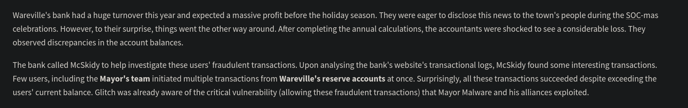

# Day 12 - Web Timing Attacks



# Web Timing and Race Conditions

Web applications are typically vulnerable to issues caused by direct input-output relationships. However, timing-based attacks can exploit the behavior of web applications not by sending "bad" data but by manipulating *how* and *when* data is sent.

---

## Web Timing Attacks

- **Definition**: Observing a web application's response time to infer information.
- **Mechanism**: Tiny changes in data or request behavior are used to observe response time differences to uncover unauthorized information.
- **Subtle Nature**: Timing issues range from **1300ms to 5ns**, making them hard to detect.

---

## Race Conditions: A Special Type of Timing Attack

- **Purpose**: Cause a web application to perform unintended actions.
- **Example**: Sending multiple simultaneous requests to exploit discrepancies in data processing.

---

## Rise of HTTP/2 and Its Role

- **HTTP/2**: Faster, more efficient protocol with new features.
- **Key Feature**: **Single-packet multi-requests** (stacking multiple requests in one TCP packet) eliminates *network latency* from timing observations.
- **Impact**: Only **server latency** remains, making timing vulnerabilities easier to detect.

---

## Categories of Timing Attacks

1. **Information Disclosure**
    - Leveraging response delays to uncover unauthorized data.
    - Example: Username enumeration to stage password-guessing attacks.
2. **Race Conditions**
    - Exploiting improper request handling to cause unintended actions.
    - Example: Applying the same coupon code multiple times before it's marked as "used."

---

## Focus: Time-of-Check to Time-of-Use (TOCTOU)


### **TOCTOU Flaw Explained**

When a user submits a coupon code:

1. The application checks if the coupon is valid and unused.
2. The discount is applied.
3. The coupon status is updated as "used."
- **Flaw**: Between Step 1 (check) and Step 3 (update), there is a small window (a few milliseconds) where the coupon remains valid.
- **Exploit**: A threat actor can send two rapid requests. Request 2 can exploit the coupon before Request 1 updates it.

---

## Real-World Scenario: Warville Banking Application

**Application**: Hosted at `http://MACHINE_IP:5000/`

### **Steps to Identify Race Conditions**

1. **Application Scanning**:
    - Identify functionalities involving shared resources, e.g., fund transfers, database updates, or balance inconsistencies.
2. **Key Functionalities to Examine**:
    - **Logout**: Unlikely to involve simultaneous tasks.
    - **Fund Transfer**: Includes:
        - Deducting funds from one account.
        - Adding funds to another account.
    - *Observation*: Fund transfers involve multiple operations, making them prime targets for race condition attacks.

---

## Verifying the Fund Transfer Functionality

### **Testing Setup**:

1. Perform a sample transaction in the browser.
2. Capture **GET** and **POST** requests using Burp Suite.

### **Sample Test**:

- **Current Balance**: $1000
- **Transaction**: Send $500 to account number `111`.
- **Result**: Observe and analyze the captured requests in Burp Suite to identify potential race conditions.


Click on the Transfer button, and you will see the following message indicating that the amount has been transferred: 


The above figure shows that the `/transfer` endpoint accepts a POST request with parameters `account_number` and `amount`. The Burp Suite tool has a feature known as `Repeater` that allows you to send multiple HTTP requests. We will use this feature to duplicate our `HTTP POST` request and send it multiple times to exploit the race condition vulnerability. Right-click on the POST request and click on `Send to Repeater`.

Now, navigate to the `Repeater` tab, where you will find the `POST` request that needs to be triggered multiple times. We can change the `account_number`, from `111`, and the `amount` value from `500` to any other value in the request as well, as shown below:


Now use `Ctrl+R` to duplicate tabs within Repeater. Here we will be duplicating the same request 10 times ie, we will be sending 10 requests in parallel.

Now that we have 10 requests ready, we want to send them simultaneously. While one option is to manually click the `Send` button in each tab individually, we aim to send them all in parallel. To do this, click the `+` icon next to `Request #10`and select Create tab group. This will allow us to group all the requests together for easier management and execution in parallel.


After clicking the `Create tab group`, a dialogue box will appear asking you to name the group and select the requests to include. For this example, we will name the group `funds`, select all the requests, and then click the `Create` button, as shown below.


Select `Send group in parallel (last-byte sync)` in the dropdown next to the `Send` button. Once selected, the `Send` button will change to `Send group (parallel)`. Click this button to send all the duplicated requests in our tab group at the same time, as shown below:


Once all the requests have been sent, navigate to the `tester` account in the browser and check the current balance. You will notice that the tester's balance is negative because we successfully transferred more funds than were available in the account, exploiting the race condition 
vulnerability.


By duplicating ten requests and sending them in parallel, we are instructing the system to make ten simultaneous requests, each deducting $500 from the `tester` account and sending it to account `111`. 

In a correctly implemented system, the application should have processed the first request, locked the database, and processed the remaining requests individually. However, due to the race condition, the application handles these requests abruptly, resulting in a negative 
balance in the tester account and an inflated balance in account `111`.

---

# Verifying Through Source Code

In a **white-box testing scenario**, where access to the application's source code is available, race condition vulnerabilities can be identified through **code reviews**. The focus is on detecting areas where multiple operations interact with shared resources without proper synchronization.

---

## Code Analysis: Fund Transfer Functionality

Here’s an example of the Python code handling fund transfers:

```python
if user['balance'] >= amount:
    conn.execute('UPDATE users SET balance = balance + ? WHERE account_number = ?',
                 (amount, target_account_number))
    conn.commit()

    conn.execute('UPDATE users SET balance = balance - ? WHERE account_number = ?',
                 (amount, session['user']))
    conn.commit()

```

## Identifying the Vulnerability

- **Issue**: The updates are committed **separately** instead of being part of a single atomic transaction.
- **Root Cause**: There is no **locking** or **transaction synchronization** between the two `UPDATE` operations.
- **Impact**: Concurrent requests can exploit the gap between the two updates, leading to **race conditions**.

---

# Fixing the Race

The developer did not properly handle concurrent requests in the bank's application, leading to a **race condition vulnerability** during fund transfers. When multiple requests were sent in parallel, each deducting and transferring funds, the application processed them simultaneously without ensuring proper synchronization. This resulted in inconsistent account balances, such as **negative balances** in the sender’s account and **excess funds** in the recipient’s account.

## Preventive Measures to Fix the Race Condition

1. **Use Atomic Transactions**
    
    The developer should have implemented **atomic database transactions** to ensure that all steps of a fund transfer (deducting and crediting balances) are performed as a **single unit**.
    
    - This ensures that either **all steps succeed** or **none do**, preventing partial updates that could lead to an inconsistent state.
2. **Implement Mutex Locks**
    
    By using **Mutex Locks**, the developer could have ensured that **only one thread** accesses the shared resource (such as the account balance) at a time.
    
    - This prevents multiple requests from interfering with each other during concurrent transactions.
3. **Apply Rate Limits**
    
    The developer should have implemented **rate limiting** on critical functions like funds transfers and withdrawals.
    
    - This would limit the **number of requests** processed within a specific time frame, reducing the risk of abuse through rapid, repeated requests.

---

## Questions

1. What is the flag value after transferring over $2000 from Glitch's account?
    
    
    
    Ans.: **THM{WON_THE_RACE_007}**