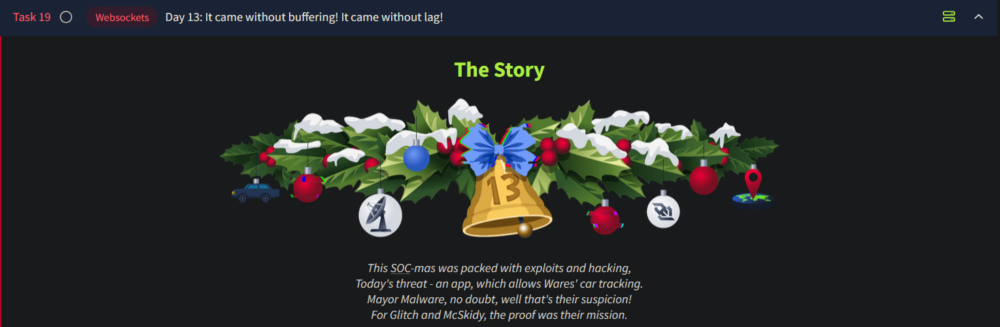
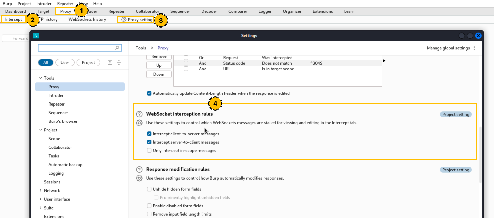
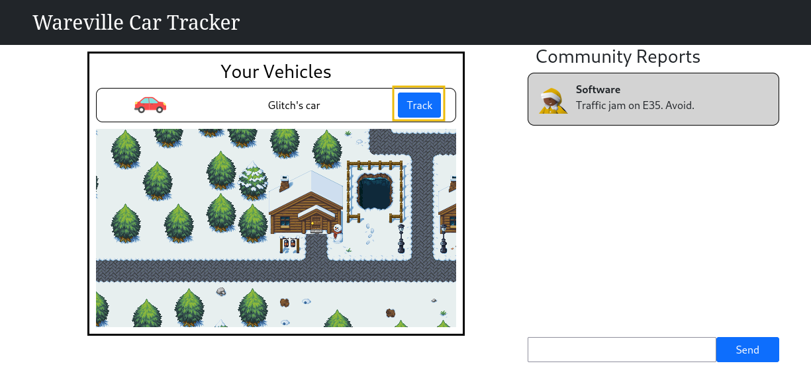
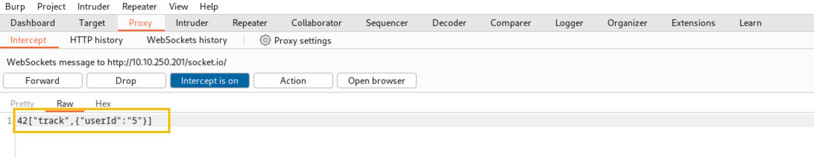
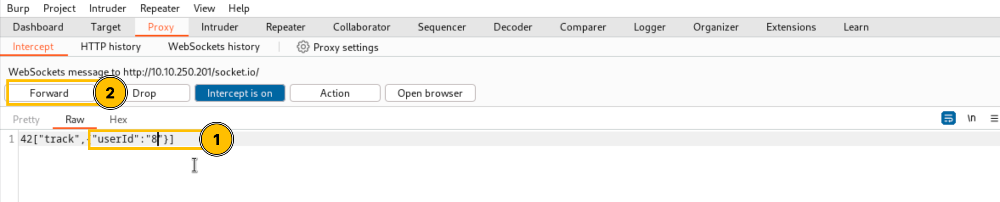
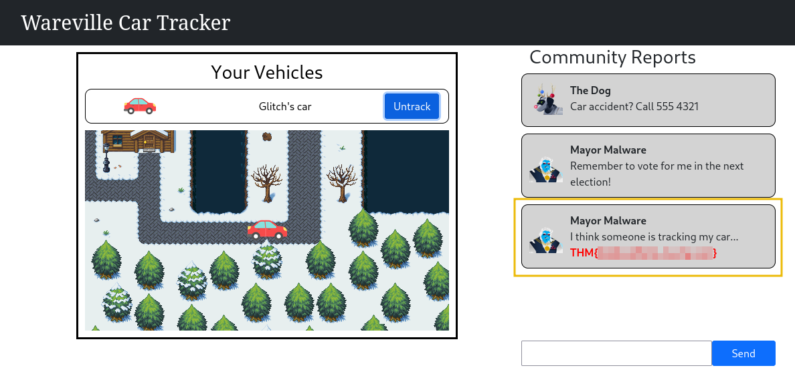

# Day 13 - Websockets

*Wares are all about security. The Glitch discovers that an app is illegally tracking the cars in Wareville. Not many car thefts in the city warrant such an extreme measure. He reaches out to McSkidy to investigate and identify how the application is tracking them and leaking users' positions.*

# Introduction to WebSockets

WebSockets allow the browser and server to maintain an open line of communication, enabling back-and-forth data exchange without repeated requests. Unlike traditional HTTP, which follows a request-response model, WebSockets keep the connection open after an initial handshake. This results in reduced overhead and faster communication, making WebSockets ideal for applications like:

- Live chat apps
- Real-time games
- Constant live data feeds

## Traditional HTTP Requests vs. WebSocket

### HTTP Requests

- Browser sends a request, server responds, then closes the connection.
- Requires repeated requests for updates (polling).
- Example: In a chat app, the browser repeatedly asks, "Any new messages?"

### WebSockets

- Keeps the connection open after establishment.
- Enables the server to push updates without constant requests.
- Reduces overhead and uses fewer resources.

## WebSocket Vulnerabilities

While WebSockets enhance performance, they introduce specific security risks. Common vulnerabilities include:

### 1. Weak Authentication and Authorization

- WebSockets lack built-in mechanisms for user authentication and session validation.
- Poorly implemented controls can allow attackers to gain access to sensitive data or disrupt connections.

### 2. Message Tampering

- Without encryption, attackers can intercept and modify messages.
- This enables actions like injecting commands, altering data, or executing unauthorized actions.

### 3. Cross-Site WebSocket Hijacking (CSWSH)

- Attackers trick a user's browser into opening a WebSocket connection to another site.
- May result in connection hijacking or data exposure.

### 4. Denial of Service (DoS)

- Persistent connections can be targeted with message floods.
- Overwhelms the server, causing slowdowns or crashes.

## What Is WebSocket Message Manipulation?

WebSocket Message Manipulation occurs when attackers intercept and alter messages between a web app and its server. Since WebSockets facilitate constant two-way communication, the risk of tampering is heightened if security measures are inadequate.

### How It Works

1. Attacker intercepts a WebSocket message.
2. Modifies the message (e.g., transaction details or user commands).
3. The altered message is processed by the server in real-time.

### Example

A web app uses WebSockets for money transfers:

- Attacker intercepts and changes the transaction amount or reroutes the funds.
- Changes take effect instantly, often unnoticed until damage is done.

### Impacts of Message Manipulation

1. **Unauthorized Actions**:
    - Impersonation or unauthorized operations like purchases or account changes.
    - Example: Altering payment details to redirect funds.
2. **Privilege Escalation**:
    - Manipulating messages to gain unauthorized privileges (e.g., admin access).
3. **Data Corruption**:
    - Injecting bad data into the system, disrupting shared tools or accounts.
4. **System Downtime**:
    - Flooding the server with bad requests, potentially causing crashes.

### Why It's Dangerous

- WebSockets often lack the same protections as HTTP, such as:
    - End-to-End Encryption (e.g., AES or RSA-based encryption).
    - Message validation checks.
- Exploitation can result in unauthorized actions, data breaches, or complete system compromise.

Implementing robust security measures like encryption, authentication, and validation is essential to mitigate these risks.

---

## Exploitation

Spawn the machine and open Burpsuite. We will be intercepting the websocket messages. TO enable intercepting websocket requests/messages, follow the instructions in numeric order as per the picture below:

Go back to your browser and click the Track button.

Burp Proxy will intercept the WebSocket traffic, as shown below.

Change the value of the `userId` parameter from 5 to 8 and click the Forward button.

Go back to your browser and check the community reports.

**Note**: If you don't see the traffic. Try to click the `untrack` button, refresh the page, and hit the track button again.

### Manipulating the Messaging

Now Glitch wants to check if he could alter the contents of the messages posted can be changed. He needs to check if he can post messages as a different user.

This is task 2 - Exploit the application and SEND a message as Mayor Malware while capturing the traffic.

---

## Questions

1. What is the value of Flag1?
    
    
    
    Ans.: **THM{dude_where_is_my_car}**
    
2. What is the value of Flag2?
    
    
    
    After capturing this request, we can now modify the sender value. The value associated with Mayor Malware is 8. On changing this, we can see the following:
    
    
    
    
    
    Ans.: **THM{my_name_is_malware_mayor_malware}**
