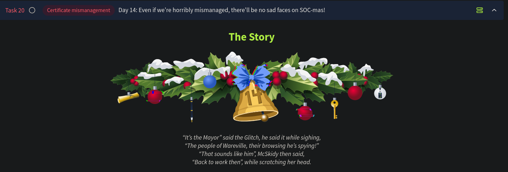

# Day 14 - Certificate Mismanagement



*It’s a quiet morning in the town of Wareville. A wholesome town where cheer and tech come together. McSkidy is charged to protect the GiftScheduler, the service elves use to schedule all the presents to be delivered in Wareville. She assigned Glitch to the case to make sure the site is secure for G-Day (Gift Day). In the meantime, Mayor Malware works tirelessly, hoping to not only ruin SOC-mas by redirecting presents to the wrong addresses but also to ensure that Glitch is blamed for the attack. After all, Glitch’s warnings about the same vulnerabilities Mayor Malware is exploiting make the hacker an easy scapegoat.*

# Understanding Certificates

### Key Components of a Certificate:

- **Public Key**:
    - Part of a cryptographic key pair (public and private).
    - Used to encrypt data and is publicly available.
- **Private Key**:
    - Remains secret, used to decrypt data.
- **Metadata**:
    - Includes information such as:
        - Certificate Authority (CA).
        - Subject (e.g., website information like `www.meow.thm`).
        - Unique identifier, validity period, signature, and hashing algorithm.

---

## Certificate Authority (CA)

### Role of a CA:

- Trusted entities issuing certificates (e.g., GlobalSign, Let’s Encrypt, DigiCert).
- Browsers trust these entities and validate their issued certificates.

### Steps in Certificate Validation:

1. **Handshake**:
    - Browser requests a secure connection.
    - Website responds with a certificate (public key + metadata).
2. [**Verification**](https://www.sectigo.com/resource-library/dv-ov-ev-ssl-certificates):
    - Browser checks certificate validity:
        - Issued by a trusted CA?
        - Not expired or tampered with?
    - Passes if valid and trusted.
3. **Key Exchange**:
    - Browser encrypts a session key using the public key.
4. [**Decryption**](https://deviceauthority.com/symmetric-encryption-vs-asymmetric-encryption/):
    - Server uses private key to decrypt session key.
    - Both browser and server use the session key for secure communication.

### HTTPS Security:

- Certificates enable **authentication**, **encryption**, and **data integrity**.

---

## Self-Signed Certificates vs. Trusted CA Certificates

### Self-Signed Certificates:

- Signed by the same entity that issues them.
- **Risk**: Browsers don’t trust them without third-party verification.
    - Vulnerable to attacks like **man-in-the-middle**.
- Suitable for:
    - Internal or air-gapped development environments (no public Internet access).

### Trusted CA Certificates:

- Verified by a CA acting as a trusted third party.
- Secure for public communication.
- Time-consuming to acquire, but ensure robust security.

---

## G-Day Threat: Mayor Malware's Plan

### Goal:

- Disrupt G-Day by hacking the Gift Scheduler and altering delivery schedules.

### Preparation:

- **Check Vulnerability**:
    - Verify the self-signed certificate's validity; suspicious it might be a trap.
- **Cover Tracks**:
    - Modify `/etc/hosts` file to resolve the Gift Scheduler’s Fully Qualified Domain Name (FQDN) locally:
        
        ```bash
        echo "MACHINE_IP gift-scheduler.thm" >> /etc/hosts
        ```
        
    - Prevent DNS logs from revealing his activities.
- Now navigate to `https://gift-scheduler.thm`. On the warning page, click on view certificate to obtain more details on it:
    
    
    
    
- Turns out the website is using a self-signed certificate.
- As Mayor Malware, we would need to sniff out some credentials. To do this, we need to setup burp to be the proxy of all connections.
- We must set the listening port to `8080` and toggle the `Specific address` option. The box next to it will automatically specify the IP address of our AttackBox, `CONNECTION_IP`. Finally, we can click on `OK` to apply the configuration.
    - Burp Suite already comes with a self-signed certificate. The users will be prompted to accept it and continue, and Mayor Malware knows they will do it out of habit, without even thinking of verifying the certificate origin first.

### **Sniff From The Middle**

- Now that our machine is ready to listen, we must reroute all Wareville traffic to our machine.
    - To do this, we will be setting up our attack box as the gateway.
    - Let’s add another line to the AttackBox’s `/etc/hosts` file.
        
        **Note:** The `CONNECTION_IP` address in the snippet should reflect the IP of our AttackBox, 
        
    
    ```bash
    echo "CONNECTION_IP wareville-gw" >> /etc/hosts
    ```
    
    - This will divert all of Wareville’s traffic, usually routed through the legitimate Wareville Gateway, to Mayor Malware’s machine, effectively putting him “In The Middle” of the requests.
        - **Note:** In practice, the adversary can launch a similar attack if they can control the user’s gateway and their attack can easily succeed against websites not using properly signed certificates. This attack requires more than adding an entry into the `/etc/hosts` file; however, this task aims to emulate parts of the attack.
    - As a last step, we must start a custom script to simulate the users’ requests to the Gift Scheduler.

### **Pwn the Scheduler**

We can now use the `HTTP History` tab to view the intercepted requests and make changes to them to achieve Mayor Malware’s goals.

---

## Questions

1. What is the name of the CA that has signed the Gift Scheduler certificate?
    
    
    
    Ans.: **THM**
    
2. Look inside the POST requests in the HTTP history. What is the password for the `snowballelf` account?
    
    
    
    Ans.: **c4rrotn0s3**
    
3. Use the credentials for any of the elves to authenticate to the Gift Scheduler website. What is the flag shown on the elves’ scheduling page?
After logging in as the `snowballelf`user, we are able to view the scheduling page which contains our flag:

    
    
    
    Ans.: **THM{AoC-3lf0nth3Sh3lf}**
    
4. What is the password for Marta May Ware’s account?
    
    
    
    Ans.: **H0llyJ0llySOCMAS!**
    
5. Mayor Malware finally succeeded in his evil intent: with Marta May Ware’s username and password, he can finally access the administrative console for the Gift Scheduler. G-Day is cancelled! What is the flag shown on the admin page?
    
    Logging in as Martha May Ware using the credentials retrieved from the request in the previous question, we are able to view the admin console, which also contains our flag:
    
    
    
    Ans.: **THM{AoC-h0wt0ru1nG1ftD4y}**