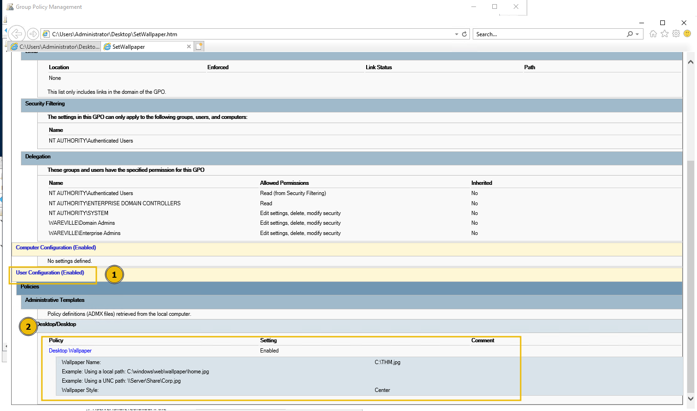

# Day 15 - Active Directory

*Ahead of SOC-mas, the team decided to do a routine security check of one of their Active Directory domain controllers. Upon some quick auditing, the team noticed something was off. Could it be? The domain controller has been breached? With sweat on their brows, the SOC team smashed the glass and hit the panic alarm. There's only one person who can save us…*

# Active Directory Overview

## Introduction to Active Directory (AD)

Active Directory is a **Directory Service** designed to manage and provide access to resources within an organization using **Lightweight Directory Access Protocol (LDAP)**. Key objects managed by AD include:

- **Users**: Accounts representing people or services.
- **Groups**: Collections of users or other objects with specific permissions.
- **Computers**: Machines within the domain governed by AD.
- **Printers and Other Resources**: Network-accessible devices or services.

### Building Blocks of AD

1. **Domains**: Logical groupings of resources (users, computers, etc.), identified by **Domain Components (DC)** and controlled under common policies.
2. **Organizational Units (OUs)**: Containers for grouping objects within a domain for easier management and granular control via **Group Policies**.
3. **Forest**: A top-level container holding one or more domains that share a schema and configuration.
4. **Trust Relationships**: Allow inter-domain and inter-forest access to resources.

**Distinguished Name (DN)** Example:
`DN=CN=Mayor Malware, OU=Management, DC=wareville, DC=thm`

---

## Core Active Directory Components

1. **Domain Controllers (DCs)**:
    - Hosts AD services.
    - Stores AD database.
    - Handles authentication and authorisation.
    - Replicates updates across DCs for consistency.
2. **Global Catalog (GC)**:
    - A searchable database with information on all directory objects.
    - Enables locating objects across domains in a forest.
3. **LDAP**:
    - Used to query and modify directory data.
    - Ensures fast retrieval of information.
4. **Kerberos Authentication**:
    - Default secure authentication protocol using tickets rather than passwords.

---

## Group Policy

**Group Policy** enables administrators to enforce settings across domains. It manages:

- Password policies
- Software deployment
- Firewall settings

### Creating a Password Policy:

1. Open **Group Policy Management** (`gpmc.msc`).
2. Create and link a new **Group Policy Object (GPO)** named "Password Policy".
3. Edit the GPO:
    - Navigate to `Computer Configuration -> Policies -> Windows Settings -> Security Settings -> Account Policies -> Password Policy`.
    - Configure:
        - Minimum password length: **12 characters**.
        - Enforce password history: **10 passwords**.
        - Maximum password age: **90 days**.
        - Complexity requirements: **Enabled**.
4. Apply the GPO to the domain or specific OUs.

---

## Common Active Directory Attacks

1. **Golden Ticket Attack**:
    - Exploits **Kerberos** by forging a Ticket Granting Ticket (TGT) using the **krbtgt** account password hash.
    - Detection:
        - **Event ID 4768**: TGT requests for privileged accounts.
        - **Event ID 4672**: Assignment of special privileges.
2. **Pass-the-Hash**:
    - Utilizes stolen NTLM password hashes to authenticate without needing the actual password.
    - Mitigation:
        - Enforce strong passwords.
        - Regular privilege audits.
        - Implement Multi-Factor Authentication (MFA).
3. **Kerberoasting**:
    - Requests Kerberos service tickets, extracts password hashes, and cracks them offline.
    - Mitigation:
        - Use strong passwords for service accounts.
        - Apply secure policies across AD.
4. **Pass-the-Ticket**:
    - Uses stolen Kerberos tickets to authenticate.
    - Detection:
        - **Event ID 4768**: TGT requests from unusual devices.
        - **Event ID 4624**: Successful logins using stolen tickets.
5. **Malicious GPOs**:
    - Attackers abuse GPOs to:
        - Deploy malware.
        - Disable security features.
        - Execute malicious scripts.
    - Mitigation:
        - Regularly audit GPOs.
        - Enforce strict GPO modification permissions.
6. **Skeleton Key Attack**:
    - Installs a backdoor for bypassing passwords using a master password.
    - Mitigation involves auditing and securing domain controllers.

---

## Investigating Active Directory Breaches

### Group Policy

1. **Reviewing GPOs**:
    - Use `Get-GPO` cmdlet to list all GPOs:
        
        ```powershell
        PS C:\Users\Administrator> Get-GPO -All
        
        DisplayName      : Default Domain Policy
        DomainName       : wareville.thm
        Owner            : WAREVILLE\Domain Admins
        Id               : 31b2f340-016d-11d2-945f-00c04fb984f9
        GpoStatus        : AllSettingsEnabled
        Description      :
        CreationTime     : 10/14/2024 12:17:31 PM
        ModificationTime : 10/14/2024 12:19:28 PM
        UserVersion      : AD Version: 0, SysVol Version: 0
        ComputerVersion  : AD Version: 3, SysVol Version: 3
        WmiFilter        :
        
        DisplayName      : Default Domain Controllers Policy
        DomainName       : wareville.thm
        Owner            : WAREVILLE\Domain Admins
        Id               : 6ac1786c-016f-11d2-945f-00c04fb984f9
        GpoStatus        : AllSettingsEnabled
        Description      :
        CreationTime     : 10/14/2024 12:17:31 PM
        ModificationTime : 10/14/2024 12:17:30 PM
        UserVersion      : AD Version: 0, SysVol Version: 0
        ComputerVersion  : AD Version: 1, SysVol Version: 1
        WmiFilter        :
        
        DisplayName      : SetWallpaper GPO
        DomainName       : wareville.thm
        Owner            : WAREVILLE\Domain Admins
        Id               : d634d7c1-db7a-4c7a-bf32-efca23d93a56
        GpoStatus        : AllSettingsEnabled
        Description      : Set the wallpaper of every domain joined machine
        CreationTime     : 10/30/2024 9:01:36 AM
        ModificationTime : 10/30/2024 9:01:36 AM
        UserVersion      : AD Version: 0, SysVol Version: 0
        ComputerVersion  : AD Version: 0, SysVol Version: 0
        WmiFilter        :
        ```
        
    - Export GPOs for analysis:
        
        ```powershell
        Get-GPO -Name "SetWallpaper" -ReportType HTML -Path "C:\\SetWallpaper.html"
        ```
        
        Then, when opening the HTML file in the browser, we are presented with an overview of things such as:
        
        - When the policy was created and modified.
        - What devices or users the GPO applies to.
        - The permissions over the GPO.
        - The user or computer configurations that it enforces.
        
        
        
2. **Detecting Modified GPOs**:
    - Identify recently modified GPOs (possibly by an attacker):
        
        ```powershell
        PS C:\Users\Administrator\Desktop> Get-GPO -All | Where-Object { $_.ModificationTime } | Select-Object DisplayName, ModificationTime
        
        DisplayName                                ModificationTime
        -----------                                ----------------
        Default Domain Policy                      10/14/2024 12:19:28 PM
        Default Domain Controllers Policy          10/14/2024 12:17:30 PM
        SetWallpaper                               10/31/2024 1:01:04 PM
        
        ```
        

### Event Viewer

- Windows comes packaged with the Event Viewer. This invaluable repository stores a record of system activity, including security events, service behaviours, and so forth.
    - For example, within the "Security" tab of Event Viewer, we can see the history of user logins, attempts and logoffs. The screenshot below shows a record of the user "cmnatic" attempting to log into the device.
        
        
        
- **Useful Event IDs**:
    - **4624**: User account logged on.
    - **4625**: Failed logon attempt.
    - **4672**: Special privileges assigned.
    - **4768**: TGT requested for high-privileged accounts.

### User Auditing

User accounts are a valuable and often successful method of attack. You can use Event Viewer IDs to review user events and PowerShell to audit their status. Attack methods such as password spraying will eventually result in user accounts being locked out, depending on the domain controller's lockout policy.

**Locked Accounts**:

```powershell
Search-ADAccount -LockedOut | Select-Object Name, SamAccountName, LockedOut, LastLogonDate, DistinguishedName
```

Additionally, a great way to quickly review the user accounts present on a domain, as well as their group membership, is by using the `Get-ADUser` cmdlet, demonstrated below:

```powershell
           
PS C:\Users\Administrator\Desktop> Get-ADUser -Filter * -Properties MemberOf | Select-Object Name, SamAccountName, @{Name="Groups";Expression={$_.MemberOf}}

Name           SamAccountName Groups
----           -------------- ------
Administrator  Administrator  {CN=Group Policy Creator Owners,CN=Users,DC=wareville,DC=thm, CN=Domain Admins,CN=Users,DC=wareville,DC=thm, CN=Enterprise Admins,CN=Users,DC=wareville,DC=thm, CN=Schema ...
Guest          Guest          CN=Guests,CN=Builtin,DC=wareville,DC=thm
krbtgt         krbtgt         CN=Denied RODC Password Replication Group,CN=Users,DC=wareville,DC=thm
tryhackme      tryhackme      CN=Domain Admins,CN=Users,DC=wareville,DC=thm
DAVID          DAVID
James          James
NewAccount     NewAccount
cmnatic        cmnatic        {CN=Domain Admins,CN=Users,DC=wareville,DC=thm, CN=Remote Desktop Users,CN=Builtin,DC=wareville,DC=thm}
```

### PowerShell History

PowerShell, like Bash on Linux, keeps a history of the commands inputted into the session. Reviewing these can be a fantastic way to see recent actions taken by the user account on the machine.

1. **Location**:
    - `%APPDATA%\Microsoft\Windows\PowerShell\PSReadLine\ConsoleHost_history.txt`
    
    
    
2. **PowerShell Logs**:
    - Event Viewer Path: `Application and Services Logs -> Microsoft -> Windows -> PowerShell -> Operational`.
    
    
    

---

## Questions

Questions 1 & 2 make use of the “Security” tab in the Event Viewer.

1. On what day was Glitch_Malware last logged in? Answer format: DD/MM/YYYY

    
    
    
    The default format in event viewer is mm/dd/yyyy. 
    Ans.: **7/11/2024**
    
2. What event ID shows the login of the Glitch_Malware user?
Ans.: **4624**


3. Read the PowerShell history of the Administrator account. What was the command that was used to enumerate Active Directory users?
Navigating to `%APPDATA%\Microsoft\Windows\PowerShell\PSReadLine` and reading the contents of the file `ConsoleHost_history.txt`, we can see the enumeration command as follows:
    
    
    
    Ans.: **Get-ADUser -Filter * -Properties MemberOf | Select-Object Name**
 

4. Look in the PowerShell log file located in `Application and Services Logs -> Windows PowerShell`. What was Glitch_Malware's set password?

    
    
    
    Ans.: **SuperSecretP@ssw0rd!**
 

5. Review the Group Policy Objects present on the machine. What is the name of the installed GPO?
    
    Using the `Get-GPO -All` cmdlet in PowerShell, we are able to see a list of all GPOs:
    
    
    
    Here we can see an out of the normal Group Policy Object, which must be the installed GPO.
    
    Ans.: **Malicious GPO - Glitch_Malware Persistence**