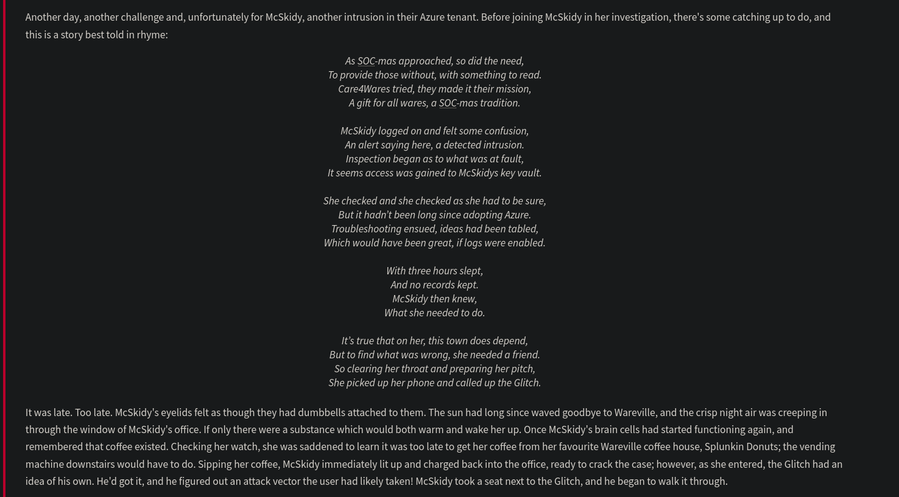

# Day 16 - Azure



# Intro to Azure

### Why McSkidy Chose Azure

### Challenges with On-Premises Infrastructure:

- **Initial Setup**:
    - Hosted various resources like:
        - Appointment-making web application.
        - Machines for investigations and evidence storage.
    - Managed all machines herself on-premises.
- **Scalability Issues**:
    - Increased demand during peak times required scaling resources up and down.
    - Managing infrastructure manually became a hassle.

### Azure as a Solution:

- **Cloud Service Provider (CSP)**:
    - Provides computing resources on demand, scalable as needed.
    - Handles infrastructure management for McSkidy.
    - **Pay-As-You-Use Model**:
        - No need for unused physical infrastructure during low demand.
- **Additional Benefits**:
    - Access to over 200 Azure services.
    - Services for identity management, data ingestion, and application development.
    - Optimized resource handling for future scalability and upgrades.

---

## Key Azure Services

### 1. **Azure Key Vault**:

- **Purpose**: Securely store and access secrets such as:
    - API keys.
    - Certificates.
    - Passwords.
    - Cryptographic keys.
- **Key Features**:
    - Secrets stored in vaults controlled by vault owners.
    - Vault owners:
        - Enable auditing to track access.
        - Assign permissions to vault consumers.
- **Usage by McSkidy**:
    - Stores evidence-related secrets and Wareville’s town secrets.

### 2. **Microsoft Entra ID** (formerly Azure Active Directory):

- **Purpose**: Identity and Access Management (IAM) service.
- **Key Features**:
    - Manages access to resources.
    - Assigns permissions to users/applications.
- **Usage by McSkidy**:
    - Enables Wareville town members to securely access or update their secrets.

---

## Assumed Breach Scenario

### Context:

- **Definition**: Penetration testing setup assuming an attacker has an initial foothold.
- **Objective**:
    - Assess the extent of damage an attacker can cause after gaining access.
    - Identify attack paths branching out from the initial intrusion.

### McSkidy's Approach:

- Conducted an **Assumed Breach test** within Wareville’s Azure tenant.
- Focused on mapping potential attack paths from the breach point.

For this Assumed Breach testing of Wareville's tenant, McSkidy will provide valid credentials. To get the credentials, click the **Cloud Details:**


To use the credentials, click the **Open Lab** button in the **Environment** tab. This will open the [Azure Portal](https://portal.azure.com/) login page, and use the recently generated credentials to authenticate to the Azure Portal. 


# Azure Cloud Shell and Azure CLI

## Azure Cloud Shell

### Overview:

- **Definition**: A browser-based command-line interface for managing Azure resources.
- **Key Features**:
    - Combines **Bash** and **PowerShell** environments.
    - Includes pre-configured tools such as:
        - **Azure CLI**.
        - **Azure PowerShell**.
        - Other popular development tools.
    - No local installation required.

### Use Cases:

- Execute scripts.
- Manage Azure services.
- Run commands efficiently via a web browser.

---

## Azure CLI

### Overview:

- **Definition**: Command-line tool for managing and configuring Azure resources.
- **Role in Attack Path**:
    - Used heavily by the Glitch during the review of the Wareville tenant.
    - Central to managing Azure in the walkthrough.

---

## Setting Up and Using Azure CLI in Azure Cloud Shell

### Launching Azure Cloud Shell:

1. **Access**:
    - Open the **Azure portal**.
    - Click on the terminal icon to launch Azure Cloud Shell.
        
        
        
2. **Environment Selection**:
    - Choose **Bash** (preferred for Azure CLI commands).
    
    
    
    - Select **No storage account required**.
    - Use the **Az-Subs-AoC** subscription.
    
    
    
    
    
    At this point, we are ready to execute Azure CLI commands in the Azure Cloud Shell.
    

### Authentication:

- No need to run `az login` as the session is pre-authenticated within the Azure portal.
- **Verification**:
    - Execute an initial command.
        
        ```bash
        usr-xxxxxxxx [ ~ ]$ az ad signed-in-user show
        
        {
          "@odata.context": "https://graph.microsoft.com/v1.0/$metadata#users/$entity",
          "businessPhones": [],
          "displayName": "usr-xxxxxxxx",
          "givenName": null,
          "id": "3970058b-7741-49c5-b1a7-191540995f7a",
          "jobTitle": null,
          "mail": null,
          "mobilePhone": null,
          "officeLocation": null,
          "preferredLanguage": null,
          "surname": null,
          "userPrincipalName": "usr-xxxxxxxx@aoc2024.onmicrosoft.com"
        }
        ```
        
    - Ensure output displays authenticated user details to confirm credentials.

---

### **Entra ID Enumeration**

- Listing all the users in the tenant.

```bash
           
usr-xxxxxxxx [ ~ ]$ az ad user list
```

The Azure CLI typically uses the following command syntax: `az GROUP SUBGROUP ACTION OPTIONAL_PARAMETERS`. Given this, the command above can be broken down into:

- Target group or service: `ad` (Azure AD or Entra ID)
- Target subgroup: `user` (Azure AD users)
- Action: `list`

To view just the accounts prepended with `wvusr-` , we can make use of the `--filter` flag with the command above:

```bash
           
usr-xxxxxxxx [ ~ ]$ az ad user list --filter "startsWith('wvusr-', displayName)"

...
  {
    "businessPhones": [],
    "displayName": "wvusr-backupware",
    "givenName": null,
    "id": "1db95432-0c46-45b8-b126-b633ae67e06c",
    "jobTitle": null,
    "mail": null,
    "mobilePhone": null,
    "officeLocation": "REDACTED",
    "preferredLanguage": null,
    "surname": null,
    "userPrincipalName": "wvusr-backupware@aoc2024.onmicrosoft.com"
  },
...
```

This could have been the first step taken by the attacker.

- Listing groups:

```bash
usr-xxxxxxxx [ ~ ]$ az ad group list
[
  {
    ---REDACTED FOR BREVITY---
    "description": "Group for recovering Wareville's secrets",
    "displayName": "Secret Recovery Group",
    "expirationDateTime": null,
    ---REDACTED FOR BREVITY---
  }
]
```

 it can be seen that a group named `Secret Recovery Group` exists. This is kind of an interesting group because of the description. To get more information on this group we can now see who are the members of this group:

```bash
usr-xxxxxxxx [ ~ ]$ az ad group member list --group "Secret Recovery Group"
[
  {
    "@odata.type": "#microsoft.graph.user",
    "businessPhones": [],
    "displayName": "wvusr-backupware",
    ---REDACTED FOR BREVITY---
  }
]
```

All of the previous commands seem to point to the `wvusr-backupware` account.  We can now use this user’s credentials to dig up further interesting information!

```bash
usr-xxxxxxxx [ ~ ]$ az account clear
usr-xxxxxxxx [ ~ ]$ az login -u EMAIL -p PASSWORD
```

### Azure Role Assignments

- **Purpose**: Define the resources that users or groups can access within Azure.
- **Default Behavior**:
    - New users created via **Microsoft Entra ID** lack access to resources by default.
    - **No Role = No Access**.

## Assigning Roles:

- **Role Assignment**:
    - An administrator assigns a role to grant resource access.
    - Specifies the level of access for a user or group:
        - **Read-Only**: Limited to viewing resources.
        - **Full-Control**: Includes management and modification privileges.
- **Group Role Inheritance**:
    - Members of a group inherit the role assigned to that group.
    - Simplifies access management for multiple users.

Use the `--all` option to list all roles within the Azure subscription, and use the `--assignee` option with the group's ID to render only the ones related to our target group.

```bash
usr-xxxxxxxx [ ~ ]$ az role assignment list --assignee REPLACE_WITH_SECRET_RECOVERY_GROUP_ID --all
[
  {
    ---REDACTED FOR BREVITY---
    "principalName": "Secret Recovery Group",
    "roleDefinitionName": "Key Vault Secrets User",
    "scope": "/subscriptions/{subscriptionId}/resourceGroups/rog-aoc-kv/providers/Microsoft.KeyVault/vaults/warevillesecrets",
    ---REDACTED FOR BREVITY---
  },
  {
    ---REDACTED FOR BREVITY---
    "principalName": "Secret Recovery Group",
    "roleDefinitionName": "Key Vault Reader",
    "scope": "/subscriptions/{subscriptionId}/resourceGroups/rog-aoc-kv/providers/Microsoft.KeyVault/vaults/warevillesecrets",
    ---REDACTED FOR BREVITY---
  }
]
```

- First, it can be seen that there are two entries in the output, which means two roles are assigned to the group.
- Based on the `roleDefinitionName` field, the two roles are `Key Vault Reader` and `Key Vault Secrets User`.
- Both entries have the same scope value, pointing to a Microsoft Key Vault resource, specifically on the `warevillesecrets` vault.

Definition of the roles based on the [Microsoft documentation](https://learn.microsoft.com/en-us/azure/role-based-access-control/built-in-roles):

| **Role** | **Microsoft Definition** | **Explanation** |
| --- | --- | --- |
| Key Vault Reader | Read metadata of key vaults and its certificates, keys, and secrets. | This role allows you to read metadata of key vaults and its certificates, keys, and secrets. 
Cannot read sensitive values such as secret contents or key material. |
| Key Vault Secrets User | Read secret contents. Only works for key vaults that use the 'Azure role-based access control' permission model. | This special role allows you to read the contents of a Key Vault Secret. |

This configuration allowed the attacker to access the sensitive data!

---

### **Azure Key Vault**

List the accessible key vaults by executing the command below:

```bash
usr-xxxxxxxx [ ~ ]$ az keyvault list
[
  {
    "id": "/subscriptions/{subscriptionId}/resourceGroups/rog-aoc-kv/providers/Microsoft.KeyVault/vaults/warevillesecrets",
    "location": "eastus",
    "name": "warevillesecrets",
    "resourceGroup": "rg-aoc-kv",
    "tags": {
      "aoc": "rg"
    },
    "type": "Microsoft.KeyVault/vaults"
  }
]
```

The output above confirms the key vault discovered from the role assignments named `warevillesecrets`. Now, let's see if secrets are stored in this key vault.

```bash
usr-xxxxxxxx [ ~ ]$ az keyvault secret list --vault-name warevillesecrets
[
  {
    ---REDACTED FOR BREVITY---
    "id": "https://warevillesecrets.vault.azure.net/secrets/REDACTED",
    "managed": null,
    "name": "REDACTED",
    "tags": {}
  }
]
```

After executing the two previous commands, we confirmed that the **Reader** role allows us to view the key vault metadata, specifically the list of key vaults and secrets. Now, the only thing left to confirm is whether the current user can access the contents of the discovered secret with the **Key Vault Secrets User** role. This can be done by executing the following command.

```bash
usr-xxxxxxxx [ ~ ]$ az keyvault secret show --vault-name warevillesecrets --name REDACTED
{
  ---REDACTED FOR BREVITY---
  "id": "https://warevillesecrets.vault.azure.net/secrets/REDACTED/20953fbf6d51464299b30c6356b378fd",
  "kid": null,
  "managed": null,
  "name": "REDACTED",
  "tags": {},
  "value": "REDACTED"
}
```

# Wrapping Up: Discovering the Attack Path

## Key Discoveries:

- **Attack Path**:
    - The Glitch assisted McSkidy in identifying the steps taken to escalate a user’s privileges within the Azure tenant.
    - Significant insights were gained into how the attack occurred.

---

## Unresolved Questions:

- **Who Was the Attacker?**:
    - Only a limited number of Wareville users had access to the tenant.
    - These users primarily consisted of town officials responsible for governance validation.
- **Motive**:
    - The only accessed item was an **access key** stored in the Azure Key Vault.
    - The key granted access to an evidence file related to recent cyber events in Wareville.

---

## Next Steps:

- Investigate the motive further to understand the attacker’s intent.
- Monitor activity over the coming days to uncover the identity of the perpetrator and secure Wareville’s resources.

---

## Questions

1. What is the password for backupware that was leaked?
    
    The password was leaked after using the command `az ad user list --filter "startsWith('wvusr-', displayName)"` :
    
    
    
    Ans.: **R3c0v3r_s3cr3ts!**
    
2. What is the group ID of the Secret Recovery Group?
    
    The group ID can be retrieved by using the command `az ad group list` :
    
    
    
    Ans.: **7d96660a-02e1-4112-9515-1762d0cb66b7**
    
3. What is the name of the vault secret?
    
    The name of the vault secret can be retrieved by using the command `az keyvault secret list --vault-name warevillesecrets` :
    
    
    
    Ans.: **aoc2024**
    
4. What are the contents of the secret stored in the vault?
    
    The contents of the secret aoc2024 can be retrieved by using the command `az keyvault secret show --vault-name warevillesecrets --name aoc2024`:
    
    
    
    Ans.: **WhereIsMyMind1999**