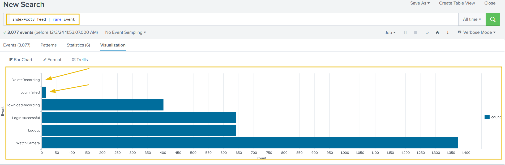

# Day 17 - Log Analysis 3


# Background Story

### The Incident:

- **Marta May Ware**:
    - Discovered that the main server was disconnected from the Wareville network.
    - Contacted **WareSec&Aware** to view the data centre's CCTV recordings.
- **WareSec&Aware's Response**:
    - Denied access to CCTV streams due to privacy policies.
    - Only the camera owner can view the recordings.
    - Claimed there were **no recordings of anyone entering the data centre yesterday**.

### The Supposition:

- **Suspicion**:
    - WareSec&Aware speculated the recordings were deleted via the camera's managing web page.
- **The Owner of the Cameras**:
    - Byte, Glitch's loyal dog, owns the cameras.
    - Glitch trusted Byte as a safeguard to prevent human tampering.
    - Glitch is determined to clear Byte's name, suspecting foul play.

---

## The Question:

- **McSkidy's Concern**:
    - Why did WareSec&Aware make assumptions without concrete proof?
    - Shouldn't **log files** confirm or refute the deletion?
    
    ---
    

## The Log Files:

- **Marta May's Information**:
    - Logs are backed up every 6 hours.
    - Attempts to search logs using keywords (e.g., camera IDs or "delete") yielded **unreadable results**.
    
    ```bash
    user@tryhackme$ cat cctv_logs.log| grep -i "11"         
    2024-12-16 22:53:06 WatchCamera 5 byte 11 rij5uu4gt204q0d3eb7jj86okt
    RecordingInfo: 1 11 rij5uu4gt204q0d3eb7jj86okt
    2024-12-16 22:53:22 WatchCamera 5 byte 11 rij5uu4gt204q0d3eb7jj86okt
    RecordingInfo: 1 11 rij5uu4gt204q0d3eb7jj86okt
    2024-12-16 22:53:25 WatchCamera 5 byte 11 rij5uu4gt204q0d3eb7jj86okt
    user@tryhackme$ 
    user@tryhackme$ cat cctv_logs.log| grep -i "download"               
    2024-12-16 22:52:50 DownloadRecording 5 byte 51 10 opfg6ns9khsbpq0u4us6dro2m8
    ```
    

---

## Next Steps:

- **McSkidy's Plan**:
    - Involve the **SOC team** equipped with a SIEM (Security Information and Event Management system).
    - Analyze the log files to uncover the truth.

---

## Investigating using Splunk

After opening the URL [https://lab_web_url.p.thmlabs.com/](https://lab_web_url.p.thmlabs.com/), navigate to `Search and Reporting` . Next, we can run the query `index=*` , to retrieve all logs (make sure to select `All Time` in the Time selector).


After running the query, we will be presented with two separate datasets pre-ingested to Splunk. We can verify this by clicking on the `sourcetype` field in the fields list on the left of the page.


The two datasets are as follows:

- `web_logs`: This file contains events related to web connections to and from the CCTV web server.
- `cctv_logs`: This file contains information about the CCTV application access logs.

We can now analyze these logs to to identify the culprit, who got unauthorized access to the server and deleted the CCTV streams.

### Examining CCTV Logs

Now we will stick with `index=* sourcetype=cctv_logs` to investigate only the cctv logs.


After examining the logs, we can figure out the following main issues:

- Logs are not parsed properly by Splunk.
- Splunk does not consider the actual timeline of the event; instead, it uses only the ingestion time.

Since this is a custom datasource, Splunk was unable to parse the logs properly. We can fix this by using the `Extract New Fields` option, where we will instruct the parser to extract fields using regular expressions.

1. Click on the `Extract New Fields` option, located below the fields list on the left of the page.

    
    
    

1. Select a sample event to configure the parsing on the next page.
    
    
    

1. Splunk uses either regular expressions or delimiters to carve out individual fields from the log. Here we will choose the regular expression option.
    
    
    

1. Now, to select the fields in the logs that we want to extract, we simply need to highlight them in the sample log. Splunk will autogenerate the regex (regular expression) to extract the selected field.
    
    
    

1. Assign an appropriate name to each of the extracted fields based on the table below:
    
    
    | **Timestamp** | **Event** | **User_id** | **UserName** | **Session_id** |
    | --- | --- | --- | --- | --- |
    | 2024-12-16 17:20:01 | Logout | 5 | byte | kla95sklml7nd14dbosc8q6vop |
    
    
    

1. In the next step, we will see a green tick mark next to the sample logs to indicate the correct extraction of the fields, or a red cross sign to signal an incorrect pattern, as shown below:
    
    
    

1. Now click Next to reach the final screen where we will Save our settings. 
This tab shows us the regular expression created, the fields extracted, and the sample event that contains the fields we wanted to extract. Let's save this session by clicking on the green `Finish` button at the top of the page and move on to the search tab to search the logs. To do so, we can click on the `Explore the fields I just created in Search` link on the next page.

    
    
    


1. We can verify that we successfully extracted the custom fields from the logs by clicking on any of our custom fields in the list on the left of the page. For example, if we click on the `UserName` field, we'll be presented with all the different values that have been extracted from the logs for this field.

    
    
    

We can also see certain fields have not been properly extracted:


some of the logs are a bit different from the ones we used as a baseline for the field extraction. Some of the log formats that our parser could not pick are mentioned below:

| **Sample Log** | 2024-12-16 23:45:56 **Login successful** 3 marta tktfav3m1mggj0pfjb7onm4qcv |
| --- | --- |
| **Sample Log** | 2024-12-16 22:47:12 Login failed glitch pass=ImtheB3st! rij5uu4gt204q0d3eb7jj86okt |

### **Removing the Fields Extraction**

1. Go to `Settings` -> `Fields` .
2. Click on the `Field extractions` tab; it will display all the fields extracted.
    
    
    

1. **Delete the Regex Pattern**
    
    This tab will display all the patterns/fields extracted so far in Splunk. We can look for the `cctv` related pattern in the list, or simply search `cctv` in the search bar, and it will display our recently created pattern. Once the right pattern is selected, click on the `Delete` button, as shown below.
    
    
    
    By doing this we are trying to improve our regular expression to capture fields from different type of logs present in the cctv_logs datasource.
    

1. **Open Filed Extractor**
    
    Next, click on the `Open Field Extractor` button, and it will take us to the same tab, where we can extract the fields again.
    
    4.1. **Update the Regex**
    
    This time, after selecting the right source type as `cctv_logs`, and time range as `All Time`, click on `I prefer to write the regular expression myself`.
    
    
    
    4.2. In the next tab, enter the regex `^(?P<timestamp>\d+\-\d+\-\d+\s+\d+:\d+:\d+)\s+(?P<Event>(Login\s\w+|\w+))\s+(?P<user_id>\d+)?\s?(?P<UserName>\w+)\s+.*?(?P<Session_id>\w+)$` and select `Preview`.
    
    
    

This regex will fix the field parsing pattern and extract all needed fields from the logs. Hit `Save` and on the next page, select `Finish`.

On the next page, once again, click on the `Explore the fields I just created in Search`.

---

**Investigating the CCTV Footage Logs**

After examining the CCTV feed logs, we have an idea of the information these logs provide us. A brief summary of these logs is:

- These logs contain the successful and failed login attempts from various users.
- They contain a few failed login attempts, which looks suspicious.
- They contain information about the CCTV footage being watched and downloaded.

1. **Event Count by Each User**
    
    Let's use the following search query to see the count of events by each user:
    
    `index=cctv_feed | stats count(Event) by UserName`
    


1. **Summary of the Event Count**
    
    We can create a summary of the event count to see what activities were captured in the logs using the following query:
    
    `index=cctv_feed | stats count by Event`
    
    
    

1. **Examining Rare Events**
    
    Using the following search query, let's look at the events with fewer occurrences in the event field to see if we can find something interesting:
    
    `index=cctv_feed | rare Event`
    
    
    
    We have a few failed login events and some `DeleteRecording` events as well.
    

1. We can now investigate the `Login Failed` events:
    
    `index=cctv_feed *failed* | table _time UserName Event Session_id`
    
    
    

Though we see the login failed attempts associated with multiple users, the `Session_id` field remains constant. 

1. We can now analyze what was happening in this session.
    
    `index=cctv_feed *put_Session_id_here* | table _time UserName Event Session_id`
    
    
    

1. Now we can analyze how many deletion events were captured:
    
    `index=cctv_feed *Delete*`
    
    
    

### Correlating with Web Logs

We know what is happening with regards to `cctv_feed` logs. We can tie this information together with the `web_logs` events to clearly understand what the attacker did to achieve their goals.

The `Session_id` field we found earlier is also present in the web logs. This field can therefore be used for correlation.


It is observed that only one IP address **10.11.105.33** is associated with the suspicious session ID.

Identify the footprint associated with the session ID.

`index=web_logs *rij5uu4gt204q0d3eb7jj86okt*`


 It is also important to note that, in this case, the details about the session IDs are found in the field status.


We see 2 other session ID values associated with the IP address we have. Next we have to observe what kind of activities were captured associated with the IP and these session IDs.

`index=web_logs clientip="10.11.105.33" | table _time clientip status uri ur_path file` 


 We can see logout events when the session ID was changed. We can try and investigate the other session ID values in the CCTV logs now.

---

### Connecting the Dots

Let’s use one of the session ID values we found in the web logs:

`index=cctv_feed *lsr1743nkskt3r722momvhjcs3*` 


Now we are able to see a username associated with the attack!

From the output, it seems the following was the timeline of the attack:

- Attacker bruteforce attempt on various accounts.
- There was a successful login after the failed attempts.
- Attacker watched some of the camera streams.
- Multiple camera streams were downloaded.
- Followed by the deletion of the CCTV footage.
- The web logs had an IP address associated with the attacker's session ID.
- We found two other session IDs associated with the IP address.
- We correlated back to the `cctv_feed` logs to find the traces of any
evidence revolving around those session IDs, and found the name of the
attacker.

---

## Questions

1. Extract all the events from the `cctv_feed` logs. How many logs were captured associated with the successful login?
    
    The number of logs associated with successful logins can be obtained using the following query:
    
    `index=cctv_feed | stats count by Event`
    
    
    
    Here we can see that successful logins have the Event type set to `Login Successful`. The count here is 642.
    
    Ans.: **642**
    
     
    
2. What is the Session_id associated with the attacker who deleted the recording?
    
    The session id can be for recording deletion can be retrieved using the following query:
    
    `index = cctv_logs event=DeleteRecording` 
    
    
    
    We see 2 such events associated with the user `byte` and both events have the same `Session_id` values.
    
    Ans.: **rij5uu4gt204q0d3eb7jj86okt**
    
3. What is the name of the attacker found in the logs, who deleted the CCTV footage?
    
    Using the other session Id value and continuing the investigation from above, we are able to see the username present in the cctv logs.
    
    
    
    All logs have the `UserName` value as `mmalware` . Therefore the attacker here is mmalware.
    
    Ans.: **mmalware**