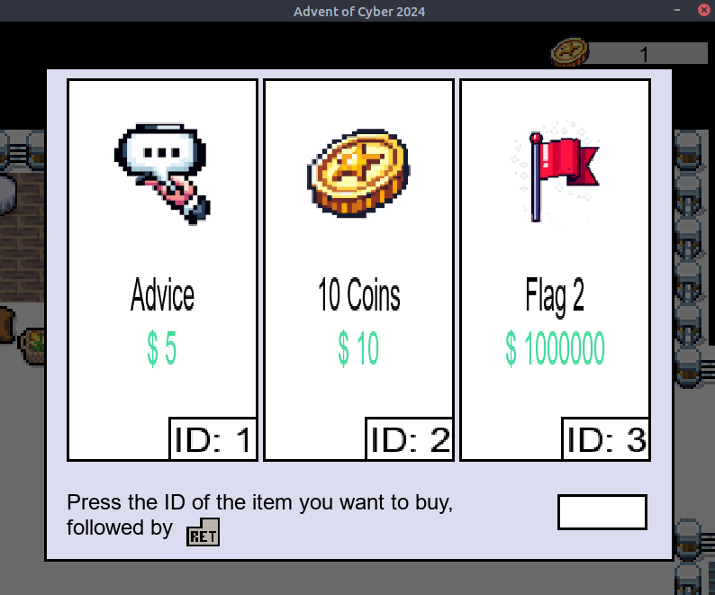

# Day 19 - Game Hacking


### Overview

- **Game hacking** is a small subset of the larger cyber security field.
- **Game industry revenue (2023)**: ~$183.9 billion, making it an attractive target for attackers.
- **Common malicious activities**:
    - Illegitimate game activations.
    - Bot automation.
    - Exploiting game logic.
- Requires specialized skills like memory management, reverse engineering, and networking (for online games).

### Executables and Libraries

### Executables:

- Standalone binary files containing compiled code ready for execution.
- Some executables rely on external libraries.

### Libraries:

- Collections of reusable functions (e.g., `.so` files).
- Cannot be executed independently; used by executables.
- Example: A library `libmaths` could include a function `add(x, y)` for summing two numbers.
    
    
    

### Attack Perspective:

- Applications trust libraries for correct operation.
- An attacker can intercept and modify function calls to alter input arguments or return values.

### Hacking with Frida

### Frida Overview:

- A tool for **analyzing, modifying, and interacting with applications** at runtime.
- **How it works**:
    - Creates a thread in the target process.
    - Executes bootstrap code to enable interaction (agent).
    - Injects JavaScript code to control the application's behavior.

### Key Functionality - Interceptor:

- Alters input/output of internal functions or observes behavior.
- Example: Modify parameters or return values for library functions.


### Example Scenario

In this example, a number is simply printed on the console.

```bash
ubuntu@tryhackme:~$ ./mainHello, 1!
Hello, 1!
Hello, 1!
Hello, 1!
Hello, 1!
Hello, 1!
Hello, 1!
Hello, 1!
```

What we want to achieve is replacing that value with an arbitrary one, let's say 1337.

Before proceeding, we will run `frida-trace` for the first time so that it creates **handlers** for each library function used by the game. By editing the handler files, we can tell Frida what to do with the intercepted values of a function call. To have Frida create the handler files, you would run the following command:

`frida-trace ./main -i '*'`

You will now see the `__handlers__` directory, containing JavaScript files for each function your application calls from a library. One such function will be called `say_hello()` and have a corresponding handler at `__handlers__/libhello.so/say_hello.js`, allowing us to interact with the target application in real-time.

Each handler will have two functions known as hooks since they are hooked into the 
function respectively before and after the function call:

- **onEnter:** From this function, we are mainly interested in the `args` variable, an array of pointers to the parameters used by our target function - a pointer is just an address to a value.
- **onLeave:** here, we are interested in the `retval` variable, which will contain a pointer to the variable returned.

```jsx
// Frida JavaScript script to intercept `say_hello`
Interceptor.attach(Module.getExportByName(null, "say_hello"), {
    onEnter: function (log, args, state) { },
    onLeave: function (log, retval, state) { }
});
```

We have pointers and not just variables because if we change any value, it has to be permanent; otherwise, we will modify a copy of the value, which will not be persistent.

Returning to the example scenario, we want to set the parameter with 1337. To do so, we must replace the first arguments of the args array: `args[0]` with a pointer to a variable containing 1337.

Frida has a function called `ptr()`that does exactly what we need: allocate some space for a variable and return its pointer. We also want to log the value of the original argument, and we have to use the function `toInt32()`, which reads the value of that pointer.

```jsx
// say_hello.js
// Hook the say_hello function from libhello.so

// Attach to the running process of "main"
Interceptor.attach(Module.findExportByName(null, "say_hello"), {
    onEnter: function (args) {
        // Intercept the original argument (args[0] is the first argument)
        var originalArgument = args[0].toInt32();
        console.log("Original argument: " + originalArgument);
        // Replace the original value with 1337
        args[0] = ptr(1337);
        log('say_hello()');
    }
});
```

When we rerun the executable with Frida, we notice that we can intercept the program's logic, setting 1337 as the parameter function. The original value is logged as expected using the following command:

```bash
ubuntu@tryhackme:~$ frida-trace ./main -i 'say*'Hello, 1337!
Original argument: 1
/* TID 0x5ec9 */
11 ms  say_hello()
Hello, 1337!
Original argument: 1
```

The parameter `-i` tells Frida which library to hook, and it can filter using the wildcard, tracing all the functions in all the libraries loaded.

---

## **TryUnlockMe - The Frostbitten OTP**

Start the game by running the following command on a terminal:

`cd /home/ubuntu/Desktop/TryUnlockMe && ./TryUnlockMe`

On exploring a bit, we can find a penguin asking us for a PIN:


Terminate the previous game instance and execute the following Frida command to intercept all the functions in the `libaocgame.so` library where some of the game logic is present:

`frida-trace ./TryUnlockMe -i 'libaocgame.so!*'`

If you revisit the NPC, you can trigger the OTP function on the console displayed as `set_otpi` :

```bash
ubuntu@tryhackme:~/Desktop/TryUnlockMe/$ frida-trace ./TryUnlockMe -i 'libaocgame.so!*'Instrumenting...

Started tracing 3 functions. Web UI available at http://localhost:1337/
/* TID 0x2240 */
7975 ms  _Z7set_otpi()
```

 We can see that the `set_otp` function is called during the NPC interaction. Open a new terminal, go to the `/home/ubuntu/Desktop/TryUnlockMe/__handlers__/libaocgame.so/` folder, and open Visual Studio Code.

```bash
ubuntu@tryhackme:~$ cd /home/ubuntu/Desktop/TryUnlockMe/__handlers__/libaocgame.so/ubuntu@tryhackme:~/Desktop/TryUnlockMe/__handlers__/libaocgame.so/$ code .ubuntu@tryhackme:~/Desktop/TryUnlockMe/__handlers__/libaocgame.so/$
```


The i at the end of the `set_otp` function indicates that an integer will be passed as a parameter. It will likely set the OTP by passing it as the first argument. To get the parameter value, use the `log` function, specifying the first elements of the array `args` on the `onEnter` function:

`log("Parameter:" + args[0].toInt32());`

The JavaScript file should look like the following:

```jsx
defineHandler({
  onEnter(log, args, state) {
    log('_Z7set_otpi()');
    log("Parameter:" + args[0].toInt32());
  },
  onLeave(log, retval, state) {
  }
});
```

```bash
ubuntu@tryhackme:~/Desktop/TryUnlockMe/$ frida-trace ./TryUnlockMe -i 'libaocgame.so!*'Instrumenting...

Started tracing 3 functions. Web UI available at http://localhost:1337/
           /* TID 0x2240 */
 39618 ms  _Z7set_otpi()
 39618 ms  Parameter:611696/code>
```

Now that the OTP has been retrieved we can advance to the next stage of the game.

---

## **TryUnlockMe - A Wishlist for Billionaires**

Exploring the new stage, we find another penguin with a costly item named Right of Pass.



We can again use Frida to intercept the function in charge of purchasing the item. The function `buy_item` displayed as: `_Z17validate_purchaseiii` has three i letters after its name to indicate that it has three integer parameters.

We can log those values using the log function for each parameter trying to buy something:

`log("Parameter1:" + args[0].toInt32())`

`log("Parameter2:" + args[1].toInt32())`

`log("Parameter3:" + args[2].toInt32())`

The JavaScript `buy_item` file should look like the following:

```jsx
defineHandler({
  onEnter(log, args, state) {
    log('_Z17validate_purchaseiii()');
    log('PARAMETER 1: '+ args[0]);
    log('PARAMETER 2: '+ args[1]);
    log('PARAMETER 3: '+ args[2]);

  },

  onLeave(log, retval, state) {

  }
});
```

We can then log something similar:

```bash
07685 ms  _Z17validate_purchaseiii()
365810 ms  PARAMETER 1: 0x1
365810 ms  PARAMETER 2: 0x5
365810 ms  PARAMETER 3: 0x1
```

By simple inspection, we can determine that the first parameter is the Item ID, the second is the price, and the third is the player's coins. 
If you manipulate the price and set it as zero, you can buy any item that you want:

`args[1] = ptr(0)`

The JavaScript `buy_item` file should look like the following:

```jsx
defineHandler({
  onEnter(log, args, state) {
    log('_Z17validate_purchaseiii()');
    args[1] = ptr(0)

  },

  onLeave(log, retval, state) {

  }
});
```

We can buy any item now!

---

## **TryUnlockMe - Naughty Fingers, Nice Hack**


For this stage, Friday displays the function as `_Z16check_biometricsPKc()` , meaning it does not take integer parameters, but strings.

By selecting the JavaScript file named `_Z16check_biometricsPKc`, add the following code to the `onEnter()` function as we did previously to debug the content of the parameter:

```jsx
defineHandler({
  onEnter(log, args, state) {
    log('_Z16check_biometricsPKc()');
    log("PARAMETER:" + Memory.readCString(args[0]))
  },

  onLeave(log, retval, state) {
  }
});
```

We should be able to log something similar:

```bash
1279884 ms  _Z16check_biometricsPKc()
1279884 ms  PARAMETER:1trYRV2vJImp9QiGEreHNmJ8LUNMyfF0W4YxXYsqrcdy1JEDArUYbmguE1GDgUDA
```

This output does not seem very helpful; we may have to consider another way. We can log the return value of the function by adding the following log instruction in the `onLeave` function:

```jsx
onLeave(log, retval, state) {
    log("The return value is: " + retval);
  }
});
```

We should be able to log something similar:

```bash
69399931 ms  The return value is: 0x0
```

So, the value returned is 0, which may indicate that it is a boolean flag set to False.

The following instruction will set it the return value to True:

`retval.replace(ptr(1))`

---

## Questions

1. What is the OTP flag?
    
    
    
    
    
    Ans.: **THM{one_tough_password}**
    
2. What is the billionaire item flag?
    
    
    
    Ans.: **THM{credit_card_undeclined}**
    
3. What is the biometric flag?
    
    To retrieve the biometric flag, we first begin by replacing the return value of the `_Z16check_biometricsPKc()` function from 0 to 1:
    
    
    
    Running the game with frida-trace again, we retrieve the flag:
    
    
    
    Ans.: **THM{dont_smash_your_keyboard}**