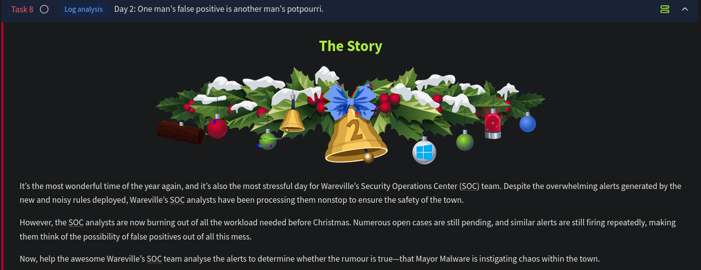

# Day 2 - Log Analysis

This challenge focuses on investigating a brute force attack and subsequent PowerShell command execution using the Elastic SIEM. Another aspect this challenge brings about is how an analyst can differentiate a True Positive from a False Positive alert using the context of the activity.

# True Positives or False Positives in a SOC

## Overview

- In a Security Operations Center (SOC), events from various devices are aggregated into a Security Information and Event Management (SIEM) system.
- **Detection Engineering rules** are set in the SIEM to identify malicious or suspicious activities.
- Alerts are triggered if an event or set of events meets rule conditions.
- Alerts are classified as:
    - **True Positive (TP):** Actual malicious activity.
    - **False Positive (FP):** Activity that is not malicious.

## Challenges in Classification

- Differentiating between TPs and FPs can be complex and time-consuming.
- Misclassification consequences:
    - **False FP (actually TP):** Missed cyberattack, potentially significant impact.
    - **False TP (actually FP):** Wastes analyst's time, reduces focus on real threats.

## Decision-Making in SOC

## The SOC Superpower

- Analysts can confirm activities by contacting the involved user or referencing Change Requests.
- Benefits:
    - Allows quick validation of legitimate activities.
    - Mature organizations require IT changes to go through approved Change Requests.

### Hindrances to the SOC

1. Lack of a change request process.
2. Activities outside or differing from approved change requests.
3. Alerts from benign activities (e.g., copying files, failed logins).
4. Insider threats performing unauthorized actions.
5. Users tricked into malicious actions via social engineering.

## Building Context for Alerts

- Analysts must consider the activity's context and use their security knowledge to judge its intent.
- Steps for context building:
    1. Review the user's past behavior and organizational norms.
    2. Identify unusual patterns (e.g., a non-technical employee using a technical tool like Wireshark).

## Event Correlation

- **Definition:** Recreating a timeline by correlating events to form a coherent story.
- Important artifacts to track:
    - IP addresses, machine names, user names, hashes, file paths, etc.
- **Process:**
    - Form hypotheses and verify them with supporting evidence.
    - Example Hypothesis: User downloaded malware from a spoofed domain.
        - Evidence: Proxy logs, parent process details, command-line parameters.
- **Determining Intent:**
    - Malware executed by:
        - **User action (intentional or tricked):** Parent process = Windows Explorer.
        - **Application vulnerability:** Parent process = Browser or Word Processor.

## Key Takeaways

- Effective classification of alerts as TP or FP is crucial for SOC efficiency and security.
- Leveraging context and correlation improves accuracy in alert analysis.
- Validation through organizational processes and direct user contact is essential but has limitations.

---

## Current Scenario:

- **Mayor's Office Alert:**
    - Analysts received an alert about multiple encoded PowerShell commands executed on their systems.
    - This has added complexity to the already challenging situation.

### Analyst Support:

- Analysts require additional support during this period of increased alert volume to reduce errors in classification.

### Next Steps:

- Investigate the encoded PowerShell commands.
- Provide targeted assistance to reduce alert fatigue and improve accuracy in distinguishing TPs and FPs.

---

## Investigation

According to the alert sent by the Mayor's office, the activity occurred on Dec 1st, 2024, between 0900 and 0930. 

To make the events more readable, we can include only the fields of interest in the tabular view. The fields we will be using are:

- The hostname where the command was run. We can use the `host.hostname` field as a column for that.
- The user who performed the activity. We can add the `user.name` field as a column for this information.
- We will add the `event.category` field to ensure we are looking at the correct event category.
- To know the actual commands run using PowerShell, we can add the `process.command_line` field.
- Finally, to know if the activity succeeded, we will add the `event.outcome` field.

We see an interesting pattern in the events here. A successful authentication followed by an encoded powershell command execution:

The time difference on each host between the authentication and command execution activity is precisely 11 seconds. Also for the sake of accountability, it is a best practice to use named accounts to perform administrative activities, whereas in this situation a generic account is used. Upon further investigation it is determined that this account `service_admin`  is shared by 2 administrators who were not in office when this activity occurred. 

Only the authentication events contain the source IP address. We now know that the command execution took place on December 1st. The authentication attempts could have started much before as well. We can now expand our timeline and continue our investigation. 

A clear spike is visible on December 1st. To investigate this further, we can filter just the authentication events for the `service_admin` user, and from the IP address `10.0.11.11`. Here we see that the But this does not explain the spike:

Now we can exclude the `10.0.11.11` IP address to understand what is causing the spike. 

Now we can see where this spike is coming from. The originating IP address is `10.0.255.1`.  We have the one successful authentication event at `Dec 1, 2024 @ 08:54:39.000` on the `ADM-01` host. Every other authentication event is a failure. This is a clear indication of a brute force attempt. The analysts have previously investigated this and found that a script with expired credentials was causing this issue. However, that script was updated with a fresh set of credentials.

The results also showed that they succeeded with the brute-force attempt because of the successful authentication attempt and quickly ran some PowerShell commands on the affected machines. Once the PowerShell commands were run, we didn't see any further login attempts. 

Upon further investigation it is determined that the credentials for the script in the machines that ran the  Windows updates were outdated. Someone brute-forced the systems and  fixed the credentials after successfully logging in. This was evident  from the fact that each executed PowerShell command was preceded by a  successful login from the same Source IP, causing failed logins over the past few days. And what's even more startling? It was Glitch who  accessed **ADM-01** and fixed the credentials after McSkidy confirmed who owned the IP address, meaning that the brute force alert is a **False positive**. This meant that the the brute force activity was not performed with a malicious intent, since Glitch has been focused on improving the defenses. 

---

## Questions

1. What is the name of the account causing all the failed login attempts?
    
    Ans: **service_admin -** Since this is the only account associated with the authentication events as seen above.
    
2. How many failed logon attempts were observed?
    
    Ans.: **6791**
    
    
    

3. What is the IP address of Glitch?
    
    Ans.: **10.0.255.1**
    

4. When did Glitch successfully logon to ADM-01? Format: MMM D, YYYY HH:MM:SS.SSS
    
    Ans.: **Dec 1, 2024 08:54:39.000**
    
5. What is the decoded command executed by Glitch to fix the systems of Wareville?
    
    Ans.: **Install-WindowsUpdate -AcceptAll -AutoReboot**
    
    
