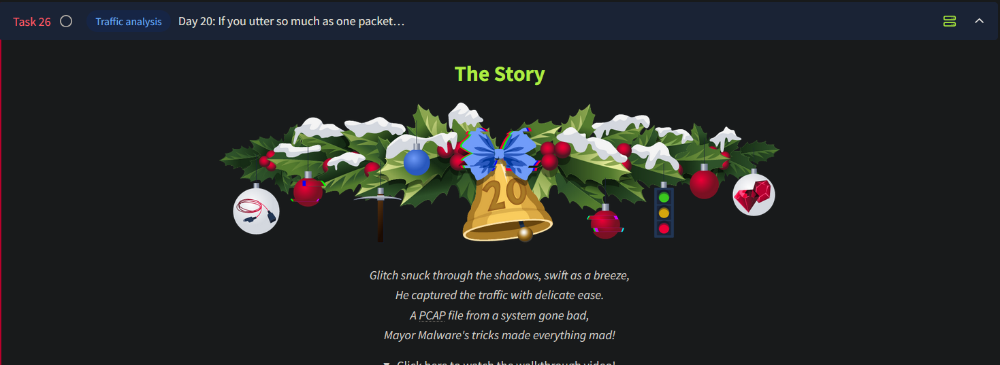
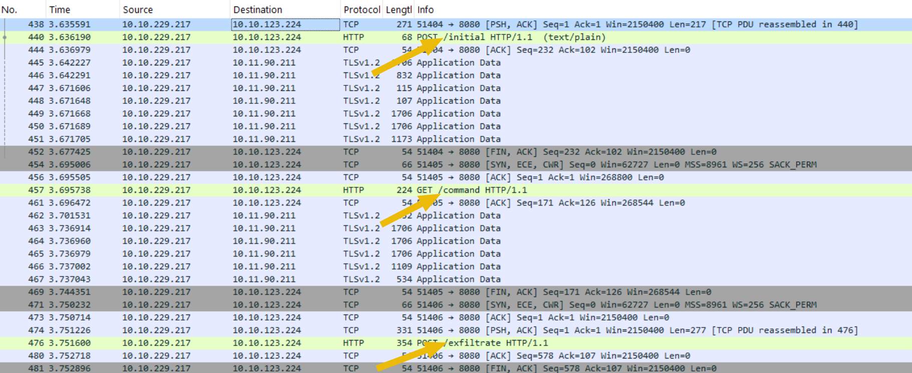
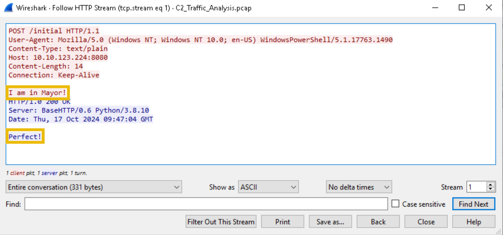
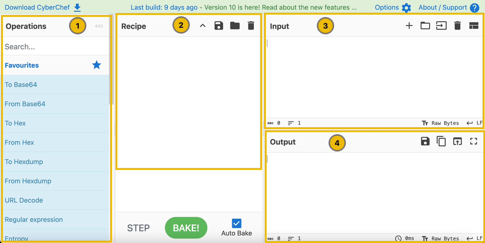

# Day 20 - Traffic Analysis



# Introduction to C2 Communication

- **C2 Server**: A command and control (C2) server manages compromised machines by sending instructions via a "secret agent" payload.
- **Secret Agent Tasks**:
    - Execute malicious commands.
    - Exfiltrate essential files.
    - Send periodic status updates to the C2, called **beacons**.

## Wireshark Overview

Wireshark is a tool to analyze network traffic (PCAP files). It’s essential for investigating C2 communication.

### Key Capabilities:

1. Analyze traffic in a user-friendly format.
2. Reconstruct network conversations.
3. Filter data for specific details.
4. Export and analyze transferred network objects.

---

## Practical Wireshark Usage

1. Open the PCAP file `C2_Traffic_Analysis`.
2. We know that the IP Address of Marta May Ware’s machine is `10.10.229.217`. We can now filter for outbound traffic by using the following filter in Wireshark:
    
    ```
    ip.src == 10.10.229.217
    ```
    
3. We see some interesting HTTP traffic from this machine:
    
    
    

### Diving Deeper

We see requests being made to `/initial` , `/command` and `/exfiltrate`. 

If we right-click on the `POST /initial` packet and select `Follow` > `HTTP Stream`, a new pop-up window will appear containing the back-and-forth HTTP communication relevant to the specific session. 



It seems like a C2 agent was deployed on Marta’s machine and it is now successfully communicating with the C2 server.

Next we can see a `GET` request being made to the same IP but this time `/command` . Following the HTTP Stream for this frame, we see the C2 server requesting the agent to run a common enumeration command on Marta’s machine.


We can see the C2 server is requesting the agent to run the `whoami` command.

C2 servers issue instructions to compromised machines based on the attacker's goals and setup. These typically include:

1. **Getting System Information**:
    - Purpose: Gather details about the target machine to plan further attacks.
    - Example: Commands to retrieve user details, OS information, or hardware specs.
2. **Executing Commands**:
    - Purpose: Perform specific malicious actions.
    - Note: This method is less stealthy and may alert security tools.
3. **Downloading and Executing Payloads**:
    - Purpose: Deploy additional tools or functionalities.
    - Example: Load ransomware or advanced spyware.
4. **Exfiltrating Data**:
    - Purpose: Steal sensitive information such as:
        - Files and documents.
        - Credentials.
        - Personal or corporate data.
    - Significance: A common ultimate goal of many C2-driven attacks.

### Signs of Exfiltration

On following the HTTP stream for the POST request being made to `/exfiltrate`, we are able to see a file being sent over to the server! 

---

## Understanding the C2 Beacon

### Characteristics of a C2 Beacon

- **Purpose**: Beacons provide regular status updates from the compromised machine to the C2 server, akin to a "heartbeat."
- **Communication Example**:
    - **Payload**: “I am still alive. Awaiting any instructions. Over.”
    - **C2 Server**: “Glad to hear that! Stand by for any further instructions. Over.”
- **Observation**: Beacons are sent at regular intervals and may contain encrypted content for confidentiality.

---

### Current Scenario

- **Payload Action**: The agent inside Marta May Ware’s computer encrypts its communication using a key only the C2 server can decrypt.
- **Identification**: Multiple periodic requests from the compromised machine to the C2 server reveal beacon activity.

### Exfiltrated File

- **Significance**: Contains clues about the encryption algorithm and the decryption key, enabling us to decrypt the beacon messages.
- **Goal**: Unlock and analyze the beacons to uncover Mayor Malware's C2 communications.

---

## Decrypting Beacons Using CyberChef

### CyberChef Overview

- A versatile tool for encryption, decryption, encoding, decoding, and more.
- Ideal for decrypting the beacons to reveal their content.

### Decryption Process:

1. **Operations Pane**:
    - Search for `AES Decrypt` and drag it into the **Recipe** area.
2. **Recipe Pane**:
    - Set encryption mode to `ECB`.
    - Enter the decryption key (provided in the task context).
    - Keep other settings as default.
3. **Input Pane**:
    - Paste the encrypted beacon string into the Input area.
4. **Output Pane**:
    - Click the **Bake** button in the Recipe area.
    - The decrypted beacon message will be displayed in the Output area.



### What to Expect

- The decrypted message will reveal instructions, status updates, or data exfiltrated by the C2 payload.
- Analyzing the message helps uncover Mayor Malware’s intentions and tactics.

---

## Questions

1. What was the first message the payload sent to Mayor Malware’s C2?
    
    
    
    Ans.: **I am in Mayor!**
    

2. What was the IP address of the C2 server?
    
    From the screenshot above, we see the IP address of the C2 server is the `Destination` column.
    
    Ans.: **10.10.123.224**
    

3. What was the command sent by the C2 server to the target machine?
    
    On following the HTTP stream for the request made to `/command`, the command gets revealed.
    
    
    
    Ans.: **whoami**
    

4. What was the filename of the critical file exfiltrated by the C2 server?
    
    The name of the file being exfiltrated can be retrieved by following the HTTP stream for the `/exfiltrate` request:
    
    
    
    Ans.: **credentials.txt**
    

5. What secret message was sent back to the C2 in an encrypted format through beacons?
    
    The encrypted secret message can be retrieved by following the HTTP stream of the request made to `/beacon:`
    
    
    

    We have already retrieved the AES ECB key that can be used for decryption in the previous HTTP stream (from `/exfiltrate` ). Using this key and the data we have from this message in Cyberchef, we get to see the decrypted message:

    

    Ans.: **THM_Secret_101**