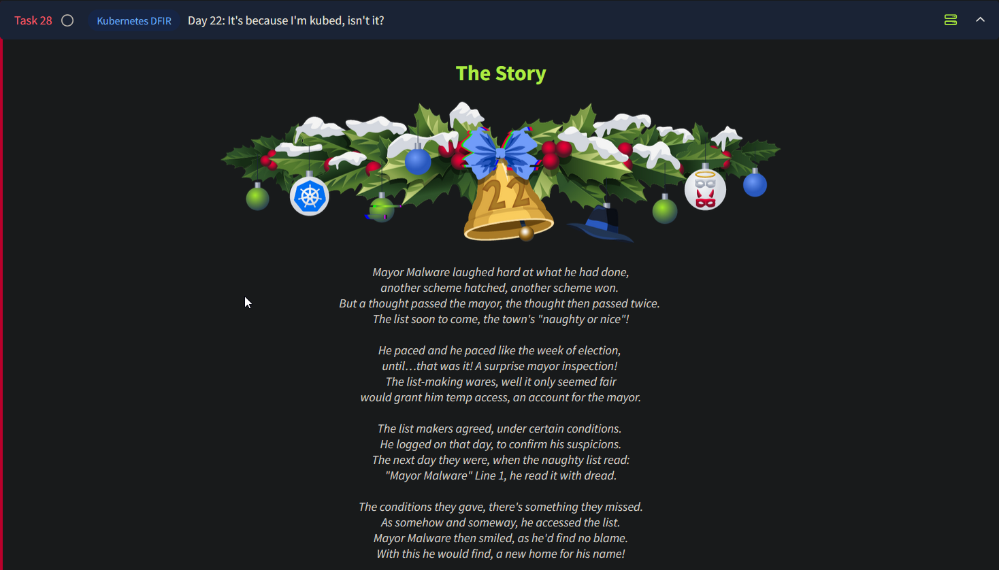

# Day 22 - Kubernetes DFIR



# Kubernetes Explained

## Monolithic vs. Microservices Architecture

- **Monolithic Architecture**: Applications built as a single unit with a single code base and executable.
    - Scaling issues: Entire application needs to scale even if only one part requires it.
- **Microservices Architecture**: Applications are broken down into individual components ("microservices").
    - Each microservice can be scaled independently based on demand.

## The Rise of Microservices

- **Example**: Netflix
    - Scaled streaming services independently of registration or billing services.
- **Containers**: Chosen for hosting microservices due to their lightweight nature.
    - Large-scale applications may require hundreds or thousands of containers.
- **Problem**: Managing and organizing a large number of containers.

## Introduction to Kubernetes

- **Kubernetes**: A container orchestration system.
    - Handles tasks like spinning up containers and balancing traffic.
    - Improves scalability, availability, and integration across tech stacks.
- **Key Concepts**:
    - Containers run in **pods**.
    - Pods run on **nodes**.
    - A group of nodes forms a **Kubernetes cluster**.

---

# DFIR Basics (Digital Forensics and Incident Response)

## Overview

- **Digital Forensics**: Collecting and analyzing digital evidence post-incident.
    - Goal: Trace the chain of attack and understand the incident.
    - Focus: Post-mortem analysis of compromised systems/networks.
- **Incident Response**: Containing threats and recovering systems.
    - Actions:
        - Isolate infected systems.
        - Close security vulnerabilities.
        - Restore systems to a clean state.
    - Role: Similar to an emergency first responder.
- **Collaboration**: Both roles document findings to:
    - Improve security.
    - Serve as evidence for legal proceedings.

## Challenges in Kubernetes Environments

- **Ephemeral Nature of Containers**:
    - Many containers live less than 5 minutes (e.g., 70% as per the 2024 Sysdig Report).
    - Digital evidence may disappear quickly as containers are spun up and down.

## Improving Visibility in Kubernetes

- **Kubernetes Audit Logging**:
    - Captures API requests at various stages.
    - Example: Logs requests to delete pods even if the pod itself is deleted.
    - Key Questions Answered:
        - What happened?
        - When did it happen?
        - Who initiated it?
        - To what did it happen?
        - Where was it observed?
        - From where was it initiated?
        - To where was it going?
- **Tools and Integration**:
    - Feed logs into runtime security tools.
    - Transform raw events into actionable data.
    - Visualize data with additional tools to enhance analysis.

---

## Investigation Begins

On the VM, open a terminal as start K8s using the following command:

```bash
ubuntu@tryhackme:~$ minikube startminikube v1.32.0 on Ubuntu 20.04
Using the docker driver based on existing profile
Starting control plane node minikube in cluster minikube

--- removed for brevity ---

Enabled addons: storage-provisioner, default-storageclass
Done! kubectl is now configured to use "minikube" cluster and "default" namespace by default
```

verify that the cluster is up and running using the following command:

```bash
ubuntu@tryhackme:~$ kubectl get pods -n wareville
NAME                              READY   STATUS    RESTARTS         AGE
morality-checker                  1/1     Running   8  (9m16s ago)   20d
naughty-or-nice                   1/1     Running   1  (9m16s ago)    9d
naughty-picker-7cbd95dd66-gjm7r   1/1     Running   32 (9m16s ago)   20d
naughty-picker-7cbd95dd66-gshvp   1/1     Running   32 (9m16s ago)   20d
nice-picker-7cd98989c8-bfbqn      1/1     Running   32 (9m16s ago)   20d
nice-picker-7cd98989c8-ttc7t      1/1     Running   32 (9m16s ago)   20d
```

We know that the web application was compromised, let's connect to that pod and see if we can recover any logs. Connect to the pod using the following command:

```bash
ubuntu@tryhackme:~$ kubectl exec -n wareville naughty-or-nice -it -- /bin/bash
root@naughty-or-nice:/#
```

Now we can review the Apache2 access log:

```bash
root@naughty-or-nice:/# cat /var/log/apache2/access.log
172.17.0.1 - - [28/Oct/2024:11:05:45 +0000] "GET / HTTP/1.1" 200 2038 "-" "Mozilla/5.0 (X11; Ubuntu; Linux x86_64; rv:131.0) Gecko/20100101 Firefox/131.0"
172.17.0.1 - - [28/Oct/2024:11:05:45 +0000] "GET /style/style.css HTTP/1.1" 200 1207 "http://localhost:8081/" "Mozilla/5.0 (X11; Ubuntu; Linux x86_64; rv:131.0) Gecko/20100101 Firefox/131.0"

--- removed for brevity ---

172.17.0.1 - - [29/Oct/2024:12:32:37 +0000] "GET /favicon.ico HTTP/1.1" 404 489 "http://localhost:8081/" "Mozilla/5.0 (X11; Ubuntu; Linux x86_64; rv:109.0) Gecko/20100101 Firefox/113.0"
172.17.0.1 - - [29/Oct/2024:12:32:48 +0000] "GET /shelly.php?cmd=whoami HTTP/1.1" 200 224 "-" "Mozilla/5.0 (X11; Ubuntu; Linux x86_64; rv:109.0) Gecko/20100101 Firefox/113.0"
```

### Initial Observations

- Logs from **28th October** are available, but the attack occurred later.
- Last log entry references a request to a **`shelly.php`** file.
    - Indicates potential exploitation via a webshell.

### Backup Investigation

- **Backup Directory**: `/home/ubuntu/dfir_artefacts/`
- File to be Reviewed: `pod_apache2_access.log`
    - Contains access logs capturing activity leading up to and during the attack.

### Challenges and Next Steps

- **IP Address Issue**: Pod was configured using a port forward, obscuring the actual IP.
- **Webshell Persistence**: Evidence suggests the webshell exists in the pod's Docker image. (This means the image itself has been compromised!)
    - Rebooting the cluster confirms the webshell remains present.
- **Next Step**: Investigate the Docker image registry to identify how the webshell was embedded into the image.

### Investigating Image Registry

To view the registry container ID, run the following command:

```bash
ubuntu@tryhackme:~$ docker ps
CONTAINER ID   IMAGE         COMMAND                  --- removed for brevity ---
77fddf1ff1b8   registry:2.7 "/entrypoint.sh /etc…"    --- removed for brevity ---
cd9ee77b8aa5   gcr.io/k8s-minikube/kicbase:v0.0.42    --- removed for brevity ---
```

Now, let's connect to the instance to see if we have any logs:

```bash
ubuntu@tryhackme:~$ docker exec CONTAINER NAME / ID ls -al /var/log
total 12
drwxr-xr-x    2 root     root          4096 Nov 12  2021 .
drwxr-xr-x    1 root     root          4096 Nov 12  2021 ..
```

We see that we do not have any registry logs. We can now move over to investigating the docker logs:

```bash
ubuntu@tryhackme:~$ docker logs CONTAINER NAME / ID 
172.17.0.1 - - [16/Oct/2024:09:02:39 +0000] "GET /v2/ HTTP/1.1" 401 87 "" "docker/26.0.0 go/go1.21.8 git-commit/8b79278 kernel/5.15.0-1070-aws os/linux arch/amd64 UpstreamClient(Docker-Client/26.0.0 \\(linux\\))"
172.17.0.1 - - [16/Oct/2024:09:02:39 +0000] "GET /v2/ HTTP/1.1" 401 87 "" "docker/26.0.0 go/go1.21.8 git-commit/8b79278 kernel/5.15.0-1070-aws os/linux arch/amd64 UpstreamClient(Docker-Client/26.0.0 \\(linux\\))"

--- removed for brevity ---

time="2024-11-08T04:32:42.87960937Z" level=info msg="using inmemory blob descriptor cache" go.version=go1.11.2 instance.id=ef35cf6e-fd01-4041-abba-2c082fd682f0 service=registry version=v2.7.1 
time="2024-11-08T04:32:42.880803524Z" level=info msg="listening on [::]:5000" go.version=go1.11.2 instance.id=ef35cf6e-fd01-4041-abba-2c082fd682f0 service=registry version=v2.7.1
```

We can start by seeing all the different connections that were made to the registry by searching for the HEAD HTTP request code and restricting it down to only the first item, which is the IP:

```bash
ubuntu@tryhackme:~/dfir_artefacts$ cat docker-registry-logs.log | grep "HEAD" | cut -d ' ' -f 1
172.17.0.1
172.17.0.1
172.17.0.1

--- removed for brevity ---

10.10.130.253
10.10.130.253
10.10.130.253
```

Here we can see that most of the connections to our registry was made from the expected IP of `172.17.0.1`, however, we can see that connections were also made by `10.10.130.253`, which is not an IP known to us. We can now drill down on this IP and check all the requests made from this IP address:

```bash
ubuntu@tryhackme:~/dfir_artefacts$ cat docker-registry-logs.log | grep "10.10.130.253"

10.10.130.253 - - [29/Oct/2024:10:06:33 +0000] "GET /v2/ HTTP/1.1" 401 87 "" "docker/19.03.12 go/go1.13.10 git-commit/48a66213fe kernel/4.15.0-213-generic os/linux arch/amd64 UpstreamClient(Docker-Client/19.03.12 \\(linux\\))"
10.10.130.253 - - [29/Oct/2024:10:06:33 +0000] "GET /v2/ HTTP/1.1" 200 2 "" "docker/19.03.12 go/go1.13.10 git-commit/48a66213fe kernel/4.15.0-213-generic os/linux arch/amd64 UpstreamClient(Docker-Client/19.03.12 \\(linux\\))"

--- removed for brevity ---

10.10.130.253 - - [29/Oct/2024:12:34:31 +0000] "PUT /v2/wishlistweb/manifests/latest HTTP/1.1" 201 0 "" "docker/19.03.12 go/go1.13.10 git-commit/48a66213fe kernel/4.15.0-213-generic os/linux arch/amd64 UpstreamClient(Docker-Client/19.03.12 \\(linux\\))"   
```

If we review the first few requests, we can see that several authentication attempts were made. But, we can also see that the request to read the manifest for the `wishlistweb` image succeeded, as the HTTP status code of 200 is returned in this log entry:

`10.10.130.253 - - [29/Oct/2024:12:26:40 +0000] "GET /v2/wishlistweb/manifests/latest  HTTP/1.1" 200 6366 "" "docker/19.03.12 go/go1.13.10 git-commit/48a66213fe kernel/4.15.0-213-generic os/linux arch/amd64 UpstreamClient(Docker-Client/19.03.12 \\(linux\\))"`

What we also notice is the User Agent in the request is docker, meaning this was a request made through the docker CLI to pull the image. This is confirmed as we see several requests then to download the image. From this, we learn several things:

- The docker CLI application was used to connect to the registry.
- Connections came from 10.10.130.253, which is unexpected since we only upload images from 172.17.0.1.
- The client was authenticated, which allowed the image to be pulled. This
means that whoever made the request had access to credentials.

If they had access to credentials to pull an image, the same credentials might have allowed them to also push a new image.  We can verify this by narrowing our search to any `PATCH` HTTP methods. The `PATCH` method is used to update docker images in a registry:

```bash
ubuntu@tryhackme:~/dfir_artefacts$ cat docker-registry-logs.log | grep "10.10.130.253" | grep "PATCH"
10.10.130.253 - - [29/Oct/2024:12:34:28 +0000] "PATCH /v2/wishlistweb/blobs/uploads/2966 --- removed for brevity ---
10.10.130.253 - - [29/Oct/2024:12:34:31 +0000] "PATCH /v2/wishlistweb/blobs/uploads/7d53 --- removed for brevity ---
```

This is an indication of Mayor Malware pushing (authenticated push) a new version of the image. This would explain how the webshell made its way into the image, since Mayor Malware pulled the image, made malicious updates, and then pushed this compromised image back to the registry. This means Mayor Malware somehow had access to the credentials of the docker registry. We need to know how the Mayor got access to them.

### Continuing Investigation in the Kubernetes Cluster

Now we can focus on the roles assigned to Mayor Malware. The DevSecOps team assures that the Mayor should not have had sufficient permissions to view secrets, etc. We can check what role was actually assigned to the Mayor. Begin by checking the rolebindings:

```bash
ubuntu@tryhackme:~/dfir_artefacts$ kubectl get rolebindings -n wareville
NAME                 ROLE              AGE
job-runner-binding   Role/job-runner   20d
mayor-user-binding   Role/mayor-user   20d
```

```bash
ubuntu@tryhackme:~/dfir_artefacts$ kubectl describe rolebinding mayor-user-binding -n wareville
Name:         mayor-user-binding
Labels:       <none>
Annotations:  <none>
Role:
  Kind:  Role
  Name:  mayor-user
Subjects:
  Kind  Name           Namespace
  ----  ----           ---------
  User  mayor-malware
```

We see that there is a role called `mayor-user` assigned to the user `mayor-malware`. We can check the permissions associated with the role using the following command:

```bash
ubuntu@tryhackme:~/dfir_artefacts$ kubectl describe role mayor-user -n wareville
Name:         mayor-user
Labels:       <none>
Annotations:  <none>
PolicyRule:
  Resources                               Non-Resource URLs  Resource Names  Verbs
  ---------                               -----------------  --------------  -----
  pods/exec                               []                 []              [create get list]
  rolebindings.rbac.authorization.k8s.io  []                 []              [get list describe]
  roles.rbac.authorization.k8s.io         []                 []              [get list describe]
  pods                                    []                 []              [get list watch]
```

Something interesting can be seen here. Most permissions assigned are expected for a non-admin user in a Kubernetes environment but the oddity here is `pods/exec`. Exec allows the user to shell into the containers running within a pod. We can further confirm our suspicious by investigating the Mayor’s activities:

```bash
cat audit.log | grep --color=always '"user":{"username":"mayor-malware"' | grep --color=always '"resource"' | grep --color=always '"verb"'
```

### Mayor’s Activities

1. **Get Secrets**
    
    ```bash
    ubuntu@tryhackme:~/dfir_artefacts$ cat audit.log | grep --color=always '"user":{"username":"mayor-malware"' | grep --color=always '"resource"' | grep --color=always '"verb"'
    --- removed for brevity ---
    
    {"kind":"Event","apiVersion":"audit.k8s.io/v1","level":"RequestResponse","auditID":"a02486f1-3a7c-4bca-8bcb-9019fa43dac4","stage":"ResponseComplete","requestURI":"/api/v1/namespaces/wareville/secrets?limit=500","verb":"list","user":{"username":"mayor-malware","groups":["example","system:authenticated"]},"sourceIPs":["192.168.49.1"],"userAgent":"kubectl/v1.29.3 (linux/amd64) kubernetes/6813625","objectRef":{"resource":"secrets","namespace":"wareville","apiVersion":"v1"},"responseStatus":{"metadata":{},"status":"Failure","message":"secrets is forbidden: User \"mayor-malware\" cannot list resource \"secrets\" in API group \"\" in the namespace \"wareville\"","reason":"Forbidden","details":{"kind":"secrets"},"code":403},"responseObject":{"kind":"Status","apiVersion":"v1","metadata":{},"status":"Failure","message":"secrets is forbidden: User \"mayor-malware\" cannot list resource \"secrets\" in API group \"\" in the namespace \"wareville\"","reason":"Forbidden","details":{"kind":"secrets"},"code":403},"requestReceivedTimestamp":"2024-10-29T12:20:30.664633Z","stageTimestamp":"2024-10-29T12:20:30.666165Z","annotations":{"authorization.k8s.io/decision":"forbid","authorization.k8s.io/reason":""}
    
    --- removed for brevity ---
    ```
    
    This log snippet tells us that Mayor Malware attempted to get the secrets stored on the cluster but received a 403 response as he didn't have sufficient permissions to do so (Note: a plural get command runs a list on the backend, and is why it appears as so in the logs).
    
2. **Get Roles**
    
    ```bash
               
    ubuntu@tryhackme:~/dfir_artefacts$ cat audit.log | grep --color=always '"user":{"username":"mayor-malware"' | grep --color=always '"resource"' | grep --color=always '"verb"'
    
    --- removed for brevity ---
    
    {"kind":"Event","apiVersion":"audit.k8s.io/v1","level":"Metadata","auditID":"8084daec-f59f-4d90-b343-f59f4f3cd67c","stage":"ResponseComplete","requestURI":"/apis/rbac.authorization.k8s.io/v1/namespaces/wareville/roles?limit=500","verb":"list","user":{"username":"mayor-malware","groups":["example","system:authenticated"]},"sourceIPs":["192.168.49.1"],"userAgent":"kubectl/v1.29.3 (linux/amd64) kubernetes/6813625","objectRef":{"resource":"roles","namespace":"wareville","apiGroup":"rbac.authorization.k8s.io","apiVersion":"v1"},"responseStatus":{"metadata":{},"code":200},"requestReceivedTimestamp":"2024-10-29T12:20:39.761026Z","stageTimestamp":"2024-10-29T12:20:39.762868Z","annotations":{"authorization.k8s.io/decision":"allow","authorization.k8s.io/reason":"RBAC: allowed by RoleBinding \"mayor-user-binding/wareville\" of Role \"mayor-user\" to User \"mayor-malware\""}}
    
    --- removed for brevity ---
    ```
    
    After being denied secret access, Mayor Malware then started snooping to see what roles were present on the cluster.
    
3. **Describe Role**
    
    ```bash
               
    ubuntu@tryhackme:~/dfir_artefacts$ cat audit.log | grep --color=always '"user":{"username":"mayor-malware"' | grep --color=always '"resource"' | grep --color=always '"verb"'
    
    --- removed for brevity ---
    
    {"kind":"Event","apiVersion":"audit.k8s.io/v1","level":"Metadata","auditID":"6ef973f4-82ab-4326-b66b-24d7036cae64","stage":"ResponseComplete","requestURI":"/apis/rbac.authorization.k8s.io/v1/namespaces/wareville/roles/job-runner","verb":"get","user":{"username":"mayor-malware","groups":["example","system:authenticated"]},"sourceIPs":["192.168.49.1"],"userAgent":"kubectl/v1.29.3 (linux/amd64) kubernetes/6813625","objectRef":{"resource":"roles","namespace":"wareville","name":"job-runner","apiGroup":"rbac.authorization.k8s.io","apiVersion":"v1"},"responseStatus":{"metadata":{},"code":200},"requestReceivedTimestamp":"2024-10-29T12:20:49.497325Z","stageTimestamp":"2024-10-29T12:20:49.498588Z","annotations":{"authorization.k8s.io/decision":"allow","authorization.k8s.io/reason":"RBAC: allowed by RoleBinding \"mayor-user-binding/wareville\" of Role \"mayor-user\" to User \"mayor-malware\""}}
    
    --- removed for brevity ---
    ```
    
    Whilst running the previous "get roles" command, Mayor Malware will have found a role named "job-runner". These logs tell us that Mayor Malware then described this role, which would have given him key pieces of information regarding the role. Most importantly for our investigation, it would have told him this role has secret read access. 
    
4. **Get Rolebindings**
    
    ```bash
               
    ubuntu@tryhackme:~/dfir_artefacts$ cat audit.log | grep --color=always '"user":{"username":"mayor-malware"' | grep --color=always '"resource"' | grep --color=always '"verb"'
    
    --- removed for brevity ---
    
    {"kind":"Event","apiVersion":"audit.k8s.io/v1","level":"Metadata","auditID":"25b7417e-550c-4b9a-bb2c-dad64662cce0","stage":"ResponseComplete","requestURI":"/apis/rbac.authorization.k8s.io/v1/namespaces/wareville/rolebindings?limit=500","verb":"list","user":{"username":"mayor-malware","groups":["example","system:authenticated"]},"sourceIPs":["192.168.49.1"],"userAgent":"kubectl/v1.29.3 (linux/amd64) kubernetes/6813625","objectRef":{"resource":"rolebindings","namespace":"wareville","apiGroup":"rbac.authorization.k8s.io","apiVersion":"v1"},"responseStatus":{"metadata":{},"code":200},"requestReceivedTimestamp":"2024-10-29T12:20:59.570824Z","stageTimestamp":"2024-10-29T12:20:59.575620Z","annotations":{"authorization.k8s.io/decision":"allow","authorization.k8s.io/reason":"RBAC: allowed by RoleBinding \"mayor-user-binding/wareville\" of Role \"mayor-user\" to User \"mayor-malware\""}}
    
    --- removed for brevity ---
    ```
    
    Now, knowing this role can view secrets, Mayor Malware tried to find its role binding to see what was using this role.
    
5. **Describe Rolebinding**
    
    ```bash
               
    ubuntu@tryhackme:~/dfir_artefacts$ cat audit.log | grep --color=always '"user":{"username":"mayor-malware"' | grep --color=always '"resource"' | grep --color=always '"verb"'
    
    --- removed for brevity ---
    
    {"kind":"Event","apiVersion":"audit.k8s.io/v1","level":"Metadata","auditID":"b0f9aa98-9039-4df8-b990-9bf6ca48ab2f","stage":"ResponseComplete","requestURI":"/apis/rbac.authorization.k8s.io/v1/namespaces/wareville/rolebindings/job-runner-binding","verb":"get","user":{"username":"mayor-malware","groups":["example","system:authenticated"]},"sourceIPs":["192.168.49.1"],"userAgent":"kubectl/v1.29.3 (linux/amd64) kubernetes/6813625","objectRef":{"resource":"rolebindings","namespace":"wareville","name":"job-runner-binding","apiGroup":"rbac.authorization.k8s.io","apiVersion":"v1"},"responseStatus":{"metadata":{},"code":200},"requestReceivedTimestamp":"2024-10-29T12:21:11.521236Z","stageTimestamp":"2024-10-29T12:21:11.523301Z","annotations":{"authorization.k8s.io/decision":"allow","authorization.k8s.io/reason":"RBAC: allowed by RoleBinding \"mayor-user-binding/wareville\" of Role \"mayor-user\" to User \"mayor-malware\""}}
    
    --- removed for brevity ---
    ```
    
    After seeing a role binding named `"job-runner-binding"`, Mayor Malware described it and found out this role is bound to a service account named `"job-runner-sa"` (aka this service account has permission to view secrets).
    
6. **Get Pods**
    
    ```bash
               
    ubuntu@tryhackme:~/dfir_artefacts$ cat audit.log | grep --color=always '"user":{"username":"mayor-malware"' | grep --color=always '"resource"' | grep --color=always '"verb"'
    
    --- removed for brevity ---
    
    {"kind":"Event","apiVersion":"audit.k8s.io/v1","level":"Metadata","auditID":"9d13a9b6-78d2-4cfc-8dc5-889b83aafc44","stage":"ResponseComplete","requestURI":"/api/v1/namespaces/wareville/pods?limit=500","verb":"list","user":{"username":"mayor-malware","groups":["example","system:authenticated"]},"sourceIPs":["192.168.49.1"],"userAgent":"kubectl/v1.29.3 (linux/amd64) kubernetes/6813625","objectRef":{"resource":"pods","namespace":"wareville","apiVersion":"v1"},"responseStatus":{"metadata":{},"code":200},"requestReceivedTimestamp":"2024-10-29T12:21:22.660584Z","stageTimestamp":"2024-10-29T12:21:22.664112Z","annotations":{"authorization.k8s.io/decision":"allow","authorization.k8s.io/reason":"RBAC: allowed by RoleBinding \"mayor-user-binding/wareville\" of Role \"mayor-user\" to User \"mayor-malware\""}}
    
    --- removed for brevity ---
    ```
    
    Here, we can see that Mayor Malware, now armed with the knowledge that a service account has the permissions he needs, lists all of the pods running in the **Wareville** namespace with a `kubectl get pods` command.
    
7. **Describe Pod**
    
    ```bash
               
    ubuntu@tryhackme:~/dfir_artefacts$ cat audit.log | grep --color=always '"user":{"username":"mayor-malware"' | grep --color=always '"resource"' | grep --color=always '"verb"'
    
    --- removed for brevity ---
    
    {"kind":"Event","apiVersion":"audit.k8s.io/v1","level":"Metadata","auditID":"5965471b-4fb9-49c9-9a16-7fd466c762c8","stage":"ResponseComplete","requestURI":"/api/v1/namespaces/wareville/pods/morality-checker","verb":"get","user":{"username":"mayor-malware","groups":["example","system:authenticated"]},"sourceIPs":["192.168.49.1"],"userAgent":"kubectl/v1.29.3 (linux/amd64) kubernetes/6813625","objectRef":{"resource":"pods","namespace":"wareville","name":"morality-checker","apiVersion":"v1"},"responseStatus":{"metadata":{},"code":200},"requestReceivedTimestamp":"2024-10-29T12:21:33.182365Z","stageTimestamp":"2024-10-29T12:21:33.185006Z","annotations":{"authorization.k8s.io/decision":"allow","authorization.k8s.io/reason":"RBAC: allowed by RoleBinding \"mayor-user-binding/wareville\" of Role \"mayor-user\" to User \"mayor-malware\""}}
    
    --- removed for brevity ---
    ```
    
    Mayor Malware describes the pod as a `"morality-checker"` he then would have found out that this pod runs with the `job-runner-sa` service account attached. Meaning that if he were able to gain access to this pod, he would be able to gain secret read access.
    
8. **Exec**
    
    ```bash
               
    ubuntu@tryhackme:~/dfir_artefacts$ cat audit.log | grep --color=always '"user":{"username":"mayor-malware"' | grep --color=always '"resource"' | grep --color=always '"verb"'
    
    --- removed for brevity ---
    
    {"kind":"Event","apiVersion":"audit.k8s.io/v1","level":"Metadata","auditID":"927fcde7-74e5-4a57-af53-dceacefaf47c","stage":"ResponseStarted","requestURI":"/api/v1/namespaces/wareville/pods/morality-checker/exec?command=%2Fbin%2Fsh\u0026container=kubectl-container\u0026stdin=true\u0026stdout=true\u0026tty=true","verb":"create","user":{"username":"mayor-malware","groups":["example","system:authenticated"]},"sourceIPs":["192.168.49.1"],"userAgent":"kubectl/v1.29.3 (linux/amd64) kubernetes/6813625","objectRef":{"resource":"pods","namespace":"wareville","name":"morality-checker","apiVersion":"v1","subresource":"exec"},"responseStatus":{"metadata":{},"code":101},"requestReceivedTimestamp":"2024-10-29T12:21:44.189258Z","stageTimestamp":"2024-10-29T12:21:44.214173Z","annotations":{"authorization.k8s.io/decision":"allow","authorization.k8s.io/reason":"RBAC: allowed by RoleBinding \"mayor-user-binding/wareville\" of Role \"mayor-user\" to User \"mayor-malware\""}}
    
    --- removed for brevity ---
    ```
    

We can now conclude that the DevSecOps team had overly permissive Role-Based Access Control (RBAC) in place in the Kubernetes environment, and it was this that allowed Mayor Malware to run an `exec` command (as captured by the logs above) and gain shell access into `morality-checker`.

We can further confirm our suspicions by checking the audit logs for the `job-runner-sa` service account:

```bash
           
ubuntu@tryhackme:~/dfir_artefacts$ cat audit.log | grep --color=always '"user":{"username":"system:serviceaccount:wareville:job-runner-sa"' | grep --color=always '"resource"' | grep --color=always '"verb"'
```

We can see Mayor Malware is able to now run `"get"` commands on secrets to list them, but most importantly, we can see he has indeed been able to escalate his privileges and gain access to the `"pull-creds"` secret using the `job-runner-sa` service account:

```bash
ubuntu@tryhackme:~/dfir_artefacts$ cat audit.log | grep --color=always '"user":{"username":"system:serviceaccount:wareville:job-runner-sa"' | grep --color=always '"resource"' | grep --color=always '"verb"'

--- removed for brevity ---

{"kind":"Event","apiVersion":"audit.k8s.io/v1","level":"RequestResponse","auditID":"c59d6a7c-1e07-43cb-8bf6-4d41a9c98ddb","stage":"ResponseComplete","requestURI":"/api/v1/namespaces/wareville/secrets/pull-creds","verb":"get","user":{"username":"system:serviceaccount:wareville:job-runner-sa","uid":"9e88bb94-e5e3-4e13-9187-4eaf898d0a7e","groups":["system:serviceaccounts","system:serviceaccounts:wareville","system:authenticated"],"extra":{"authentication.kubernetes.io/pod-name":["morality-checker"],"authentication.kubernetes.io/pod-uid":["a20761b8-1a36-4318-a048-96d61644b436"]}},"sourceIPs":["10.244.120.126"],"userAgent":"kubectl/v1.31.1 (linux/amd64) kubernetes/948afe5","objectRef":{"resource":"secrets","namespace":"wareville","name":"pull-creds","apiVersion":"v1"},"responseStatus":{"metadata":{},"code":200},"responseObject":{"kind":"Secret","apiVersion":"v1","metadata":{"name":"pull-creds","namespace":"wareville","uid":"c3854acc-f67b-4e82-a975-816e0c6ab04b","resourceVersion":"174795","creationTimestamp":"2024-10-17T18:10:27Z","managedFields":[{"manager":"kubectl-create","operation":"Update","apiVersion":"v1","time":"2024-10-17T18:10:27Z","fieldsType":"FieldsV1","fieldsV1":{"f:data":{".":{},"f:.dockerconfigjson":{}},"f:type":{}}}]},"data":{".dockerconfigjson":"eyJhdXRocyI6eyJodHRwOi8vZG9ja2VyLXJlZ2lzdHJ5Lm5pY2V0b3duLmxvYzo1MDAwIjp7InVzZXJuYW1lIjoibXIubmljZSIsInBhc3N3b3JkIjoiTXIuTjR1Z2h0eSIsImF1dGgiOiJiWEl1Ym1salpUcE5jaTVPTkhWbmFIUjUifX19"},"type":"kubernetes.io/dockerconfigjson"},"requestReceivedTimestamp":"2024-10-29T12:22:15.861424Z","stageTimestamp":"2024-10-29T12:22:15.864166Z","annotations":{"authorization.k8s.io/decision":"allow","authorization.k8s.io/reason":"RBAC: allowed by RoleBinding \"job-runner-binding/wareville\" of Role \"job-runner\" to ServiceAccount \"job-runner-sa/wareville\""}}

--- removed for brevity ---
```

We can retrieve the pull-creds secret ourselves to see any further evidence:

```bash
ubuntu@tryhackme:~/dfir_artefacts$ kubectl get secret pull-creds -n wareville -o jsonpath='{.data.\.dockerconfigjson}' | base64 --decode
```

Here we can see that  the docker registry pull password is the same as the push password. This means that after retrieving these credentials, Mayor Malware would have been able to make the docker registry push we saw earlier and ensure his malicious web shell was deployed into the Kubernetes environment and gain persistence. It is for this reason that push and pull credentials should always be different.

---

## Questions

1. What is the name of the webshell that was used by Mayor Malware?
    
    The name of the webshell can be retrieved by accessing the apache2 access logs in the 
    `naughty-or-nice` pod. The commands to access the logs have been mentioned in the notes above.
    
    
    
    Ans.: **shelly.php**
    
2. What file did Mayor Malware read from the pod?
    
    This information can be obtained from the `pod_apache2_access.log` file on the VM. We know the webshell `shelly.php` makes use of the `cmd` parameter to run commands. On viewing the cmd parameters, we see an interesting `cat` command being run. The `cat` command is used to display the contents of a file. Therefore the file we are looking for is present in the logs here:
    
    
    
    Ans.: **db.php**
    
3. What tool did Mayor Malware search for that could be used to create a remote connection from the pod?
    
    From the same log file, we can see the `which` command being run. The `which` command is used to find the location of a file. Here the command is being used to find the location of `nc`, which is netcat. Netcat is a popular tool that can be used to establish remote connections.
    
    
    
    Ans.: **nc**
    
4. What IP connected to the docker registry that was unexpected?
    
    This information can be obtained from docker’s logs for the registry stored under `/home/ubuntu/dfir_artefacts/docker-registry-logs.log`. 
    
    
    
    Here we can see most of the connections being made from `172.17.0.1` and as per our notes, the connections from this IP are expected. Therefore the other IP address is the one that is unexpected.
    
    Ans.: **10.10.130.253**
    
5. At what time is the first connection made from this IP to the docker registry?
    
    This information can be retrieved by performing a `grep` for the suspicious IP address on the docker registry logs file.
    
    
    
    Ans.: **29/Oct/2024:10:06:33 +0000**
    
6. At what time is the updated malicious image pushed to the registry?
    
    We know that image pushes to the registry are marked by `PATCH` requests. Therefore we can filter for `PATCH` requests in the docker registry logs coming from the suspicious IP address we identified earlier, to know when the malicious image was pushed.
    
    
    
    Ans.: **29/Oct/2024:12:34:28 +0000**
    
7. What is the value stored in the "pull-creds" secret?
    
    From our notes above, we know that the value stored in the “pulled-creds” secret can be retrieved by running the following command:
    
    ```bash
    $ kubectl get secret pull-creds -n wareville -o jsonpath='{.data.\.dockerconfigjson}' | base64 --decode
    ```
    
    
    
    Ans.: **{"auths":{"[http://docker-registry.nicetown.loc:5000](http://docker-registry.nicetown.loc:5000/)":{"username":"mr.nice","password":"Mr.N4ughty","auth":"bXIubmljZTpNci5ONHVnaHR5"}}}**