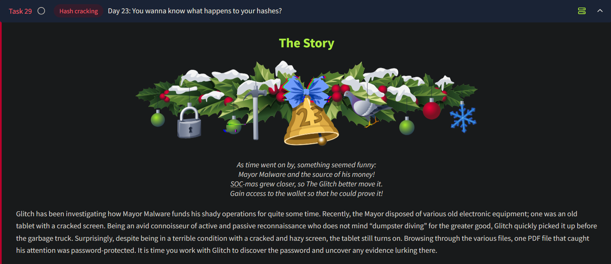

# Day 23 - Hash Cracking



# Overview of Password Storage

1. **Historical Context**:
    - Passwords were stored in cleartext with usernames.
    - Cleartext passwords were vulnerable to breaches and misuse.
2. **Hash Functions**:
    - Converts an input into a fixed-size output (e.g., SHA256 produces a 256-bit hash).
    - Instead of storing `password`, systems store `hash(password)`.
3. **Salting**:
    - Adds a random string (`salt`) to passwords before hashing: `hash(password + salt)`.
    - Protects against attacks by making hash results unique.
4. **Issues with Implementation**:
    - Negligence leads to plaintext password storage.
    - Example: A platform stored 600M passwords in plaintext for 7 years.

---

## Password-Protected Files and Data at Rest

1. **Encryption**:
    - Protects files and disks from unauthorized access.
    - Encrypted files pose challenges for forensic investigations.
2. **Forensic Goals**:
    - Access plaintext files from protected documents.
    - Glitch’s challenge: Crack the password of a PDF file from Mayor Malware's tablet.

---

## Cracking Passwords

### Cracking a Hashed Password

1. **Scenario**:
    - Mayor Malware's password hash found in a database breach.
    - Stored in `/home/user/AOC2024/hash1.txt`:
        
        ```
        d956a72c83a895cb767bb5be8dba791395021dcece002b689cf3b5bf5aaa20ac
        
        ```
        
2. **Steps**:
    - Identify hash type using `hash-id.py`.
    
    ```bash
    user@machine:~$ cd AOC2024/
    user@machine:~/AOC2024$ cat hash1.txt 
    d956a72c83a895cb767bb5be8dba791395021dcece002b689cf3b5bf5aaa20ac
    user@machine:~/AOC2024$ python hash-id.py
       #########################################################################
       #########################################################################
       #     __  __                     __           ______    _____           #
       #    /\ \/\ \                   /\ \         /\__  _\  /\  _ `\         #
       #    \ \ \_\ \     __      ____ \ \ \___     \/_/\ \/  \ \ \/\ \        #
       #     \ \  _  \  /'__`\   / ,__\ \ \  _ `\      \ \ \   \ \ \ \ \       #
       #      \ \ \ \ \/\ \_\ \_/\__, `\ \ \ \ \ \      \_\ \__ \ \ \_\ \      #
       #       \ \_\ \_\ \___ \_\/\____/  \ \_\ \_\     /\_____\ \ \____/      #
       #        \/_/\/_/\/__/\/_/\/___/    \/_/\/_/     \/_____/  \/___/  v1.2 #
       #                                                             By Zion3R #
       #                                                    www.Blackploit.com #
       #                                                   Root@Blackploit.com #
       #########################################################################
    --------------------------------------------------
     HASH: d956a72c83a895cb767bb5be8dba791395021dcece002b689cf3b5bf5aaa20ac
    
    Possible Hashs:
    [+] SHA-256
    [+] Haval-256
    
    Least Possible Hashs:
    [+] GOST R 34.11-94
    [+] RipeMD-256
    [+] SNEFRU-256
    [+] SHA-256(HMAC)
    [+] Haval-256(HMAC)
    [+] RipeMD-256(HMAC)
    [+] SNEFRU-256(HMAC)
    [+] SHA-256(md5($pass))
    [+] SHA-256(sha1($pass))
    --------------------------------------------------
     HASH: ^C
    
      Bye!
    ```
    
    - Crack the hash using John the Ripper:
        
        ```bash
        john --format=raw-sha256 --wordlist=/usr/share/wordlists/rockyou.txt hash1.txt
        
        ```
        
3. **Advanced Cracking with Rules**:
    - Use transformation rules:
        
        ```bash
        john --format=raw-sha256 --rules=wordlist --wordlist=/usr/share/wordlists/rockyou.txt hash1.txt
        ```
        
        Adding the option `--rules=wordlist` to your `john` command line generates multiple passwords from each one. For instance, it appends and prepends single digits. It does various common substitutions; for example, `a` can be replaced with `@`, `i` can be replaced with `!`, and `s` can be replaced with `$`. Many more mutations and transformations are part of these rules. You can check all the underlying rules by checking the `[List.Rules:Wordlist]` section in `/etc/john/john.conf`, John’s configuration file. 
        
4. **Viewing Results**:
    - Retrieve a cracked password:
        
        ```bash
        john --format=raw-sha256 --show hash1.txt
        
        ```
        

---

### Cracking a Password-Protected PDF

1. **Convert PDF to Hash**:
    - Use `pdf2john.pl` to extract hash from a PDF.
2. **Cracking with Custom Wordlist**:
    - Create a personalized wordlist `wordlist.txt`:
        
        ```
        Fluffy
        FluffyCat
        Mayor
        Malware
        MayorMalware
        
        ```
        
    - Crack PDF password using:
        
        ```bash
        john --rules=single --wordlist=wordlist.txt pdf.hash
        
        ```
        
3. **Explanation of Commands**:
    - `-rules=single`: Uses more aggressive modifications on the wordlist.
    - `-wordlist=wordlist.txt`: Custom wordlist for specific targets.

---

## Practical Considerations

- **Password Behavior**:
    - Common passwords like `qwerty`, `123456`, or variants are often used.
    - Users often include meaningful data (e.g., pet names, dates) in passwords.
- **Forensic Use**:
    - Legal boundaries restrict direct access to online accounts.
    - Focus on local data, such as discarded password-protected files.

---

## Summary of Tools and Commands

- **Tools**:
    - `hash-id.py`: Identifies hash types.
    - `John the Ripper`: Cracks hashes and encrypted files.
    - `pdf2john.pl`: Converts PDFs to hash challenges.

---

## Questions

1. Crack the hash value stored in `hash1.txt`. What was the password?
    
    
    
    Ans.: **fluffycat12**
    
    
2. What is the flag at the top of the `private.pdf` file?
    
    Using `pdf2john`, we first retrieve the hash of the `private.pdf` file. Next we can use `john` and the custom wordlist in order to crack this hash. On doing so, we get the password of the file:
    
    
    
    We do not have a pdf file viewer application on this VM. Therefore we can use the `pdftotext` tool to convert the pdf to a text file so we can read its contents on the console.
    
    ```bash
    $ pdftotext private.pdf -upw PASSWORD
    ```
    
    Now using the `head` command, we can read the first 10 lines of the newly created text file, which also contains the flag we are looking for:
    
    
    
    Ans.: **THM{do_not_GET_CAUGHT}**