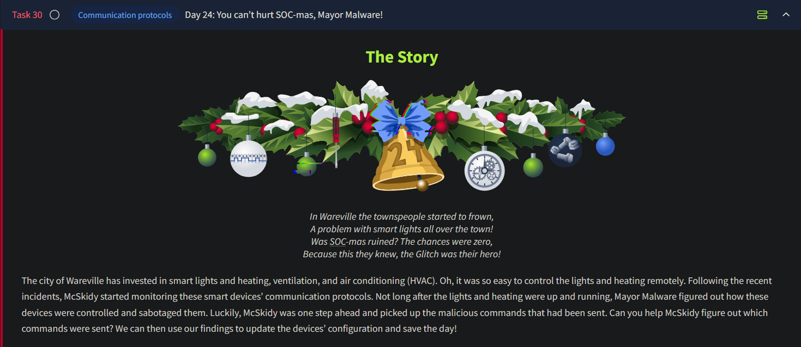
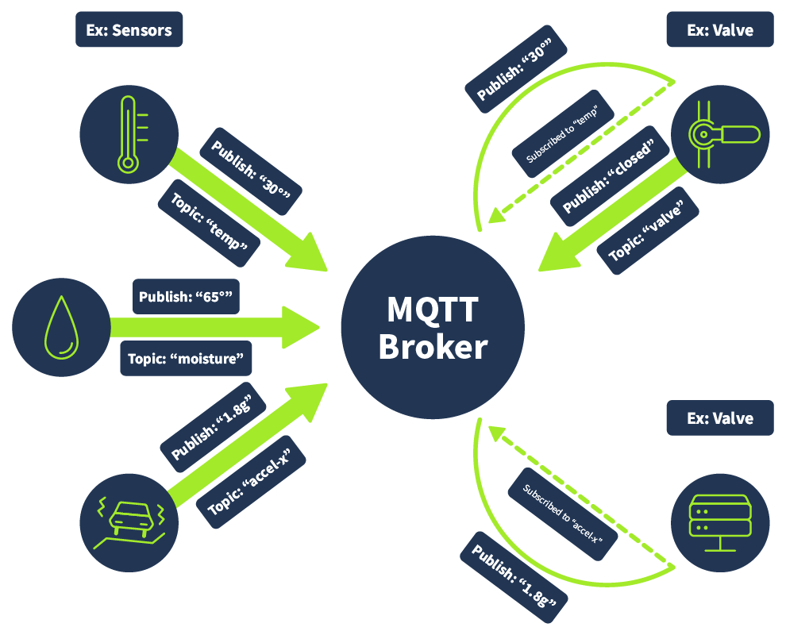
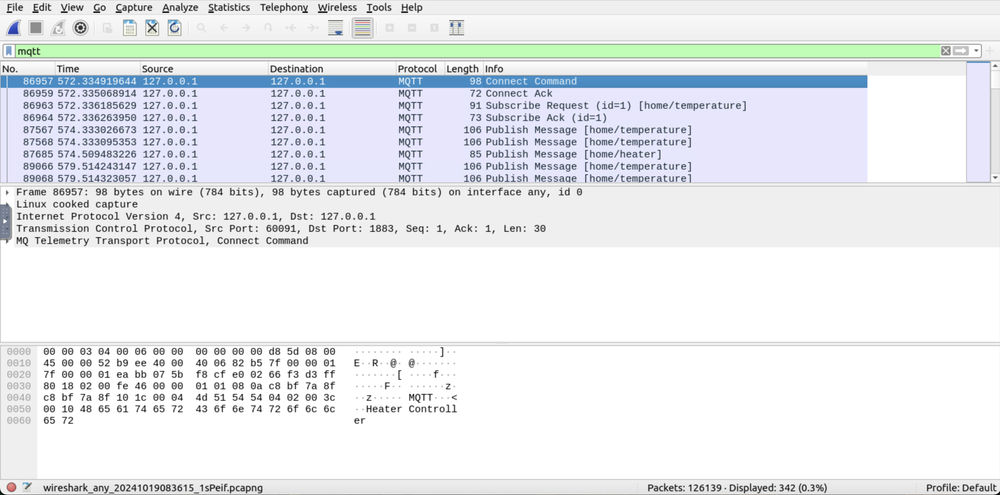
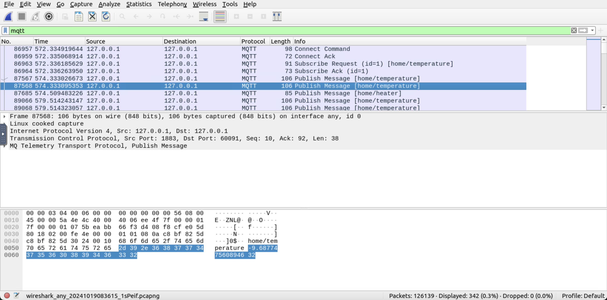
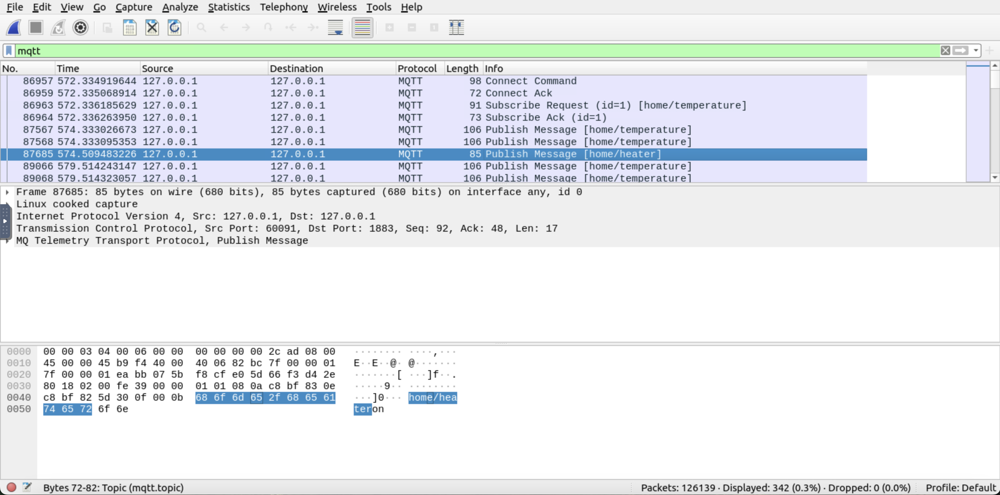
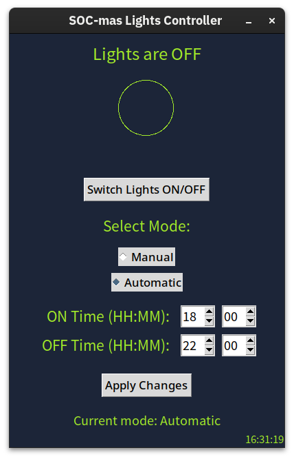

# Day 24 - Communication Protocols (IoT)



# Smart Devices Overview

- **Convenience**:
    - Smart devices simplify tasks (e.g., HVAC, vacuum cleaners).
    - Controlled remotely via apps on mobile devices.
    - Minimalistic designs reduce need for physical switches.

## Is It Smart?

- **Reliance on Networks**:
    - Smart devices often require network connections (IoT - Internet of Things).
    - Potential security risks:
        - Devices can be compromised if not secured properly.
        - Network isolation and authentication mechanisms can help mitigate risks.
- **Security Best Practices**:
    - Understand device functionality.
    - Implement robust security setups to balance usability and safety.

## The Language of IoT

- IoT devices communicate using a mix of languages:
    - Programming (e.g., C++, Java for hardware interaction).
    - Communication protocols (e.g., HTTP, MQTT for system interaction).

## MQTT: A Key Communication Protocol

- **Definition**:
    - MQTT (Message Queuing Telemetry Transport) is a protocol for IoT communication.
    - Operates on a publish/subscribe model.
    
    
    

### Key MQTT Concepts

1. **MQTT Clients**:
    - Devices that publish or subscribe to messages.
    - Example:
        - Temperature sensor: Publishes readings.
        - HVAC controller: Subscribes to temperature readings and adjusts HVAC settings.
2. **MQTT Broker**:
    - Manages message distribution:
        - Receives messages from publishing clients.
        - Distributes them to subscribing clients.
3. **MQTT Topics**:
    - Classification system for messages.
    - Clients subscribe to topics relevant to their functionality:
        - Example:
            - Temperature sensor → Topic: `room temperature`.
            - Light sensor → Topic: `light readings`.
        - HVAC controller subscribes to `room temperature`, not `light readings`.
            - Light controller subscribes to `light readings`, not `room temperature`.

---

## Demonstration

The files related to this task are in the `~/Desktop/MQTTSIM/` directory. The walkthrough and the challenge files are shown in the terminal below.

```bash
ubuntu@tryhackme:~/Desktop/MQTTSIM$ tree.
├── challenge
│   ├── challenge.pcapng
│   ├── challenge.sh
│   └── lights.py
└── walkthrough
    ├── hvac.py
    └── walkthrough.sh
```

We will use Wireshark to monitor network communication and apply `MQTT` as the filter. 
There will be no traffic for now as no MQTT broker or client is running. Start the MQTT broker and client to see the traffic. We will start the `walkthrough.sh` script to learn how the MQTT protocol works. 

Once we run it, three windows will pop up. The window with the red text is the MQTT broker, the one with the blue text is the MQTT client, and the third is the application UI we might see as the end user. We can look at the logs on each of these windows if we like, but as an end user, we will only interact with the application UI.


Now we can observe how the communication looks like in Wireshark:



### Connection Establishment

- **First Two Events**:
    - Show the connection establishment:
        - **Connect Command**: Initiates the connection.
        - **Connect Ack**: Acknowledges the connection.

### Topic Subscription

- **Next Two Events**:
    - A client subscribes to the topic `home/temperature`.
    - **Client Role**:
        - Likely the HVAC controller:
            - Subscribes to temperature data to manage the heater (on/off).

### Message Publishing

- **Published Messages**:
    - **Topics** are shown in square brackets:
        - `home/temperature`: Published by the **temperature sensor**.
        - `home/heater`: Published by the **HVAC controller**.
- **Functionality**:
    - The HVAC controller uses data from `home/temperature` to control the heater and publishes its actions to `home/heater`.



In the lower pane, we can see that it is publishing a temperature of -9.6877475608946. That is very cold. Therefore, we see a message from the heater right after the temperature is broadcast. This message shows that the heater was turned on, as seen in the highlighted part in the lower pane.



Summary of what the communication looks like:


---

## Challenge

The lights have gone off in all the major factories and halls. Mayor Malware has sabotaged the lighting system implemented by a contractor company. Their support will take some time to respond, as it is the holiday season. But McSkidy needs to get the lights back on now!

To see what Mayor Malware has done, we can run the script `challenge.sh` as shown below. This will open three windows, including the lights controller interface.

```bash
ubuntu@tryhackme:~/Desktop/MQTTSIM/walkthrough$ cd ~/Desktop/MQTTSIM/challenge/
ubuntu@tryhackme:~/Desktop/MQTTSIM/challenge$ ./challenge.sh
[...]
```



### Understanding the Scenario

- **Goal**: Use the `mosquitto_pub` command to publish a message that turns the lights on.
- **Setup**:
    - MQTT broker running on localhost.
    - Captured packets in `challenge.pcapng` file contain MQTT messages for turning lights "on" and "off."

### Analyzing the Packet Capture

1. **Open Wireshark**:
    - Launch Wireshark.
    - Navigate to `File > Open` and select the `challenge.pcapng` file.
2. **Filter for MQTT Messages**:
    - Use the display filter `mqtt` to isolate MQTT protocol traffic.
    - Look for:
        - Topics related to lighting devices.
        - Messages indicating the light state ("on" or "off").
3. **Identify the Correct Topic and Message**:
    - Analyze publish/subscribe events to pinpoint:
        - The topic controlling lights (e.g., `home/lights`).
        - The correct message to turn the lights on (e.g., `on`).

### Publishing the Message

**Command Syntax**:

```bash
mosquitto_pub -h localhost -t "topic_name" -m "message"
```

- Replace `topic_name` with the identified topic (e.g., `home/lights`).
- Replace `message` with the identified command to turn lights on (e.g., `on`).

We should get a flag if we successfully turn on the lights.

---

## Questions

1. What is the flag?
    
    Following the MQTT packets of the challenge pcap file, we see in packet 3131, the message value in the `Publish Message` packet reads `on`:
    
    
    
    However in packet 3215, the message is set to `off`:
    
    
    
    Therefore, we now know that the message `on` needs to be sent to the topic `d2FyZXZpbGxl/Y2hyaXN0bWFzbGlnaHRz`. Therefore, the command to be sent will be:
    
    ```bash
    $ mosquitto_pub -h localhost -t "d2FyZXZpbGxl/Y2hyaXN0bWFzbGlnaHRz" -m "on" 
    ```
    
    Once this command is sent out, we can see the flag appear:
    
    
    
    Ans.: **THM{Ligh75on-day54ved}**