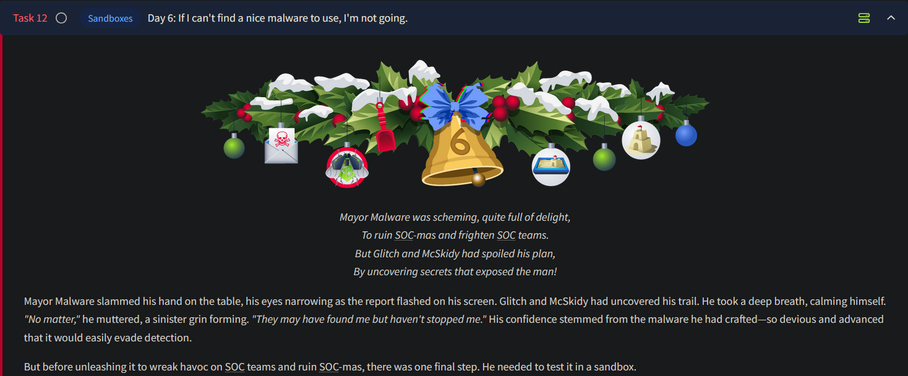
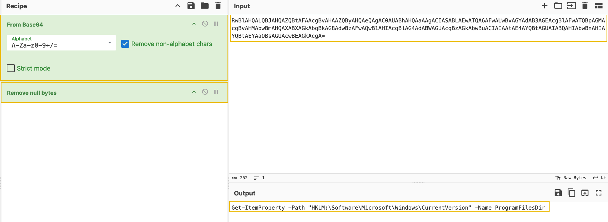
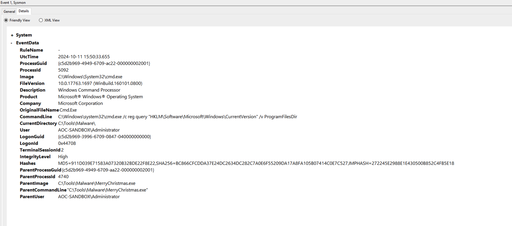

# Day 6 - Malware Sandbox



## What is a Sandbox?

A sandbox is an isolated environment that is used to safely test malicious code samples without impacting any other system. A sandbox comes with a plethora of tools to monitor and analyze the behavior of these malicious programs.

### How does Malware detect a sandbox?

In this case, the malware performs a very simple check, by testing the presence of the `Program Files` directory, which is usually not present in sandbox environments. Very simply, the malware author makes use of a C function to check if the `C:\ProgramFiles` directory is present by querying the registry path `HKLM\\Software\\Microsoft\\Windows\\CurrentVersion` .

```c
void registryCheck() {
    const char *registryPath = "HKLM\\Software\\Microsoft\\Windows\\CurrentVersion";
    const char *valueName = "ProgramFilesDir";
    
    // Prepare the command string for reg.exe
    char command[512];
    snprintf(command, sizeof(command), "reg query \"%s\" /v %s", registryPath, valueName);
    // Run the command
    int result = system(command);
    // Check for successful execution
    if (result == 0) {
        printf("Registry query executed successfully.\n");
    } else {
        fprintf(stderr, "Failed to execute registry query.\n");
    }
}
int main() {
    const char *flag = "[REDACTED]";
    registryCheck();
        return 0;

} 
```

Therefore when executing malware samples in sandboxes, we must ensure that the environment being used must mimic a real world system as much as possible.

## YARA

[YARA](https://virustotal.github.io/yara/) is a tool that helps analysts identify and classify malware, based on patterns in its code. Using custom written rules, analysts can define parameters to look for — such as particular strings, file headers, or behaviours— and YARA will scan files or processes to find matches, thereby making it an important tool to detect malicious code.

The malware author (Mayor Malware) in this scenario is testing if a YARA rule actually works. He wrote a script that executes a YARA detection rule every time a new event is added to the System monitor log.  This particular YARA rule detects any command that tries to access the registry:

```ocaml
rule SANDBOXDETECTED
{
    meta:
        description = "Detects the sandbox by querying the registry key for Program Path"
        author = "TryHackMe"
        date = "2024-10-08"
        version = "1.1"

    strings:
        
    $cmd= "Software\\Microsoft\\Windows\\CurrentVersion\" /v ProgramFilesDir" nocase

    

    condition:
        $cmd
}
```

- In the **strings** section, we have defined variables that include the value to look out for: $cmd
- In the **condition** section, we define when the rule will match the scanned file. In this case, if any of the specified strings are present.

The tool `JingleBells.ps1` will run on the system and continuously monitor the generated Event Logs. It generates an alert if it finds any activity/event that indicates the registry mentioned above key is being queried.

`MerryChristmas.exe` present in the `C:\Tools\Malware folder` is the malware sample we will be working with.

### Tweaking the script to avoid detection

In the initial version of the script, the YARA rule triggered successfully. Therefore the malware author decides to make their script more stealthy through obfuscation:

```c
void registryCheck() {
// Encoded PowerShell command to query the registry
    const char *encodedCommand = "RwBlAHQALQBJAHQAZQBtAFAAcgBvAHAAZQByAHQAeQAgAC0AUABhAHQAaAAgACIASABLAEwATQA6AFwAUwBvAGYAdAB3AGEAcgBlAFwATQBpAGMAcgBvAHMAbwBmAHQAXABXAGkAbgBkAG8AdwBzAFwAQwB1AHIAcgBlAG4AdABWAGUAcgBzAGkAbwBuACIAIAAtAE4AYQBtAGUAIABQAHIAbwBnAHIAYQBtAEYAaQBsAGUAcwBEAGkAcgA=";
    // Prepare the PowerShell execution command
    char command[512];
    snprintf(command, sizeof(command), "powershell -EncodedCommand %s", encodedCommand);

    // Run the command
    int result = system(command);

    // Check for successful execution
    if (result == 0) {
        printf("Registry query executed successfully.\n");
    } else {
        fprintf(stderr, "Failed to execute registry query.\n");
    }  
}
```

Here we see the registry query command has been base64 encoded and utilizes powershell to execute this query to the registry. On decoding using CyberChef, we see the following:



### Floss

While obfuscation is helpful there are tools available that extract obfuscated strings from malware binaries. Floss is a powerful tool developed by Mandiant that functions similarly to the Linux `strings` tool but is optimized for malware analysis, making it ideal for revealing any concealed details.

```c
           
PS C:\Tools\FLOSS> floss.exe C:\Tools\Malware\MerryChristmas.exe |Out-file C:\tools\malstrings.txt
```

Floss is run on `MerryChristmas.exe` and the output of the script is saved at `C:\tools\malstrings.txt` .

### Using YARA Rules on Sysmon Events

YARA rules can detect artifacts in Sysmon logs to identify and trace malware behavior.

***Sysmon Overview:***

- Sysmon (System Monitor) provides detailed system activity logs, valuable for threat hunting and malware analysis.
- Logs system events such as process creation, network connections, and file changes.
- YARA rules are applied to logs, searching for specific patterns or events.
- Focus on **Event ID 1**: Process creation events.

The `YaraMatches.txt` file contains the sysmon event:

```c
PS C:\Tools> get-content C:\Tools\YaraMatches.txt

Event Time: 10/11/2024 15:06:39
Event ID: 1
Event Record ID: 96517
Command Line: reg  query "HKLM\Software\Microsoft\Windows\CurrentVersion" /v ProgramFilesDir
YARA Result: DetectShutdownTimeQuery C:\Users\Administrator\AppData\Local\Temp\2\tmp8D61.tmp
```

Use the event record ID to filter the exact log line in Event Viewer, and under the details tab we can see what triggered the YARA rule. XML used in the event viewer as the filter is as follows:

```c
<QueryList>
  <Query Id="0" Path="Microsoft-Windows-Sysmon/Operational">
    <Select Path="Microsoft-Windows-Sysmon/Operational">
      *[System[(EventRecordID="INSERT_EVENT_record_ID_HERE")]]
    </Select>
  </Query>
</QueryList>

```



- The `ParentImage` key shows us which parent process spawned the cmd.exe process to execute the registry check. We can see it was our malware located at `C:\Tools\Malware\MerryChristmas.exe`.
- The `ParentProcessId` and `ProcessId` keys are valuable for follow-up research. We could also use them to check other logs for related events.
- The `User` key can help us determine which privileges were used to run the `cmd.exe` command. The malware could have created a hidden account and used that to run commands.
- The `CommandLine` key shows which command was run in detail, helping us identify the malware's actions.
- The `UtcTime` key is essential for creating a time frame for the malware's operation. This time frame can help focus our threat hunting efforts.

---

## Questions

1. What is the flag displayed in the popup window after the EDR detects the malware?
    
    
    To retrieve the flag, we need to run the `JingleBells.ps1` script and then execute `MerryChristmas.exe` . On doing so, our “EDR” gets triggered and gives us a pop up, containing the flag:
    
    
    

    Ans.: **THM{GlitchWasHere}**

2. What is the flag found in the malstrings.txt document after running floss.exe, and opening the file in a text editor?

    On running Floss against our malicious executable `MerryChristmas.exe` , we are able to see the flag required for this question:

    

    Ans.: **THM{HiddenClue}**