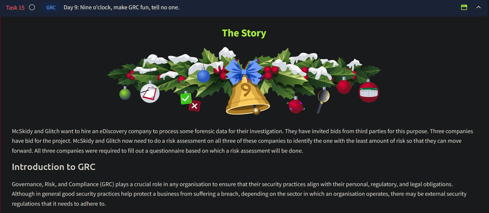

# Day 9 - GRC

## Governance, Risk, and Compliance (GRC)

### Overview

- **Purpose**: Align security practices with personal, regulatory, and legal obligations.
- **Key Sectors**:
    - **Financial Sector Examples**:
        - **Reserve Bank Regulations**: Mandate minimum security levels for banks.
        - **SWIFT CSP**: Security standards for SWIFT network usage post-incident.
        - **Data Protection**: Standards to secure customer-sensitive information.

### Functions of GRC

1. **Governance**:
    - Develops security strategies, policies, and practices.
    - Aligns security with organizational goals.
    - Defines roles and responsibilities.
2. **Risk**:
    - Identifies, assesses, and mitigates risks to IT assets.
    - Develops contingency plans for potential cyber threats.
3. **Compliance**:
    - Ensures adherence to external laws and industry standards (e.g., GDPR, NIST, ISO 27001).

---

## Risk Assessments

### Purpose

- Evaluate potential risks to prevent disruptions or breaches.
- Example: Assessing risks when selecting an eDiscovery company for data handling.

### Why Risk Assessments Are Important

1. **Internal Risks**:
    - Identify weak points (e.g., outdated software).
    - Direct resources to critical areas.
    - Maintain compliance.
2. **Third-Party Risks**:
    - Evaluate vendors and partners for potential security vulnerabilities.
    - Align third-party standards with internal security policies.

---

## Steps in Performing a Risk Assessment

### 1. Identification of Risks

- **Examples**:
    - Unpatched servers.
    - Privileged accounts without controls.
    - Third-party connections with potential malware.
    - Unsupported systems still in production.

### 2. Assigning Likelihood to Risks

- Scale (1-5):
    1. **Improbable**: Almost impossible.
    2. **Remote**: Very unlikely.
    3. **Occasional**: Possible once/sometime.
    4. **Probable**: Likely to occur multiple times.
    5. **Frequent**: Happens regularly.

### 3. Assigning Impact to Risks

- Scale (1-5):
    1. **Informational**: Minimal impact.
    2. **Low**: Limited operational impact, minimal revenue loss.
    3. **Medium**: Major impact on one operation area.
    4. **High**: Significant loss across multiple areas.
    5. **Critical**: Threat to organizational existence.

### 4. Risk Ownership

- **Risk Scoring**: Likelihood × Impact.
- **Actions**:
    - Mitigate if cost-effective.
    - Accept if mitigation cost exceeds risk loss.

---

## Internal vs Third-Party Risk Assessments

### Internal

- **Purpose**:
    - Identify and address internal vulnerabilities.
    - Enhance compliance and security resource allocation.

### Third-Party

- **Purpose**:
    - Evaluate external risks from vendors/suppliers.
    - Ensure alignment with internal security standards.
- **Example**: McSkidy and Glitch assess eDiscovery companies to avoid weak security links.

---

## Example: Procuring a Partner

- **Process**:
    - Send questionnaires to third-party vendors.
    - Use responses to update risk register and calculate risk scores.
    - Select the vendor with the lowest risk score for collaboration.

The task presented to us in this challenge is to perform a third party vendor risk assessment using a questionnaire. Based on the risk scores calculated, we would need to select the vendor with the lowest risk score.

---

## Questions

1. What does GRC stand for?
    
    Ans.: **Governance, Risk, and Compliance**
    
2. What is the flag you receive after performing the risk assessment?
    
    Ans.: Click on `View Site` to launch the vendor risk assessment portal. Complete the task by determining the risk scores for each vendor.
    
    
    

    On completing the assessment, we are presented with the flag:

    

    Ans.: **THM{RI5K_M4N4G3D}**